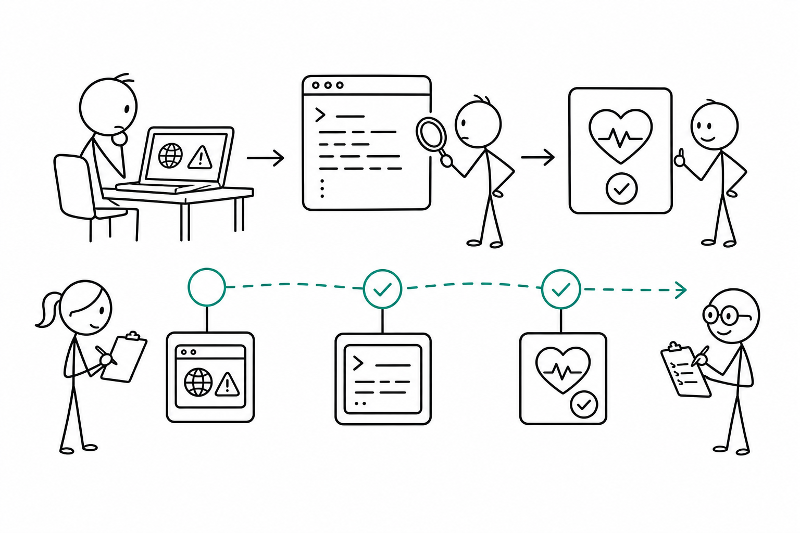

# 6교시 - 시연 앱 증상 진단

## 목표

이 시간의 목표는 웹앱이 실패했을 때 브라우저, 로그, health check를 이용해 원인 후보를 좁히는 것이다. Day3에서 로그를 읽었다면, Day4에서는 그 로그를 웹앱 구성요소와 연결한다.

이 세션의 끝에서 우리는 다음을 할 수 있어야 한다.

- 브라우저 증상만 보고 단정하지 않는다.
- 404, 500, unhealthy를 구분한다.
- 증상별로 다음 확인 명령을 고른다.

## 오늘 한 줄 요약

웹앱 진단은 “화면이 안 됨”에서 시작해 “어느 부품이 실패했는가”로 좁히는 과정이다.

## 수업 이미지



## 오늘의 흐름

| 시간 | 단계 | 진행 |
|---|---|---|
| 15:00-15:08 | 진단 순서 | 브라우저, 로그, health 순서를 정한다. |
| 15:08-15:22 | 증상 분류 | 404, 500, connection refused, unhealthy를 구분한다. |
| 15:22-15:38 | 팀 진단 | 증상 카드 4개를 원인 후보와 연결한다. |
| 15:38-15:47 | 복구 판단 | 설정을 되돌리고 정상 상태를 확인한다. |
| 15:47-15:50 | 정리 | Day7 incident note 방식과 연결한다. |

## 진단 순서

문제가 생기면 아래 순서로 본다.

1. 브라우저 주소가 맞는가?
2. 서버 터미널이 아직 실행 중인가?
3. 서버 로그에 어떤 `path`와 `status`가 찍혔는가?
4. `/health`는 `ok`인가 `unhealthy`인가?
5. 최근에 바꾼 설정은 무엇인가?

## 증상별 첫 판단

| 증상 | 의미 후보 | 먼저 확인할 것 |
|---|---|---|
| connection refused | 서버가 꺼져 있거나 포트가 다름 | 서버 터미널, 포트 |
| 404 | 요청한 경로가 없음 | URL 경로 |
| 500 | 서버가 처리 중 실패 | 서버 로그, 데이터/설정 |
| unhealthy | 앱은 응답하지만 상태가 나쁨 | `/health` reason |

## 증상 카드

### 카드 A

```text
브라우저: http://localhost:8000/no-page
응답: 404
```

질문:

- 앱이 완전히 죽은 것인가?
- 어떤 경로를 다시 확인해야 하는가?

### 카드 B

```text
브라우저: /api/products
응답: 500
로그: data file not found
```

질문:

- client, API, data 중 어느 쪽 원인에 가까운가?
- 어떤 설정을 확인해야 하는가?

### 카드 C

```text
브라우저: /health
응답: {"status":"unhealthy","reason":"data file missing"}
```

질문:

- 메인 화면이 보인다면 운영상 정상이라고 말할 수 있는가?
- health check가 왜 필요한가?

### 카드 D

```text
브라우저: localhost:8000 접속 실패
서버 터미널: 아무것도 실행 중이지 않음
```

질문:

- 코드 문제인가, 프로세스 실행 문제인가?
- Day2에서 배운 어떤 개념과 연결되는가?

## 정상 상태로 되돌리기

실패 모드로 실행 중이면 서버를 멈춘다.

```text
Ctrl+C
```

기본 설정으로 다시 실행한다.

```bash
python3 server.py
```

확인:

```text
http://localhost:8000/health
```

`status`가 `ok`인지 확인한다.

## 진단 기록 양식

```text
증상:
확인한 주소:
서버 로그:
health 결과:
최근 바꾼 설정:
가능한 원인:
다음 조치:
```

## 다음 교시 연결

다음 시간에는 웹앱 구조도를 직접 그린다. 진단을 잘하려면 머릿속에 요청 경로와 구성요소 지도가 있어야 한다.
