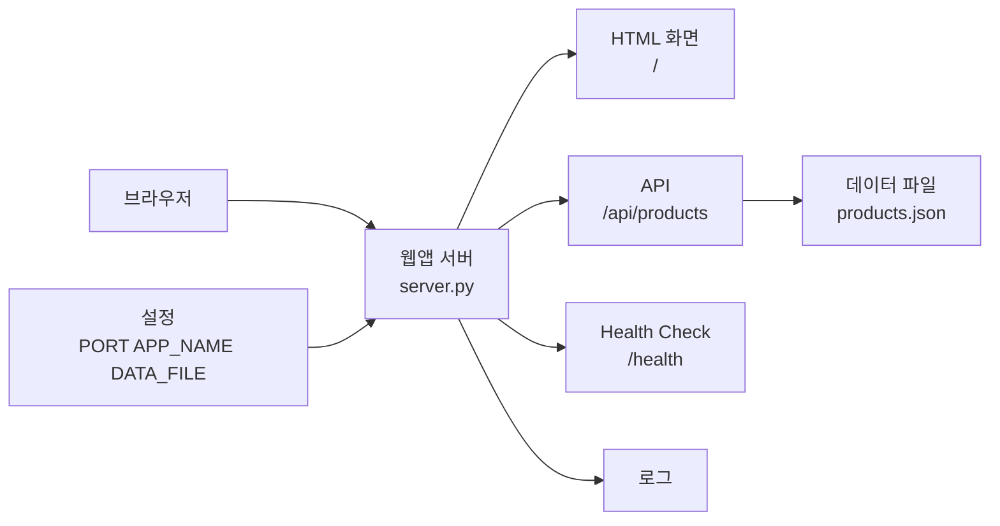

# 7교시 - 애플리케이션 구조도 그리기

## 목표

이 시간의 목표는 오늘 본 시연 앱을 구조도로 표현하는 것이다. Cloud Native에서는 말로만 “앱이 안 된다”고 하지 않고, 요청 경로와 구성요소를 그림으로 설명하는 능력이 중요하다.

이 세션의 끝에서 우리는 다음을 할 수 있어야 한다.

- 브라우저에서 API와 데이터 파일까지의 흐름을 그린다.
- 설정과 health check를 구조도에 포함한다.
- 실패 지점을 구조도 위에 표시한다.

## 오늘 한 줄 요약

구조도는 예쁜 그림이 아니라, 장애를 설명하기 위한 지도다.

## 수업 이미지


## 구조도에 넣을 것

필수:

- 브라우저
- 웹 애플리케이션 서버
- `/` HTML 응답
- `/api/products` JSON 응답
- `data/products.json`
- `/health`
- 설정값: `PORT`, `APP_NAME`, `DATA_FILE`

선택:

- 서버 로그
- 404 경로
- 500 실패 경로
- unhealthy 이유

## 그림을 잘 그리는 것이 목표가 아니다

구조도는 미술 과제가 아니다. 네모와 화살표만 있어도 된다.

좋은 구조도의 기준:

- 사용자가 어디에서 시작하는지 보인다.
- 요청이 어느 부품으로 가는지 보인다.
- 데이터가 어디에서 나오는지 보인다.
- 설정이 앱 밖에서 들어온다는 점이 보인다.
- 실패가 어느 연결에서 생겼는지 표시되어 있다.

## 예시 구조



이 그림을 그대로 베끼는 것이 목표는 아니다. 각 화살표가 어떤 요청과 응답을 뜻하는지 말할 수 있어야 한다.

## 실패 지점 표시

| 실패 | 구조도에서 표시할 위치 |
|---|---|
| 없는 경로 404 | 브라우저에서 서버로 가는 요청 경로 |
| 데이터 파일 누락 500 | API에서 데이터 파일로 가는 연결 |
| unhealthy | health check 결과 |
| 포트 오류 | 브라우저에서 서버로 가는 입구 |

## 팀 리뷰 질문

서로의 구조도를 보고 아래를 확인한다.

1. 사용자가 보는 화면과 API가 구분되어 있는가?
2. 데이터가 어디에서 오는지 표시되어 있는가?
3. 설정이 앱 바깥 값으로 표시되어 있는가?
4. health check가 단순 화면 확인과 구분되어 있는가?
5. 실패 지점이 한 곳 이상 표시되어 있는가?

## 제출 형식

종이나 노트에 그려도 되고, Mermaid로 작성해도 된다.

Mermaid 기본형:

```text
브라우저 -> 웹앱 서버 -> API -> 데이터
웹앱 서버 -> health
설정 -> 웹앱 서버
웹앱 서버 -> 로그
```

## 다음 교시 연결

마지막 시간에는 오늘 배운 웹앱 구조를 Cloud/DevOps 용어와 연결한다. Day5에서는 배포, 롤백, Cloud, DevOps가 왜 필요한지 더 큰 흐름으로 본다.
