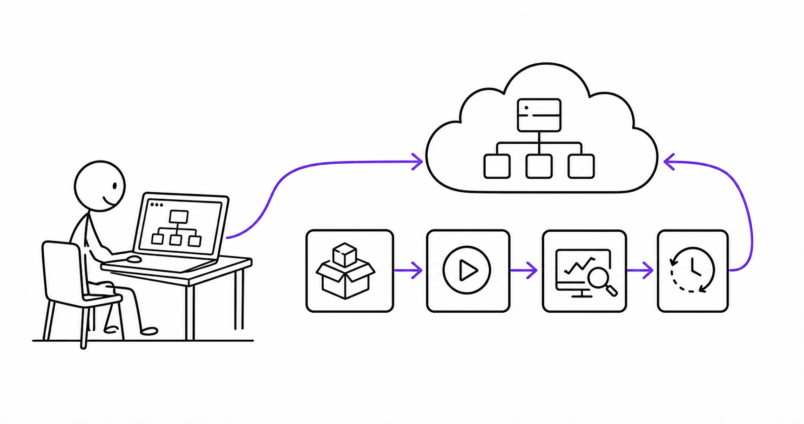

# 8교시 - 정리와 Cloud/DevOps 용어 예고

## 목표

이 시간의 목표는 Day4에서 본 웹앱 구조를 정리하고, Day5의 Cloud/DevOps 용어로 연결하는 것이다. 이제 “앱이 실행된다”에서 한 단계 나아가 “앱을 배포하고 운영한다”는 말을 준비한다.

이 세션의 끝에서 우리는 다음을 할 수 있어야 한다.

- 웹앱 구성요소와 실패 증상을 한 장으로 정리한다.
- 로컬에서 되는 앱이 배포에서 실패할 수 있는 이유를 말한다.
- Cloud와 DevOps 용어가 왜 등장하는지 예고 수준으로 이해한다.

## 오늘 한 줄 요약

로컬 웹앱 구조를 이해해야, 배포와 운영에서 무엇이 깨졌는지 설명할 수 있다.

## 수업 이미지



## 오늘의 흐름

| 시간 | 단계 | 진행 |
|---|---|---|
| 17:00-17:10 | 하루 리캡 | client, API, data, config, health를 정리한다. |
| 17:10-17:25 | 실패 정리 | 404, 500, unhealthy, connection refused를 비교한다. |
| 17:25-17:38 | 배포 연결 | 로컬에서 되던 앱이 다른 환경에서 실패하는 이유를 본다. |
| 17:38-17:47 | 퇴실 미션 | 오늘의 앱 구조와 실패 1개를 설명한다. |
| 17:47-17:50 | Day5 예고 | Cloud/DevOps 용어로 넘어간다. |

## 오늘의 핵심 정리

| 개념 | 쉬운 설명 |
|---|---|
| client | 사용자가 보는 쪽 |
| API | 요청을 받아 데이터를 응답하는 쪽 |
| data | 앱이 읽는 정보 |
| config | 환경마다 달라지는 값 |
| health check | 앱 상태를 확인하는 약속된 경로 |
| log | 요청과 실패의 증거 |

## 실패 증상 정리

| 증상 | 먼저 의심할 것 |
|---|---|
| connection refused | 서버 프로세스가 꺼져 있거나 포트가 다름 |
| 404 | 요청 경로가 없음 |
| 500 | 서버 내부 처리 실패 |
| unhealthy | 앱은 응답하지만 운영 상태가 나쁨 |

## 로컬에서는 되는데 배포에서 실패하는 이유

내 컴퓨터에서 되던 앱이 서버, 컨테이너, Kubernetes, AWS에서 실패할 수 있다.

| 로컬에서 숨겨진 전제 | 배포에서 생기는 문제 |
|---|---|
| 파일이 내 컴퓨터에 있음 | 컨테이너 이미지에 파일이 빠짐 |
| 포트가 비어 있음 | 이미 다른 프로세스가 사용 중 |
| 설정을 내 터미널에만 넣음 | 서버에는 환경 변수가 없음 |
| health check가 없음 | 플랫폼이 앱 상태를 판단하지 못함 |
| 로그를 보지 않음 | 실패 원인을 추적하기 어려움 |

Docker와 Kubernetes는 이런 전제를 명확하게 만들기 위해 등장한다. Docker는 실행 환경을 포장하고, Kubernetes는 포장된 앱을 원하는 상태로 운영한다. 하지만 그 전에 앱이 어떤 부품으로 되어 있는지 알아야 한다.

## 퇴실 미션

아래 문장을 완성한다.

```text
오늘 본 웹앱은 _____, _____, _____, _____, _____로 구성된다.
내가 관찰한 실패는 _____이고, 먼저 확인할 증거는 _____이다.
이 구조가 Cloud Native와 연결되는 이유는 _____이다.
```

예시:

```text
오늘 본 웹앱은 client, API, data, config, health check로 구성된다.
내가 관찰한 실패는 데이터 파일 누락 500이고, 먼저 확인할 증거는 서버 로그와 /health 응답이다.
이 구조가 Cloud Native와 연결되는 이유는 컨테이너와 Kubernetes가 결국 이런 앱을 실행하고 상태를 확인하기 때문이다.
```

## 자기 점검

| 항목 | 가능 | 애매함 | 어려움 |
|---|---|---|---|
| `/`와 `/api/products` 차이를 설명할 수 있다 | | | |
| `/health`가 왜 필요한지 말할 수 있다 | | | |
| 404와 500을 구분할 수 있다 | | | |
| 설정이 코드 밖에 있어야 하는 이유를 말할 수 있다 | | | |
| 앱 구조도를 그릴 수 있다 | | | |

## 다음 날 연결

Day5에서는 Cloud와 DevOps 용어를 본다. 이제 질문이 조금 바뀐다.

- 이 앱을 다른 컴퓨터에서 실행하려면 무엇이 필요할까?
- 새 버전을 배포했다가 실패하면 어떻게 되돌릴까?
- 사람이 매번 수동으로 확인하지 않으려면 어떤 자동화가 필요할까?
- Cloud는 서버를 빌리는 것 이상으로 무엇을 바꾸었을까?

오늘의 웹앱 구조가 있어야 이 질문들이 현실적인 문제가 된다.
