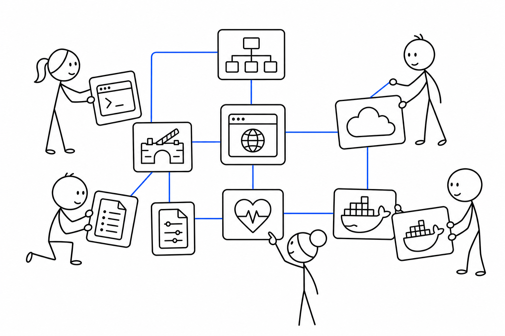

# 1교시 - 1주차 복습과 용어 워밍업

## 목표

이 시간의 목표는 1주차에 배운 조각들을 하나의 이야기로 다시 연결하는 것이다. 프로세스, 포트, 로그, 터미널, 웹앱 구조는 따로 떨어진 지식이 아니라 Docker, Kubernetes, Cloud를 이해하기 위한 바닥이다.

이 세션의 끝에서 우리는 다음을 할 수 있어야 한다.

- 1주차 핵심 용어를 쉬운 말로 다시 설명한다.
- “앱이 실행된다”와 “서비스로 운영된다”의 차이를 말한다.
- Day5 팀 미션에서 사용할 배포 이야기의 재료를 정리한다.

## 오늘 한 줄 요약

1주차는 도구를 외운 시간이 아니라, 앱이 서비스가 되는 길을 보기 위한 기본 언어를 만든 시간이다.

## 수업 이미지



## 1주차 핵심 용어

| 용어 | 쉬운 뜻 | 어디서 봤나 |
|---|---|---|
| process | 실행 중인 프로그램 | Day2 |
| port | 앱이 요청을 기다리는 번호 | Day2 |
| localhost | 내 컴퓨터 자신 | Day2 |
| log | 요청과 실패의 기록 | Day2, Day3 |
| current directory | 지금 명령이 실행되는 폴더 | Day3 |
| API | 데이터를 요청하는 통로 | Day4 |
| config | 실행 환경마다 바뀌는 설정값 | Day4 |
| health check | 앱 상태를 확인하는 경로 | Day4 |

처음부터 모든 단어를 완벽히 외우지 않아도 된다. 중요한 것은 문제가 생겼을 때 어떤 단어로 질문할지 아는 것이다.

## 실행과 운영의 차이

| 표현 | 의미 |
|---|---|
| 앱이 실행된다 | 프로세스가 켜지고 요청을 받을 수 있다 |
| 앱이 서비스가 된다 | 다른 사람이 접속하고, 실패를 관찰하고, 복구할 수 있다 |
| 앱이 운영된다 | 배포, 설정, 보안, 로그, health, 비용, 롤백까지 고려된다 |

Day2에서는 앱을 실행했다. Day3에서는 터미널과 로그로 증거를 찾았다. Day4에서는 웹앱 부품과 실패 증상을 구조로 보았다. Day5에서는 이 흐름을 Cloud와 DevOps 용어로 연결한다.

## 오늘의 큰 질문

> 내 노트북에서 되던 앱을 다른 사람이 안정적으로 쓰는 서비스로 만들려면 무엇이 더 필요할까?

가능한 답:

- 같은 실행 환경
- 배포 방법
- 설정 관리
- 로그와 health check
- 실패했을 때 되돌리는 방법
- 누가 어떤 변경을 했는지 남기는 기록

## 활동 - 용어를 쉬운 말로 바꾸기

아래 문장을 쉬운 말로 바꿔본다.

```text
API 서버의 health check가 unhealthy이고, 로그에는 config missing이 보인다.
```

예시:

```text
데이터를 주는 서버가 상태 확인에서 정상이라고 말하지 못하고,
기록을 보니 필요한 설정값이 빠진 것 같다.
```

## 다음 교시 연결

다음 시간에는 Cloud를 제품 이름 목록으로 외우기보다, “왜 서버를 사지 않고 빌리게 되었는가”라는 변화의 흐름으로 본다.
