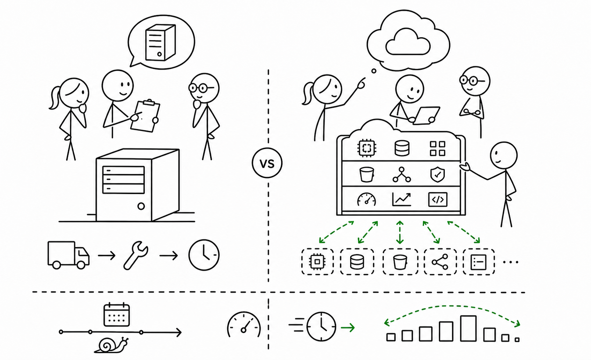

# 2교시 - 운영 관점으로 보는 Cloud 기초

## 목표

이 시간의 목표는 Cloud를 제품 이름 암기가 아니라 운영 방식의 변화로 이해하는 것이다. Cloud는 “인터넷 어딘가의 컴퓨터”라고만 이해하면 반만 맞다. 중요한 변화는 필요한 자원을 빠르게 만들고 지우고, API로 다룰 수 있게 되었다는 점이다.

이 세션의 끝에서 우리는 다음을 할 수 있어야 한다.

- Cloud, Region, 계정, VM, Container를 쉬운 말로 설명한다.
- 물리 서버 구매와 Cloud 사용의 차이를 말한다.
- Cloud가 왜 DevOps와 함께 자주 등장하는지 이해한다.

## 오늘 한 줄 요약

Cloud는 서버를 빌리는 장소가 아니라, 인프라를 빠르게 만들고 바꾸는 운영 방식의 변화다.

## 수업 이미지



## Cloud 이전의 어려움

서비스를 운영하려면 예전에는 서버를 직접 준비해야 했다.

- 서버 장비를 구매한다.
- 전원, 네트워크, 공간을 준비한다.
- 운영체제를 설치한다.
- 장애가 나면 직접 교체하거나 복구한다.
- 사용자가 늘면 서버를 더 사야 한다.

작게 시작할 때는 가능하지만, 빠르게 변하는 서비스에는 느리고 비싸다.

## Cloud가 바꾼 것

Cloud는 필요한 컴퓨팅 자원을 빌려 쓰는 방식을 대중화했다. 더 중요한 점은 인프라를 API로 만들고 지울 수 있다는 것이다.

| 이전 방식 | Cloud 방식 |
|---|---|
| 서버 구매 | 필요한 만큼 임대 |
| 수동 설치 | 이미지와 자동화 |
| 몇 주 대기 | 몇 분 안에 생성 |
| 장비 단위 관리 | API와 설정으로 관리 |
| 고정 비용 중심 | 사용량 기반 비용 |

Cloud는 편리하지만 공짜는 아니다. 잘못 만들면 비용이 나가고, 권한을 잘못 열면 보안 문제가 생긴다.

## 기본 용어

| 용어 | 쉬운 뜻 |
|---|---|
| Cloud | 필요한 컴퓨팅 자원을 빌려 쓰고 API로 다루는 환경 |
| Region | 클라우드 자원이 위치한 큰 지역 |
| Account | 자원을 만들고 비용과 권한을 관리하는 단위 |
| VM | 가상의 컴퓨터 |
| Container | 앱 실행 환경을 가볍게 포장한 실행 단위 |
| Managed Service | 설치와 운영 일부를 클라우드가 대신 맡는 서비스 |

## Region을 왜 알아야 하나

Region은 단순 지명이 아니다. 사용자가 어디에 있는지, 장애가 어느 지역에 나는지, 비용이 얼마인지에 영향을 준다.

예를 들어 한국 사용자가 많은 서비스라면 너무 먼 지역에 서버를 두면 응답이 느릴 수 있다. 반대로 모든 것을 한 지역에만 두면 그 지역 장애에 취약할 수 있다.

초반에는 이것만 기억한다.

- Region은 자원이 놓이는 지역이다.
- 사용자와 가까우면 지연 시간이 줄 수 있다.
- 지역마다 제공 서비스와 가격이 다를 수 있다.
- 아무 Region에나 만들면 비용과 운영이 헷갈릴 수 있다.

## VM, Container, Managed Service

| 선택지 | 직접 책임 | 줄어드는 부담 |
|---|---|---|
| VM | OS 설치, 패치, 런타임, 앱 운영 | 물리 장비 구매 |
| Container | 이미지, 설정, 로그, 앱 운영 | 환경 차이 |
| Managed Service | 설정, 권한, 비용 판단 | 설치, 패치, 일부 장애 대응 |

어떤 선택이 항상 정답은 아니다. 작은 실습에서는 직접 해보는 것이 좋고, 실제 운영에서는 팀 역량, 비용, 보안, 장애 대응 능력을 함께 본다.

## 활동 - 용어 연결하기

아래 문장을 Cloud 용어로 바꿔본다.

```text
서울 근처의 클라우드 지역에 가상의 컴퓨터를 하나 만들고,
그 안에서 컨테이너로 앱을 실행한다.
```

포함할 단어:

- Region
- VM
- Container
- Account

## 다음 교시 연결

Cloud 자원을 만들 수 있어도 서비스는 자동으로 좋아지지 않는다. 다음 시간에는 코드 변경이 어떻게 배포되고, 문제가 생기면 어떻게 롤백되는지 본다.
