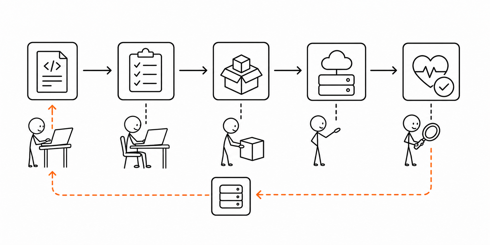

# 3교시 - 배포, 롤백, 릴리스 이야기

## 목표

이 시간의 목표는 배포, 릴리스, 롤백을 구분하는 것이다. 코드를 고치는 것과 사용자가 새 기능을 쓰게 되는 것은 같은 일이 아니다. 그 사이에는 빌드, 설정, 실행, 검증, 공개, 복구가 있다.

이 세션의 끝에서 우리는 다음을 할 수 있어야 한다.

- 배포와 릴리스의 차이를 쉬운 말로 설명한다.
- 롤백이 왜 필요한지 말한다.
- 코드 변경이 서비스가 되기까지의 흐름을 그린다.

## 오늘 한 줄 요약

배포는 코드를 실행 환경에 올리는 일이고, 롤백은 문제가 생겼을 때 이전 상태로 돌아가는 안전장치다.

## 수업 이미지



## 배포란 무엇인가

배포는 변경된 코드나 설정을 실제 실행 환경에 반영하는 일이다.

작은 흐름:

```text
코드 변경 -> 테스트 -> 패키징 -> 실행 환경에 반영 -> 상태 확인
```

컨테이너를 쓰면 패키징 단계가 Docker 이미지로 바뀐다.

```text
코드 변경 -> 이미지 빌드 -> 컨테이너 실행 -> health check 확인
```

## 릴리스란 무엇인가

릴리스는 사용자가 새 기능이나 새 버전을 쓰게 만드는 일이다. 배포와 릴리스가 항상 같은 순간에 일어나지는 않는다.

| 구분 | 쉬운 설명 |
|---|---|
| 배포 | 새 버전을 실행 환경에 올림 |
| 릴리스 | 사용자가 새 버전을 쓰게 함 |
| 롤백 | 문제가 생겨 이전 상태로 되돌림 |

예를 들어 새 버전을 미리 서버에 올려두고, 일부 사용자에게만 공개할 수도 있다.

## 롤백이 필요한 이유

새 버전은 언제든 실패할 수 있다.

- 테스트에서 놓친 버그가 있다.
- 설정값이 빠졌다.
- 특정 경로만 `500`이 난다.
- 사용자가 몰려 성능 문제가 생긴다.
- 데이터 형식이 예상과 다르다.

롤백은 실패를 인정하는 부끄러운 일이 아니다. 사용자를 보호하기 위한 운영 절차다.

## Day4 실패를 배포 이야기로 바꾸기

| Day4 증상 | 배포 관점 |
|---|---|
| `/no-page` 404 | 새 화면 경로가 잘못 연결됨 |
| `/api/products` 500 | API가 데이터 파일이나 설정을 못 읽음 |
| `/health` unhealthy | 플랫폼이 새 버전을 정상으로 보기 어려움 |
| connection refused | 서버 프로세스가 떠 있지 않거나 포트가 다름 |

## 배포 후 확인할 것

| 확인 | 이유 |
|---|---|
| 프로세스가 실행 중인가 | 앱이 켜졌는지 |
| 포트가 열렸는가 | 요청을 받을 수 있는지 |
| `/health`가 ok인가 | 운영 상태가 정상인지 |
| 주요 API가 200인가 | 기능이 동작하는지 |
| 로그에 ERROR가 늘었는가 | 숨은 실패가 있는지 |

## 활동 - 배포 문장 만들기

아래 단어를 모두 넣어 한 문장으로 설명한다.

- 코드 변경
- 배포
- health check
- 로그
- 롤백

예시:

```text
코드 변경을 배포한 뒤 health check와 로그를 확인하고, 문제가 있으면 이전 버전으로 롤백한다.
```

## 다음 교시 연결

다음 시간에는 이런 배포와 복구를 팀이 반복 가능하게 만드는 사고방식, DevOps 피드백 루프를 본다.
