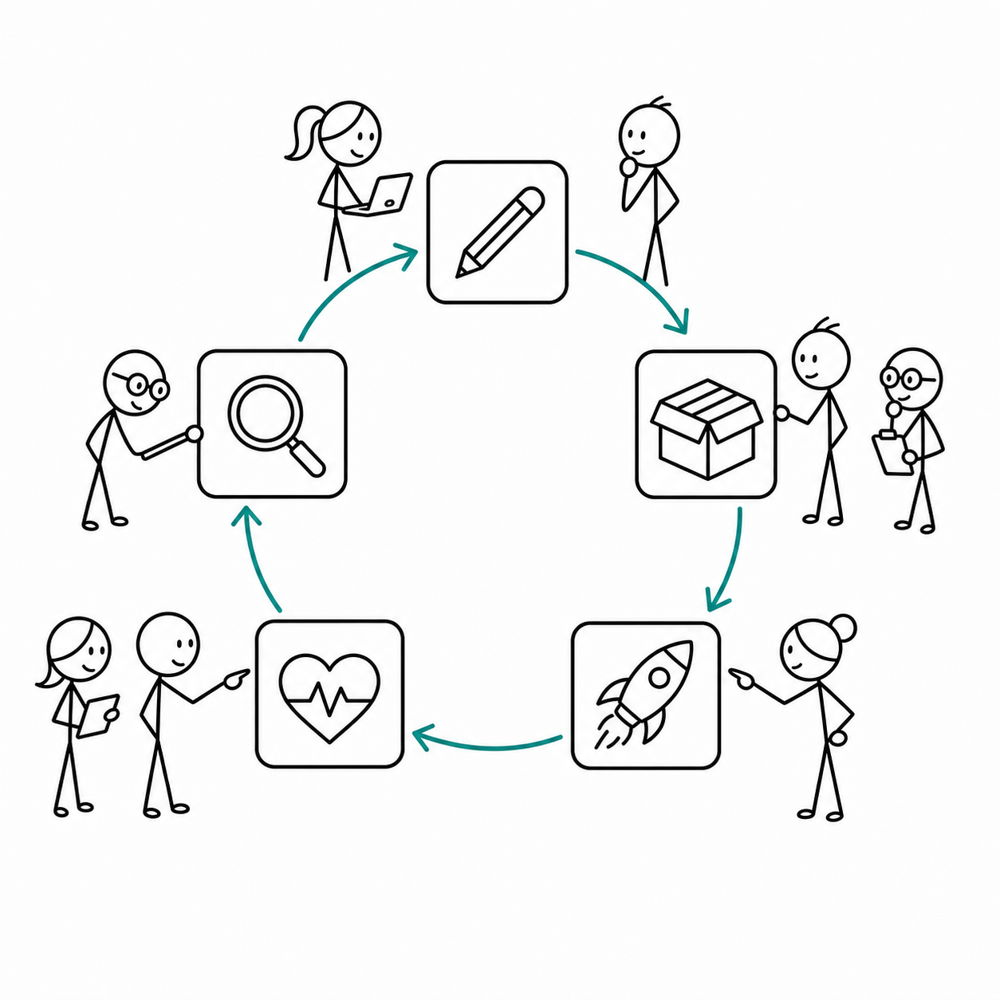
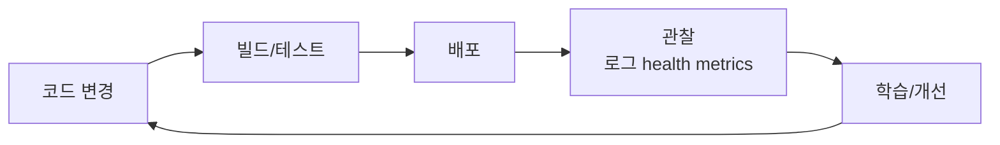

# 4교시 - DevOps 피드백 루프

## 목표

이 시간의 목표는 DevOps를 직무 이름이나 유행어가 아니라 피드백을 빠르게 만드는 방식으로 이해하는 것이다. 개발과 운영이 멀리 떨어져 있으면 배포가 느리고, 장애 원인을 찾기 어렵고, 같은 실수가 반복된다.

이 세션의 끝에서 우리는 다음을 할 수 있어야 한다.

- DevOps가 반복 가능성과 피드백을 중시하는 이유를 설명한다.
- CI/CD, 관찰, 자동화가 어떤 문제에서 나왔는지 말한다.
- 1주차에서 배운 로그와 health check가 DevOps와 연결됨을 이해한다.

## 오늘 한 줄 요약

DevOps는 개발과 운영 사이의 피드백을 짧게 만들어 더 자주, 더 안전하게 개선하려는 방식이다.

## 수업 이미지



## DevOps가 필요한 이유

서비스가 작을 때는 한 사람이 코드를 고치고 서버에 접속해 직접 배포할 수 있다. 하지만 팀과 서비스가 커지면 문제가 생긴다.

- 누가 어떤 변경을 했는지 모른다.
- 배포 순서가 사람마다 다르다.
- 장애가 나도 개발자는 운영 환경을 모른다.
- 운영자는 코드 의도를 모른다.
- 같은 장애가 반복된다.

DevOps는 개발자가 운영까지 모두 혼자 하라는 뜻이 아니다. 개발과 운영이 같은 증거를 보고, 같은 절차로 배포하고, 빠르게 피드백을 받게 만들자는 방향이다.

## 피드백 루프



좋은 루프는 빠르고 안전하다.

- 변경이 작다.
- 테스트와 확인이 반복 가능하다.
- 실패가 빨리 보인다.
- 되돌리는 방법이 있다.
- 배운 내용을 다음 배포에 반영한다.

## 반복 가능성이 중요한 이유

사람이 기억으로 하는 작업은 흔들린다.

| 사람의 기억에 의존 | 반복 가능한 방식 |
|---|---|
| 서버에 직접 접속해 손으로 설정 | 스크립트, Dockerfile, IaC |
| 배포 후 눈으로 화면만 확인 | health check, smoke test |
| 장애 원인을 채팅으로만 공유 | 로그, incident note |
| 실패 후 수동 복구 | 롤백 절차 |

오늘은 아직 CI/CD를 만들지 않는다. 하지만 왜 자동화가 필요한지는 이해해야 한다.

## 1주차와 DevOps 연결

| 1주차에서 배운 것 | DevOps에서의 역할 |
|---|---|
| 터미널 명령 | 반복 가능한 조작의 시작 |
| Git | 변경 이력 |
| 로그 | 실패 원인 추적 |
| health check | 배포 후 상태 확인 |
| 구조도 | 팀이 같은 시스템을 이해하는 지도 |
| Docker 개념 | 실행 환경 표준화 |

## 활동 - 루프에서 빠진 것 찾기

아래 흐름에서 빠진 것을 찾는다.

```text
코드 변경 -> 서버에 복사 -> 사용자에게 공개
```

빠진 것 예:

- 테스트
- 설정 확인
- health check
- 로그 확인
- 롤백 계획
- 변경 기록

## 다음 교시 연결

점심 이후에는 팀 미션을 준비한다. 오늘 배운 Cloud, 배포, 롤백, DevOps를 사용해 “코드 변경이 서비스가 되는 이야기”를 만든다.
