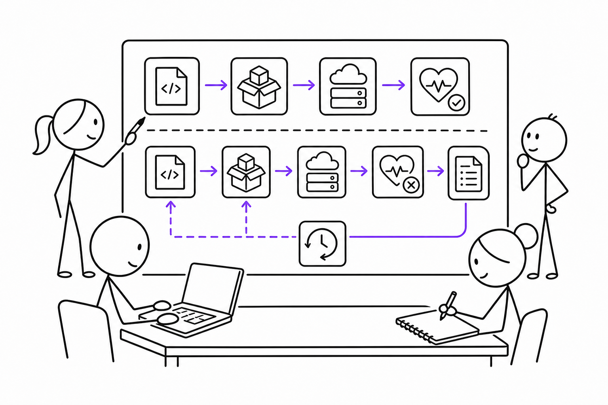

# 5교시 - 미션 준비: 배포 설명하기

## 목표

이 시간의 목표는 팀 미션을 시작하기 전에 이야기 재료와 제출 형식을 정리하는 것이다. 오후 미션은 코드를 많이 쓰는 시간이 아니라, 1주차에 배운 개념을 사용해 배포와 실패 상황을 설명하는 시간이다.

이 세션의 끝에서 우리는 다음을 할 수 있어야 한다.

- 배포 이야기의 등장인물과 구성요소를 정한다.
- 정상 흐름과 실패 흐름을 모두 포함한다.
- 팀별 산출물 형식을 이해한다.

## 오늘 한 줄 요약

좋은 배포 설명은 “잘 됐다”가 아니라, 무엇을 확인했고 실패하면 어떻게 되돌릴지까지 포함한다.

## 수업 이미지



## 오늘의 흐름

| 시간 | 단계 | 진행 |
|---|---|---|
| 14:00-14:08 | 미션 소개 | 산출물과 기준을 확인한다. |
| 14:08-14:20 | 시나리오 선택 | 팀별로 작은 앱 변경 상황을 고른다. |
| 14:20-14:35 | 정상 흐름 작성 | 코드 변경에서 서비스 확인까지를 적는다. |
| 14:35-14:45 | 실패/롤백 작성 | 실패 1개와 되돌리기 방식을 넣는다. |
| 14:45-14:50 | 점검 | 6교시 팀 미션 시작 전 빠진 요소를 확인한다. |

## 미션 주제

팀별로 아래 중 하나를 고른다.

| 주제 | 변경 내용 | 실패 예시 |
|---|---|---|
| 상품 목록 앱 | 새 상품을 추가한다 | 데이터 파일 누락 |
| 공지 앱 | 새 공지를 보여준다 | 정적 파일 누락 |
| 주문 API | 주문 경로를 추가한다 | 설정 누락으로 500 |
| 상태 페이지 | `/health`를 추가한다 | health check가 잘못된 경로를 봄 |

직접 다른 주제를 만들어도 된다. 단, 작은 웹앱과 연결되어야 한다.

## 반드시 포함할 요소

| 요소 | 질문 |
|---|---|
| 코드 변경 | 무엇을 바꾸는가? |
| 실행 환경 | 어디에서 실행되는가? 로컬, VM, 컨테이너, Cloud 중 무엇인가? |
| 설정 | 어떤 값이 환경마다 달라질 수 있는가? |
| 확인 | 성공을 어떻게 확인하는가? |
| 로그 | 실패하면 어떤 로그를 볼 것인가? |
| 롤백 | 문제가 생기면 무엇으로 되돌릴 것인가? |

## 추천 구조

```text
1. 변경하려는 것
2. 배포 전 확인
3. 배포 흐름
4. 배포 후 확인
5. 실패 상황
6. 롤백 또는 다음 조치
7. Cloud Native와 연결되는 점
```

## 산출물 형식

팀은 아래 둘 중 하나를 선택한다.

| 형식 | 설명 |
|---|---|
| 다이어그램 중심 | 구조도와 화살표로 설명 |
| 스토리 중심 | 배포 상황을 시간 순서로 설명 |

둘 다 가능하면 좋지만, 하나만 제대로 해도 된다. 중요한 것은 용어를 많이 쓰는 것이 아니라, 흐름과 근거가 보이는 것이다.

## 셀프 체크

6교시 시작 전 아래를 확인한다.

- 404와 500 중 하나 이상 설명에 들어갔는가?
- health check가 들어갔는가?
- 로그 확인이 들어갔는가?
- 설정 누락이나 포트 문제 같은 실패가 들어갔는가?
- 롤백 또는 복구가 들어갔는가?

## 다음 교시 연결

다음 시간에는 팀별로 다이어그램과 스토리를 실제로 만든다. 완벽한 답보다 설명 가능한 흐름을 우선한다.
