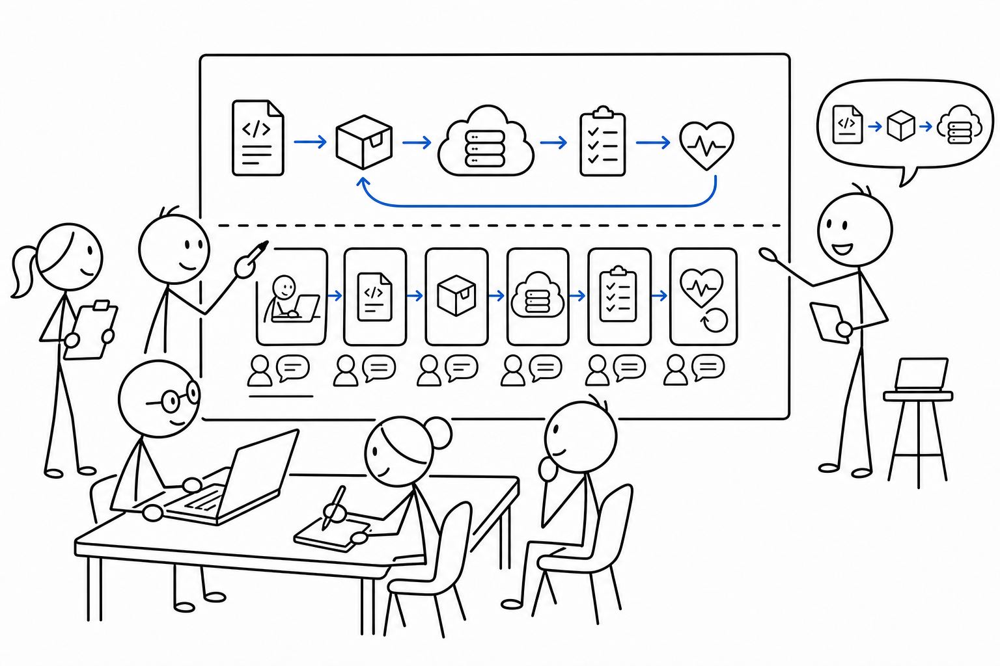

# 6교시 - 팀 미션: 다이어그램과 스토리 만들기

## 목표

이 시간의 목표는 팀별로 “코드 변경이 실행 중인 서비스가 되기까지”를 설명하는 산출물을 만드는 것이다. 1주차의 최종 산출물은 멋진 앱이 아니라, 앱이 서비스가 되는 흐름을 설명하는 능력이다.

이 세션의 끝에서 우리는 다음을 만들 수 있어야 한다.

- 배포 흐름 다이어그램 또는 스토리
- 실패 상황 1개와 원인 후보
- 확인 방법과 롤백 방법

## 오늘 한 줄 요약

서비스 운영 설명은 정상 흐름과 실패 흐름을 함께 보여줄 때 설득력이 생긴다.

## 수업 이미지



## 역할

| 역할 | 하는 일 |
|---|---|
| 드라이버 | 문서나 그림을 실제로 작성한다 |
| 기록자 | 용어와 근거를 정리한다 |
| 그림 담당 | 흐름과 실패 지점을 표시한다 |
| 발표자 | 1분 안에 설명한다 |

역할은 실력 순서가 아니다. 서로 다른 관찰을 합치기 위한 방법이다.

## 다이어그램 기본형

아래 흐름을 팀 주제에 맞게 바꾼다.

```text
코드 변경
  -> Git 기록
  -> 빌드 또는 패키징
  -> 실행 환경
  -> health check
  -> 사용자 요청
  -> 로그 확인
```

Docker를 넣고 싶다면 이렇게 바꿀 수 있다.

```text
코드 변경
  -> Docker image build
  -> Container run
  -> port 확인
  -> health check
  -> logs 확인
```

오늘은 Docker 명령을 실행하지 않아도 된다. 하지만 2주차에 이 흐름을 실제 명령으로 확인하게 된다.

## 실패 흐름 예시

```text
변경: 상품 데이터 파일 경로를 바꿈
증상: /api/products가 500
health: unhealthy
로그: data file not found
원인 후보: DATA_FILE 설정이 잘못됨
복구: 이전 DATA_FILE 값으로 되돌리고 /health 확인
```

## 팀 산출물 템플릿

[mission/deployment-story-template.md](mission/deployment-story-template.md)를 복사하거나 그대로 참고한다.

필수 항목:

- 서비스 이름
- 변경 내용
- 정상 배포 흐름
- 실패 상황
- 확인 증거
- 롤백 또는 복구
- 2주차 Docker와 연결되는 점

## 발표 준비

1분 발표 구조:

```text
우리 팀 서비스는 _____입니다.
이번 변경은 _____입니다.
정상 배포 흐름은 _____입니다.
실패하면 _____ 증상이 보이고, _____를 확인합니다.
문제가 있으면 _____로 되돌립니다.
2주차 Docker와 연결되는 점은 _____입니다.
```

## 다음 교시 연결

다음 시간에는 팀별 공유를 한다. 다른 팀의 답을 보며 빠진 확인, 빠진 실패, 애매한 용어를 찾아본다.
