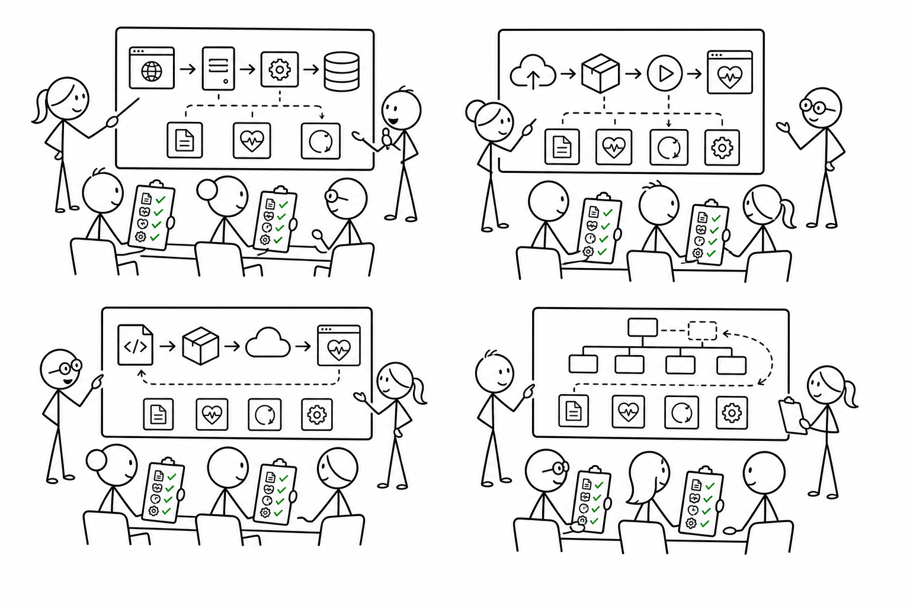

# 7교시 - 팀별 공유와 피드백

## 목표

이 시간의 목표는 팀별 산출물을 공유하고, 설명에서 빠진 운영 관점을 찾는 것이다. 피드백은 정답 맞히기가 아니라 설명을 더 안전하고 재현 가능하게 만드는 과정이다.

이 세션의 끝에서 우리는 다음을 할 수 있어야 한다.

- 다른 팀의 배포 흐름에서 빠진 확인을 찾는다.
- 404, 500, unhealthy, 로그, 롤백이 적절히 쓰였는지 본다.
- 자기 팀 산출물을 한 단계 개선한다.

## 오늘 한 줄 요약

좋은 피드백은 “틀렸다”가 아니라 “어떤 증거를 더 보면 좋을까?”를 묻는다.

## 수업 이미지



## 오늘의 흐름

| 시간 | 단계 | 진행 |
|---|---|---|
| 16:00-16:08 | 공유 기준 | 발표와 피드백 규칙을 확인한다. |
| 16:08-16:32 | 팀 발표 | 팀별 1분 발표를 진행한다. |
| 16:32-16:42 | 피드백 | 빠진 확인, 애매한 용어, 위험한 가정을 찾는다. |
| 16:42-16:48 | 수정 | 팀 산출물을 짧게 보완한다. |
| 16:48-16:50 | 정리 | 1주차 퀴즈와 Docker 예고로 연결한다. |

## 발표 기준

발표자는 아래를 1분 안에 말한다.

- 어떤 서비스를 가정했는가?
- 무엇을 변경했는가?
- 어떻게 배포한다고 설명했는가?
- 어떤 실패를 넣었는가?
- 무엇을 보고 성공/실패를 판단하는가?
- 문제가 있으면 어떻게 되돌리는가?

## 피드백 체크리스트

듣는 팀은 아래를 표시한다.

| 항목 | 있음 | 애매함 | 없음 |
|---|---|---|---|
| 코드 변경이 명확하다 | | | |
| 실행 환경이 나온다 | | | |
| 설정이 나온다 | | | |
| health check가 나온다 | | | |
| 로그 확인이 나온다 | | | |
| 실패 상황이 나온다 | | | |
| 롤백 또는 복구가 나온다 | | | |
| Docker와 연결된다 | | | |

## 좋은 피드백 문장

```text
health check가 어디에서 확인되는지 더 적으면 좋겠습니다.
```

```text
500이 났을 때 어떤 로그를 볼지 추가하면 더 재현 가능할 것 같습니다.
```

```text
롤백이 이전 코드인지 이전 설정인지 구분하면 좋겠습니다.
```

## 피해야 할 피드백

- 그냥 이상해요.
- 틀린 것 같아요.
- 저희 팀 방식이 더 맞아요.

피드백은 사람을 평가하는 말이 아니라, 설명을 개선하는 근거여야 한다.

## 수정 시간

팀별로 가장 중요한 보완 1개만 고른다.

예:

- health check 추가
- 실패 로그 추가
- 롤백 대상 명확화
- Docker image와 container 연결 추가

## 다음 교시 연결

마지막 시간에는 1주차를 짧게 점검하고, 2주차 Docker 이론과 실습으로 넘어가기 위한 핵심 질문을 정리한다.
