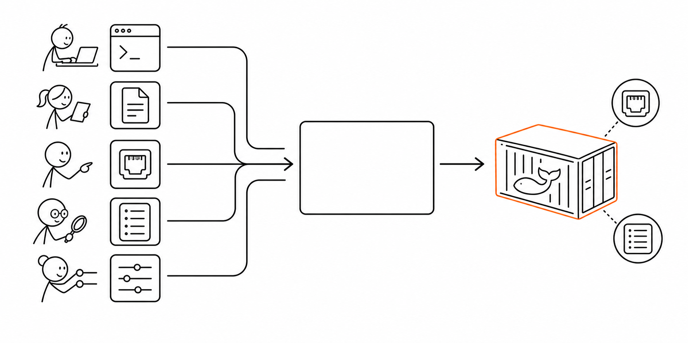

# 8교시 - Week1 핵심 정리와 Docker Live QA

## 목표

이 시간의 목표는 1주차 전체를 정리하고, 2주차 Docker 학습으로 넘어가기 전에 반드시 알아야 할 개념과 질문을 정리하는 것이다. 남은 시간은 1주차 개념과 Docker 준비 상태를 Live QA로 해결한다.

이 세션의 끝에서 우리는 다음을 할 수 있어야 한다.

- 1주차 핵심 개념을 짧은 문장으로 설명한다.
- Docker가 해결하려는 문제를 “실행 환경 차이”로 말한다.
- image, container, registry, tag가 왜 필요한지 예고 수준으로 이해한다.
- 2주차 Docker 실습 전 안전 규칙을 말한다.

## 오늘 한 줄 요약

Week1은 앱 실행과 운영의 기본 언어를 만든 주간이고, Docker는 그 실행 조건을 포장해 반복하려는 도구다.

## 수업 이미지



## 1주차 전체 요약

| 일차 | 핵심 |
|---|---|
| Day1 | 과정 흐름, 질문 규칙, 개발 도구, Docker Desktop 준비 |
| Day2 | 프로세스, 포트, localhost, 환경 변수, 로그 |
| Day3 | 터미널 생존법, 경로, help, 로그, 에러 해석 |
| Day4 | 웹앱 구성요소, API, config, health check, 실패 진단 |
| Day5 | Cloud, 배포, 롤백, DevOps 피드백 루프 |

## 반드시 알아야 할 키포인트

- 프로세스는 실행 중인 프로그램이다.
- 포트는 앱이 요청을 기다리는 번호다.
- 로그는 요청과 실패의 증거다.
- health check는 앱 상태를 확인하는 약속된 경로다.
- 배포는 변경을 실행 환경에 반영하는 일이다.
- 롤백은 문제가 생겼을 때 이전 상태로 되돌리는 일이다.
- DevOps는 개발과 운영 사이의 피드백을 짧게 만드는 방식이다.
- Cloud는 인프라를 빠르게 만들고 바꾸는 운영 방식의 변화다.

## Docker가 필요한 이유

작은 웹앱도 실행하려면 여러 조건이 필요했다.

- 코드 파일
- 실행 명령
- Python 같은 런타임
- 포트
- 환경 변수
- 데이터 파일
- 로그 확인 방법

친구 컴퓨터, 서버, 클라우드 환경으로 가면 이 조건이 달라질 수 있다. Docker는 이 실행 조건을 이미지로 포장하고, 컨테이너로 실행해서 환경 차이를 줄이려는 도구다.

## Docker 이론 핵심 예고

| 용어 | 쉬운 뜻 | 1주차와 연결 |
|---|---|---|
| Image | 실행 재료를 포장한 것 | 코드, 파일, 실행 명령 |
| Container | 이미지를 실제로 실행한 상태 | 프로세스, 포트, 로그 |
| Registry | 이미지를 보관하고 받는 곳 | 이미지 저장소 |
| Tag | 이미지 버전 이름표 | 배포와 롤백에서 버전 구분 |
| Runtime | 컨테이너를 실제로 실행하는 담당 | 프로세스 실행 |

## VM과 Container 맛보기

| 구분 | VM | Container |
|---|---|---|
| 비유 | 컴퓨터 한 대를 통째로 빌리는 느낌 | 앱 실행 방을 가볍게 나누는 느낌 |
| OS | 각 VM이 자기 OS를 가짐 | 보통 호스트 OS 커널을 공유 |
| 장점 | 강한 격리, 다른 OS 실행 | 빠른 시작, 가벼운 배포 |
| 주의 | 무겁고 느릴 수 있음 | 권한과 보안 설정이 중요 |

Docker는 VM을 완전히 대체하는 정답이 아니다. 앱 실행 환경을 빠르게 포장하고 반복하는 데 강한 도구다.

## 2주차 안전 규칙

Docker 실습에서는 삭제 명령이 나온다. 안전 규칙을 먼저 기억한다.

- `docker rm`은 컨테이너를 삭제한다.
- `docker rmi`는 이미지를 삭제한다.
- `docker system prune`은 사용하지 않는 Docker 자원을 크게 정리할 수 있으므로 혼자 실행하지 않는다.
- Linux `rm -rf /`, `rm -rf *`는 절대 실행하지 않는다.
- 명령을 실행하기 전에 지금 지우는 대상이 container인지 image인지 확인한다.

## Live QA

남은 시간은 Week1 전체와 Docker 준비 질문을 해결한다.

우선순위:

1. 프로세스, 포트, 로그, health check 개념
2. Cloud, 배포, 롤백, DevOps 용어
3. Docker 이미지와 컨테이너 차이
4. Docker Desktop 실행 문제
5. `docker version`, `docker run hello-world` 문제
6. 삭제 명령 안전 규칙

## 2주차 준비 체크

터미널에서 확인한다.

```bash
docker version
```

확인할 것:

- Client 정보가 보인다.
- Server 정보가 보인다.
- Docker Desktop이 실행 중이다.

가능하면 한 번 더 확인한다.

```bash
docker run hello-world
```

## 퇴실 티켓

```text
1주차에서 가장 이해된 개념:
아직 헷갈리는 개념:
Docker가 해결하려는 문제를 한 문장으로 쓰면:
Live QA에서 해결한 것:
2주차 첫날에 꼭 확인하고 싶은 질문:
```
