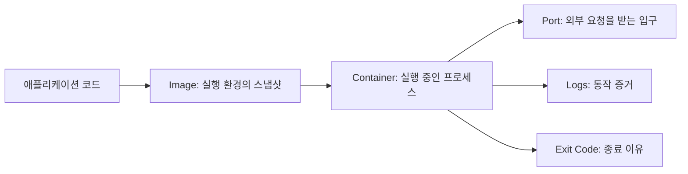

# 1교시 - 1주차에서 Docker로 넘어가는 이유

## 목표

1주차에는 프로그램, 프로세스, 포트, 로그, 설정, 배포라는 말을 배웠다. 2주차부터는 이 개념을 Docker 위에서 실제로 다룬다. 오늘의 출발점은 단순하다.

같은 코드를 여러 사람의 노트북에서 실행하면 왜 서로 다른 문제가 생길까?

## 한 줄 요약

Docker는 "앱을 실행하는 방법"을 사람의 기억이 아니라 이미지와 컨테이너라는 실행 단위로 고정하는 도구다.

## "내 노트북에서는 되는데요"의 정체

팀 프로젝트에서 자주 나오는 말이 있다.

```text
제 컴퓨터에서는 잘 됩니다.
```

이 말은 핑계처럼 들릴 수 있지만, 기술적으로는 꽤 정확한 말일 때가 많다. 실행 환경이 다르면 같은 코드도 다르게 동작한다.

| 차이 | 실제로 생기는 문제 |
|---|---|
| OS 버전 | 파일 경로, 권한, 네트워크 도구가 다르게 동작한다 |
| 언어 런타임 | Python, Node.js, Java 버전 차이로 앱이 시작되지 않는다 |
| 패키지 버전 | 어떤 사람은 최신 라이브러리, 어떤 사람은 오래된 라이브러리를 쓴다 |
| 환경 변수 | DB 주소, API key, 실행 mode가 빠진다 |
| 포트 사용 | 이미 8080 포트를 다른 앱이 쓰고 있다 |

1주차에는 이 문제를 "프로세스가 실행되고 포트를 열고 로그를 남긴다"는 관점으로 봤다. 2주차에는 이 실행 환경을 컨테이너로 포장해본다.

## Docker가 등장한 흐름

Docker가 갑자기 하늘에서 떨어진 것은 아니다. 그 전에 서버 운영은 대략 이런 흐름을 지나왔다.

| 시기 | 대표 방식 | 좋아진 점 | 남은 문제 |
|---|---|---|---|
| 물리 서버 | 서버 한 대에 직접 OS와 앱 설치 | 구조가 단순하다 | 구매와 증설이 느리고 환경 재현이 어렵다 |
| VM | 하나의 물리 장비 위에 여러 가상 서버 실행 | 서버 사용률이 좋아지고 격리가 쉬워졌다 | VM마다 OS가 필요해 무겁고 배포 속도가 느리다 |
| Container | OS kernel은 공유하고 프로세스 실행 환경을 격리 | 빠르게 시작하고 이미지로 배포하기 쉽다 | 네트워크, 저장소, 보안, 운영 규칙을 새로 배워야 한다 |
| Orchestrator | Kubernetes 같은 시스템이 많은 컨테이너를 관리 | 배포, 복구, 확장을 자동화할 수 있다 | 시스템 구조가 복잡해진다 |

Docker는 컨테이너 기술을 개발자가 쓰기 쉬운 경험으로 묶어 대중화했다. 이후 업계는 Docker만의 포맷이 아니라 OCI 표준, containerd, runc 같은 구성요소로 나뉘어 발전했다. 그래서 지금의 Docker는 "컨테이너를 배우는 입구"이면서, 동시에 Kubernetes와 cloud native 운영으로 가는 관문이다.

## 컨테이너를 배우는 이유

컨테이너를 배우는 이유는 명령어 몇 개를 외우기 위해서가 아니다. 실제 운영에서는 다음 질문에 답해야 한다.

- 어떤 버전의 앱이 실행 중인가?
- 실행 중인 프로세스가 왜 죽었는가?
- 로그는 어디에 남았는가?
- 사용자의 요청이 컨테이너까지 도달했는가?
- 같은 이미지를 다른 서버에서도 같은 방식으로 실행할 수 있는가?
- 문제가 생기면 어떤 단위로 중지하고 교체할 수 있는가?

이 질문은 나중에 Kubernetes를 배울 때 그대로 다시 나온다. Kubernetes의 Pod도 결국 컨테이너를 실행하고 관찰하고 교체하는 시스템이기 때문이다.

## 오늘 사용할 멘탈 모델



Image는 실행 가능한 포장이고, Container는 그 포장을 실제로 실행한 결과다.

## 오늘의 체크 질문

아래 문장을 완성해본다.

```text
Docker를 쓰면 좋은 이유는 코드를 마법처럼 좋게 만들어서가 아니라,
__________을/를 팀이 같은 방식으로 다루게 해주기 때문이다.
```

정답에 가까운 단어:

- 실행 환경
- 프로세스 실행 방식
- 포트와 로그 확인 방식
- 배포 단위

## 다음 교시 연결

다음 시간에는 image, container, registry, runtime을 분리해서 본다. 이 네 단어를 섞어 쓰면 Docker 명령어가 전부 비슷해 보인다.
