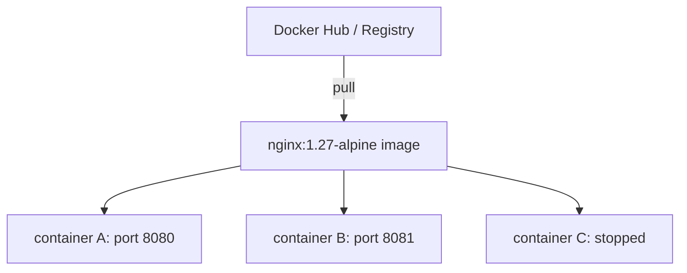
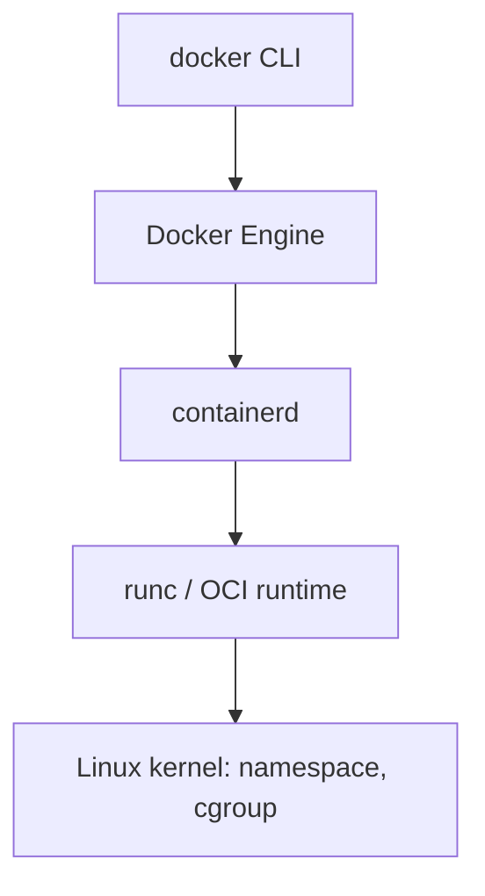

# 2교시 - Image, Container, Runtime 개념 모델

## 목표

Docker를 사용할 때 가장 많이 헷갈리는 부분은 image와 container를 같은 것으로 생각하는 것이다. 이 시간에는 image, container, registry, runtime을 분리해서 이해한다.

## 한 줄 요약

Image는 실행할 재료와 방법을 담은 불변 패키지이고, container는 그 image를 실제 프로세스로 실행한 결과다.

## 아키텍처 그림

## 네 가지 핵심 단어

| 용어 | 역할 | 비유 | 확인 명령 |
|---|---|---|---|
| Image | 실행에 필요한 파일과 메타데이터 묶음 | 앱 실행용 포장 상자 | `docker image ls` |
| Container | image에서 시작된 실행 중이거나 종료된 프로세스 단위 | 포장을 뜯어 실제로 켠 앱 | `docker ps -a` |
| Registry | image를 저장하고 가져오는 원격 저장소 | 앱 이미지 창고 | `docker pull`, `docker push` |
| Runtime | container를 실제로 실행하는 하위 구성요소 | 프로세스를 격리해 켜는 실행기 | `docker info` |

Image는 보통 읽기 전용으로 취급한다. Container는 실행하면서 로그, 상태, 네트워크, 임시 파일 같은 런타임 상태를 가진다.

## Image와 Container의 차이

같은 image에서 여러 container를 만들 수 있다. 같은 프로그램 설치 파일로 여러 번 실행할 수 있는 것과 비슷하다.

중요한 점은 image 이름이 같아도 container는 각각 다른 이름, ID, 포트, 로그, 종료 상태를 가질 수 있다는 것이다.

## Tag는 버전처럼 보이지만 규칙이다

`nginx:1.27-alpine`에서 `nginx`는 image repository 이름이고, `1.27-alpine`은 tag다.

Tag는 사람이 읽기 쉬운 이름표다. 하지만 tag는 언제나 완전한 버전 고정이라고 볼 수 없다. 특히 `latest`는 "최신 안정 버전"이라는 보장이 아니라 저장소가 그렇게 붙인 이름표일 뿐이다.

| 예시 | 의미 | 수업에서의 판단 |
|---|---|---|
| `nginx:latest` | 저장소의 latest 태그 | 재현성 설명에는 부적합 |
| `nginx:1.27-alpine` | nginx 1.27 계열 alpine 기반 이미지 | 오늘 실습에 사용 |
| `my-api:2026-05-19` | 팀이 만든 날짜 기반 태그 | 배포 추적에 유리 |
| `my-api:git-a1b2c3d` | Git commit 기반 태그 | 어떤 코드가 배포됐는지 추적하기 좋음 |

운영에서는 "어떤 image를 실행했는가"가 장애 분석의 출발점이 된다.

## Runtime은 왜 따로 보나

초급 단계에서는 Docker가 모든 것을 해주는 것처럼 보여도 된다. 하지만 조금 더 정확히 보면 Docker Engine 아래에는 containerd와 runc 같은 구성요소가 있다.

이 구조를 지금 완벽히 외울 필요는 없다. 다만 Docker가 단순 GUI 앱이 아니라 Linux kernel의 격리 기능을 사용해 프로세스를 실행한다는 점은 기억한다.

## 컨테이너는 작은 VM인가?

비슷해 보이지만 정확히는 다르다.

| 항목 | VM | Container |
|---|---|---|
| 격리 단위 | 가상 하드웨어와 OS | 프로세스와 파일시스템 관점 |
| OS kernel | VM마다 별도 kernel | host kernel 공유 |
| 시작 속도 | 상대적으로 느림 | 상대적으로 빠름 |
| 이미지 크기 | 보통 큼 | 보통 작음 |
| 운영 관점 | 서버 단위 관리에 가깝다 | 애플리케이션 프로세스 단위 관리에 가깝다 |

Container가 VM보다 항상 좋은 것은 아니다. 보안 격리, 커널 요구사항, 운영 도구, 팀 역량에 따라 VM이 더 맞을 때도 있다. 다만 cloud native 애플리케이션 배포에서는 container가 표준 실행 단위로 널리 쓰인다.

## 흔한 오해

| 오해 | 바로잡기 |
|---|---|
| Image를 실행하면 image가 바뀐다 | 실행 상태는 container에 생긴다 |
| Container 안은 완전히 다른 컴퓨터다 | host kernel을 공유하는 격리된 프로세스에 가깝다 |
| `latest`는 항상 가장 좋은 버전이다 | 운영에서는 재현성이 떨어질 수 있다 |
| Container가 꺼지면 image도 사라진다 | container와 image는 다른 객체다 |

## 다음 교시 연결

이제 개념을 명령어로 연결한다. `docker run`은 pull, create, start의 여러 행동을 한 번에 묶어서 수행할 수 있다.
