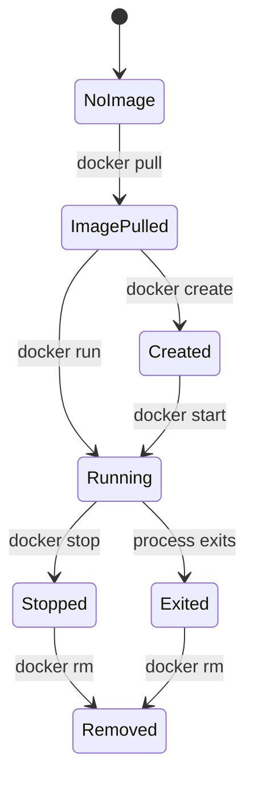

# 3교시 - Docker 명령어 지도와 상태 전이

## 목표

Docker 명령어를 단순 암기 목록으로 보지 않는다. 오늘은 명령어가 image와 container의 상태를 어떻게 바꾸는지 추적한다.

## 한 줄 요약

Docker 명령어는 "image를 가져오고, container를 만들고, 시작하고, 관찰하고, 멈추고, 삭제하는" 상태 전이 도구다.

## 전체 흐름



`docker run`은 편한 명령어라서 여러 단계를 한 번에 처리한다. image가 없으면 pull하고, container를 만들고, 시작한다.

## 오늘 쓸 명령어 지도

| 목적 | 명령 | 읽는 법 |
|---|---|---|
| 이미지 목록 보기 | `docker image ls` | 로컬에 어떤 image가 있는지 본다 |
| 컨테이너 실행 | `docker run ...` | image에서 container를 만들고 시작한다 |
| 실행 중 컨테이너 보기 | `docker ps` | Running 상태만 본다 |
| 모든 컨테이너 보기 | `docker ps -a` | 종료된 container까지 본다 |
| 로그 보기 | `docker logs NAME` | stdout/stderr로 나온 증거를 본다 |
| 내부 명령 실행 | `docker exec NAME COMMAND` | 실행 중인 container 안에서 명령을 실행한다 |
| 중지 | `docker stop NAME` | 정상 종료 신호를 보낸다 |
| 삭제 | `docker rm NAME` | stopped container 객체를 지운다 |

## 이름을 붙이는 이유

컨테이너는 ID를 가진다. 하지만 긴 ID는 사람이 읽기 어렵다. 그래서 수업에서는 `--name`으로 이름을 붙인다.

```bash
docker run --name web-demo nginx:1.27-alpine
```

이름을 붙이면 `docker logs web-demo`, `docker stop web-demo`처럼 읽기 쉬운 명령을 쓸 수 있다.

## Foreground와 background

컨테이너는 터미널 앞에서 실행할 수도 있고, 뒤에서 실행할 수도 있다.

| 방식 | 예시 | 특징 |
|---|---|---|
| foreground | `docker run nginx:1.27-alpine` | 터미널이 컨테이너 로그에 붙는다 |
| detached | `docker run -d nginx:1.27-alpine` | 컨테이너가 뒤에서 실행되고 터미널은 돌아온다 |

서버처럼 계속 떠 있어야 하는 프로그램은 보통 `-d`를 붙여 detached mode로 실행한다.

## 포트 매핑

컨테이너 안의 80번 포트가 자동으로 내 노트북의 80번 포트가 되는 것은 아니다. 외부에서 접근하려면 포트를 연결해야 한다.

```bash
docker run -d --name web-demo -p 8080:80 nginx:1.27-alpine
```

`-p 8080:80`은 다음 뜻이다.

```text
내 노트북의 8080 포트 -> 컨테이너의 80 포트
```

왼쪽은 host port, 오른쪽은 container port다. 이 순서를 자주 헷갈린다.

## 삭제 명령 주의

`docker rm`은 stopped container를 삭제하는 명령이다. Linux 파일 삭제 명령인 `rm`과 이름은 비슷하지만 대상이 다르다.

오늘 실습에서는 다음 규칙을 지킨다.

- `docker ps -a`로 이름을 먼저 확인한다.
- 수업에서 만든 `w2d1-*` 이름의 container만 삭제한다.
- Linux 명령 `rm -rf /` 같은 명령은 절대 실행하지 않는다.
- 잘 모르겠으면 삭제하지 말고 상태를 먼저 확인한다.

## 다음 교시 연결

다음 시간에는 `nginx:1.27-alpine` 컨테이너를 실제로 실행하고, 상태와 로그와 내부 명령을 관찰한다.
