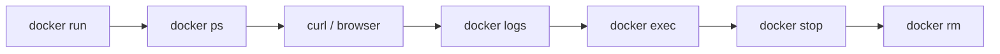

# 4교시 - 라이브 데모: 실행 중인 컨테이너 관찰

## 목표

이 시간은 오후 핸즈온 전에 전체 흐름을 한 번 눈으로 확인하는 시간이다. 명령을 바로 외우기보다 "무엇을 확인해야 하는가"에 집중한다.

## 한 줄 요약

컨테이너를 운영할 때는 실행 여부, 포트 연결, 로그, 내부 프로세스, 종료 상태를 순서대로 확인한다.

## 아키텍처 그림


## 관찰 순서



## 데모 명령

먼저 이미지를 받는다. 이미 로컬에 있으면 "Image is up to date"와 비슷한 메시지가 나온다.

```bash
docker pull nginx:1.27-alpine
```

컨테이너를 실행한다.

```bash
docker run -d --name w2d1-demo -p 8080:80 nginx:1.27-alpine
```

예상 결과는 긴 container ID다.

```text
19a80aef454263832b4d8151cb9791fcc0d45e56c3eb01b9d6ef8ac3fb1466bd
```

실행 중인지 확인한다.

```bash
docker ps --filter name=w2d1-demo
```

확인할 부분:

- `STATUS`가 `Up`인지
- `PORTS`에 `0.0.0.0:8080->80/tcp`와 비슷한 값이 있는지
- `NAMES`가 `w2d1-demo`인지

브라우저에서 `http://localhost:8080`을 열거나 `curl`을 사용한다.

```bash
curl http://localhost:8080
```

성공하면 HTML 안에 다음 문구가 보인다.

```text
Welcome to nginx!
```

로그를 확인한다.

```bash
docker logs --tail 10 w2d1-demo
```

방금 보낸 요청이 로그에 남는다.

```text
"GET / HTTP/1.1" 200
```

컨테이너 내부에서 nginx 버전을 확인한다.

```bash
docker exec w2d1-demo nginx -v
```

예상 결과:

```text
nginx version: nginx/1.27.5
```

정리한다.

```bash
docker stop w2d1-demo
docker rm w2d1-demo
```

## 관찰 포인트

| 질문 | 확인 명령 | 증거 |
|---|---|---|
| 컨테이너가 떠 있는가? | `docker ps` | `STATUS`가 `Up` |
| 요청이 도달했는가? | `curl`, `docker logs` | HTTP 200 로그 |
| 내부 프로그램은 무엇인가? | `docker exec ... nginx -v` | nginx 버전 |
| 컨테이너가 사라졌는가? | `docker ps -a --filter name=w2d1-demo` | 출력 없음 |

## 다음 교시 연결

오후에는 같은 흐름을 각자 직접 실행한다. 실패가 나와도 괜찮다. 중요한 것은 실패 메시지를 읽고 어떤 상태에서 멈췄는지 찾는 것이다.
