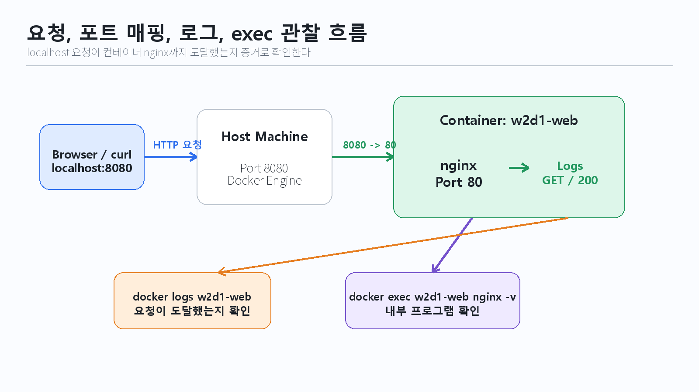

# 5교시 - 핸즈온 1: 컨테이너 실행과 포트 검증

## 목표

`nginx:1.27-alpine` 컨테이너를 직접 실행하고, host port와 container port가 어떻게 연결되는지 검증한다.

## 실습 구조



## 성공 기준

이 실습을 완료하면 다음을 증명할 수 있어야 한다.

- `docker run`으로 컨테이너를 detached mode에서 실행했다.
- `docker ps`에서 컨테이너 이름, 상태, 포트 매핑을 확인했다.
- 브라우저 또는 `curl`로 nginx 응답을 확인했다.
- 포트 충돌이 날 때 다른 host port를 선택할 수 있다.

## Prerequisites

필수:

- Docker Desktop 또는 Docker Engine이 실행 중이어야 한다.
- 터미널에서 `docker version`이 성공해야 한다.
- 인터넷 연결이 가능해야 한다. 첫 실행 시 `nginx:1.27-alpine` 이미지를 받아야 할 수 있다.

확인:

```bash
docker version
docker ps
```

`docker ps`가 권한 오류를 내면 Docker Desktop이 켜져 있는지, WSL 터미널이 Docker Desktop과 연결되어 있는지 확인한다.

## Step 1. 이미지 받기

```bash
docker pull nginx:1.27-alpine
```

예상 결과 중 하나:

```text
Status: Downloaded newer image for nginx:1.27-alpine
```

또는:

```text
Status: Image is up to date for nginx:1.27-alpine
```

이미지가 로컬에 있는지 확인한다.

```bash
docker image ls nginx
```

확인할 부분:

- `REPOSITORY`가 `nginx`
- `TAG`가 `1.27-alpine`

## Step 2. 컨테이너 실행

```bash
docker run -d --name w2d1-web -p 8080:80 nginx:1.27-alpine
```

예상 결과:

```text
긴 container ID가 출력된다.
```

예:

```text
19a80aef454263832b4d8151cb9791fcc0d45e56c3eb01b9d6ef8ac3fb1466bd
```

## Step 3. 실행 상태 확인

```bash
docker ps --filter name=w2d1-web
```

예상 결과의 핵심:

```text
STATUS: Up ...
PORTS: 0.0.0.0:8080->80/tcp
NAMES: w2d1-web
```

여기서 `8080->80`은 host의 8080 포트가 container의 80 포트로 연결된다는 뜻이다.

## Step 4. HTTP 요청으로 검증

브라우저에서 다음 주소를 연다.

```text
http://localhost:8080
```

또는 터미널에서 실행한다.

```bash
curl http://localhost:8080
```

성공하면 다음 문구가 보인다.

```text
Welcome to nginx!
```

## 포트 충돌 해결

이미 8080 포트를 다른 프로그램이 쓰고 있으면 `docker run`에서 다음과 비슷한 오류가 날 수 있다.

```text
Bind for 0.0.0.0:8080 failed: port is already allocated
```

이때는 host port만 바꾼다.

```bash
docker run -d --name w2d1-web -p 8088:80 nginx:1.27-alpine
```

그리고 접속 주소도 바꾼다.

```text
http://localhost:8088
```

## Troubleshooting

| 증상 | 확인 | 해결 |
|---|---|---|
| `docker: command not found` | Docker 설치 여부 | Docker Desktop 설치 후 터미널 재시작 |
| Docker daemon 오류 | `docker version`의 Server 영역 | Docker Desktop 실행 |
| 이름 충돌 | `docker ps -a --filter name=w2d1-web` | 기존 실습 컨테이너를 중지/삭제 |
| 포트 충돌 | 오류 메시지의 `port is already allocated` | `-p 8088:80`처럼 host port 변경 |
| 브라우저 접속 실패 | `docker ps`의 PORTS | 컨테이너가 Up인지, 포트가 맞는지 확인 |

## Cleanup

6교시에서 이어서 사용할 것이므로 지금은 삭제하지 않는다. 단, 수업을 여기서 멈춘다면 아래 명령으로 정리한다.

```bash
docker stop w2d1-web
docker rm w2d1-web
```

정리 확인:

```bash
docker ps -a --filter name=w2d1-web
```

출력이 없으면 정리된 것이다.
