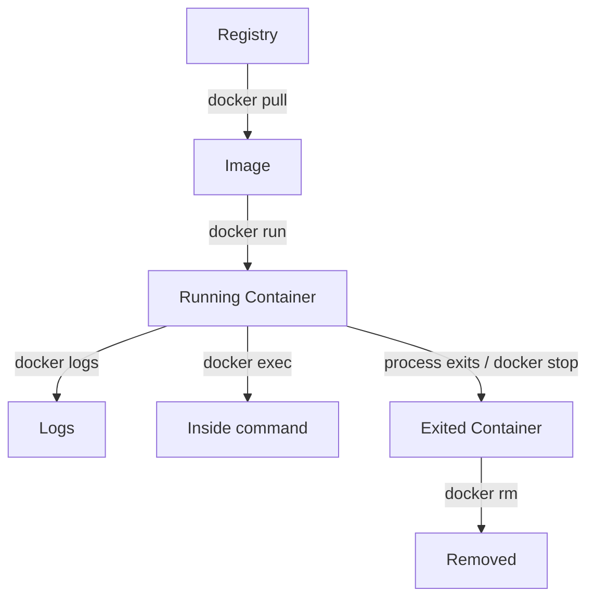

# 8교시 - Day1 핵심 정리와 Image build 예고

## 목표

오늘 다룬 컨테이너 개념과 명령 흐름을 정리하고, 내일 Dockerfile과 image build로 넘어갈 준비를 한다.

## 반드시 알아야 할 10가지

1. Image는 실행 환경을 담은 패키지다.
2. Container는 image를 실행한 프로세스 단위다.
3. 같은 image에서 여러 container를 만들 수 있다.
4. `docker run`은 image가 없으면 pull하고 container를 만들어 시작할 수 있다.
5. `-d`는 컨테이너를 background에서 실행한다.
6. `-p 8080:80`은 host 8080 포트를 container 80 포트로 연결한다.
7. `docker ps`는 실행 중인 container만 보여준다.
8. `docker ps -a`는 종료된 container까지 보여준다.
9. 컨테이너는 main process가 끝나면 종료된다.
10. 삭제 전에는 항상 이름과 상태를 확인한다.

## 오늘의 핵심 다이어그램



## 개념 연결 표

| 오늘 본 것 | 운영에서의 의미 | Kubernetes에서 다시 만나는 이름 |
|---|---|---|
| Image | 어떤 버전의 앱을 배포했는지 추적하는 단위 | Pod template의 container image |
| Container | 실제 실행 중인 앱 프로세스 | Pod 안의 container |
| Port mapping | 외부 요청을 내부 프로세스로 연결 | Service, Ingress |
| Logs | 장애 분석의 첫 번째 증거 | `kubectl logs` |
| Exit code | 프로세스 종료 이유 | CrashLoopBackOff 진단 |
| Cleanup | 실습/운영 환경 오염 방지 | 리소스 삭제와 namespace 정리 |

## Live QA 주제

남은 시간은 질문과 실습 오류 정리에 사용한다. 특히 아래 질문은 오늘 안에 해결한다.

- `docker ps`와 `docker ps -a`의 차이를 말할 수 있는가?
- `8080:80`에서 왼쪽과 오른쪽의 의미를 설명할 수 있는가?
- 컨테이너가 바로 종료됐을 때 실패인지 정상 종료인지 어떻게 구분하는가?
- `docker logs`와 애플리케이션 로그는 어떤 관계인가?
- `docker rm`을 실행하기 전에 무엇을 확인해야 하는가?

## 내일 예고: Dockerfile

오늘은 이미 만들어진 `nginx:1.27-alpine` image를 실행했다. 내일은 직접 image를 만든다.

내일의 핵심 질문:

```text
내 코드를 다른 사람이 같은 방식으로 실행하려면
Dockerfile에 무엇을 적어야 할까?
```

미리 알아두면 좋은 단어:

| 단어 | 내일 볼 의미 |
|---|---|
| `FROM` | 어떤 base image에서 시작할지 |
| `COPY` | 내 파일을 image 안으로 넣는 방법 |
| `RUN` | image를 만들 때 실행하는 명령 |
| `CMD` | container가 시작될 때 실행할 기본 명령 |
| build context | Docker build에 전달되는 파일 범위 |
| cache | 이전 build 결과를 재사용하는 방식 |

## 오늘의 자기 점검

아래 문장을 자기 말로 채운다.

```text
Image와 container의 차이는 ________이다.
컨테이너가 종료되었을 때 나는 먼저 ________ 명령으로 상태를 확인하고,
그 다음 ________ 명령으로 로그를 확인한다.
```
