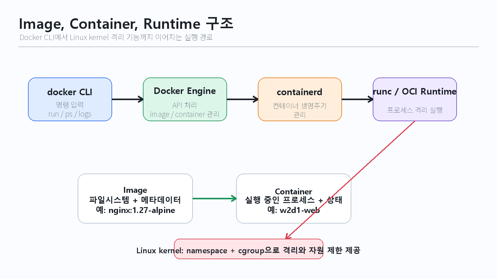

# 2주차 1일차 - 컨테이너 개념 모델

## 목표

컨테이너를 격리된 프로세스와 포장된 실행 환경으로 이해한다. 오늘의 목표는 Docker 명령어를 외우는 것이 아니라, image, container, registry, runtime이 어떤 책임을 나누는지 설명하고 실제 컨테이너를 안전하게 관찰하는 것이다.

## 오늘의 대표 이미지

## 오늘 배울 내용

- Image, Container, Registry, Tag, Runtime의 의미
- Image와 실행 중인 Container의 차이
- run, ps, logs, exec, stop 명령 흐름
- 컨테이너가 팀의 실행 환경 차이를 줄이는 이유
- VM 중심 운영에서 container 중심 운영으로 흐름이 바뀐 이유
- 컨테이너가 바로 종료되거나 포트가 열리지 않을 때 확인할 증거

## 난이도 기준

2주차부터는 1주차보다 밀도를 높인다. 대상 수준은 대학교 이공계 전공자 또는 주니어 엔지니어 초입이다. 명령을 따라 치는 것에서 끝내지 않고, 각 명령이 Docker Engine, containerd, Linux kernel 기능과 어떻게 이어지는지까지 다룬다.

| 수준 | 오늘의 목표 |
|---|---|
| 필수 | image와 container를 구분하고 `docker run`, `ps`, `logs`, `exec`, `stop`, `rm`을 안전하게 실행한다 |
| 표준 | 포트 매핑, foreground/background 실행, container lifecycle을 증거로 설명한다 |
| 심화 | namespace, cgroup, OCI runtime, containerd가 Docker 아래에서 어떤 역할을 하는지 개념적으로 연결한다 |

## 일일 시간표

| 시간 | 교시 | 인덱스 |
|---|---|---|
| 09:00-09:50 | 1교시 | [1주차에서 Docker로 넘어가는 이유](01-week1-to-docker-shift.md) |
| 10:00-10:50 | 2교시 | [Image, Container, Runtime 개념 모델](02-image-container-runtime-model.md) |
| 11:00-11:50 | 3교시 | [Docker 명령어 지도와 상태 전이](03-docker-command-map.md) |
| 12:00-12:50 | 4교시 | [라이브 데모: 실행 중인 컨테이너 관찰](04-live-demo-observe-container.md) |
| 13:00-14:00 | 점심 | 점심시간 |
| 14:00-14:50 | 5교시 | [핸즈온 1: 컨테이너 실행과 포트 검증](05-lab-run-container.md) |
| 15:00-15:50 | 6교시 | [핸즈온 2: logs, exec, stop, remove](06-lab-logs-exec-stop-remove.md) |
| 16:00-16:50 | 7교시 | [진단 랩: 컨테이너가 바로 종료되는 이유](07-diagnose-container-exit.md) |
| 17:00-17:50 | 8교시 | [Day1 핵심 정리와 Image build 예고](08-day1-recap-image-build-preview.md) |

## 랩/미션/데모

공식 `nginx:1.27-alpine` 이미지를 사용해 컨테이너를 실행하고, 브라우저 또는 `curl`로 요청을 보낸 뒤, 상태와 로그와 내부 명령 실행 결과를 근거로 컨테이너의 생명주기를 설명한다.

검증 목표:

- `docker ps`에서 실행 중인 컨테이너를 찾는다.
- `curl http://localhost:8080` 또는 브라우저에서 nginx 응답을 확인한다.
- `docker logs`에서 HTTP 요청 로그를 찾는다.
- `docker exec`로 컨테이너 내부 프로세스 또는 nginx 버전을 확인한다.
- `docker stop`과 `docker rm`으로 실습 컨테이너를 정리한다.

주의: Linux 파일 삭제 명령인 `rm`과 Docker 컨테이너 삭제 명령인 `docker rm`은 다르다. 오늘은 이름을 확인한 실습 컨테이너만 삭제한다.

## 보충/심화 자료

- Docker 명령어 치트시트
- 컨테이너 생명주기 다이어그램
- 심화: namespace와 cgroup
