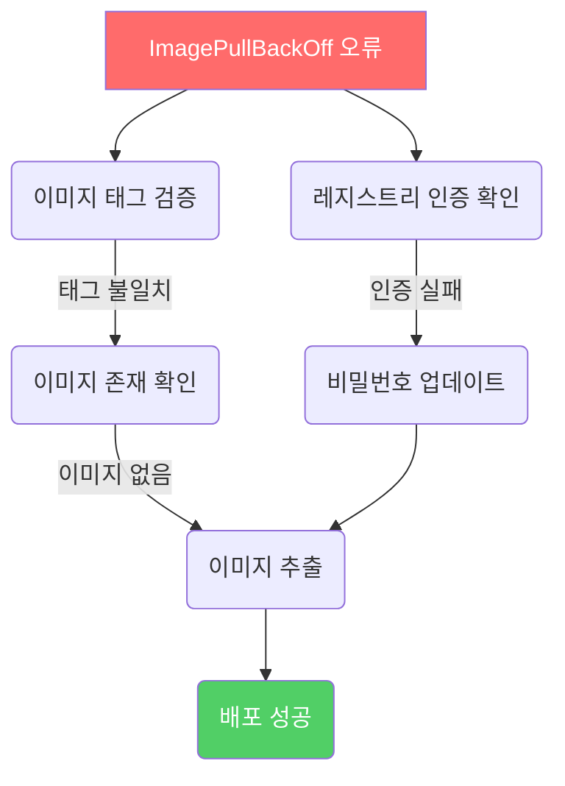

# Deep Dive - 트러블슈팅

## 시나리오 1: CI/CD 파이프라인 트리거 실패

### 트러블슈팅 흐름도

```mermaid
flowchart TD
  BEGIN[파이프라인 트리거 실패] --> CHECK_BRANCH[브랜치 규칙 확인]
  CHECK_BRANCH --> CHECK_WEBHOOK[웹후크 설정 점검]
  CHECK_WEBHOOK --> VERIFY_SETTINGS[파이프라인 설정 검토]
  VERIFY_SETTINGS --> CHECK_RUNNER[GitLab Runner 상태 확인]
  CHECK_RUNNER --> REVIEW_LOGS[에러 로그 분석]
  REVIEW_LOGS --> FINISH[문제 해결 완료]

  style BEGIN fill:#ff6b6b,color:#fff
  style CHECK_BRANCH fill:#ffd43b,color:#000
  style CHECK_WEBHOOK fill:#667eea,color:#fff
  style VERIFY_SETTINGS fill:#868e96,color:#fff
  style CHECK_RUNNER fill:#51cf66,color:#fff
  style REVIEW_LOGS fill:#ffd43b,color:#000
  style FINISH fill:#51cf66,color:#fff

  caption "GitLab CI/CD 파이프라인 트리거 실패 대응 흐름도"
```


### 시나리오 설명

<details>
<summary>문제 상황 보기</summary>

GitLab CI/CD 파이프라인이 특정 브랜치 변경 시 트리거되지 않음

</details>

### 원인 분석

<details>
<summary>원인 분석 보기</summary>

파이프라인 정의 파일에서 branch 규칙이 잘못 설정되거나 웹후크 설정이 누락됨

</details>

### 원인 확인 방법

<details>
<summary>진단 단계 보기</summary>

git status --branch 확인 중인 브랜치 이름 확인

cat .gitlab-ci.yml 파이프라인 정의 파일 확인

curl -X POST "https://gitlab.example.com/api/v4/projects/123/webhooks" --header "PRIVATE-TOKEN: <token>" --data-urlencode "url=https://webhook.example.com" 웹후크 상태 확인

git log --oneline HEAD~5..HEAD 최근 변경 이력 확인

git fetch --prune --unshallow 깊이 제한 해제 후 브랜치 동기화

</details>

### 수정 방법

<details>
<summary>해결 단계 보기</summary>

git branch -m old-branch new-branch 브랜치 이름 수정

sed -i 's/old-branch/new-branch/g' .gitlab-ci.yml 파이프라인 파일 수정

curl -X POST "https://gitlab.example.com/api/v4/projects/123/webhooks" --header "PRIVATE-TOKEN: <token>" --data-urlencode "url=https://webhook.example.com" --data-urlencode "token=webhook_token" 웹후크 재등록

systemctl restart gitlab-runner 서비스 재시작

git push -u origin new-branch 수정 후 푸시

</details>

### 정상 확인 방법

<details>
<summary>검증 단계 보기</summary>

git status --branch 브랜치 상태 재확인

curl -X GET "https://gitlab.example.com/api/v4/projects/123/pipeline?ref=new-branch" --header "PRIVATE-TOKEN: <token>" 파이프라인 트리거 확인

git log --oneline HEAD~5..HEAD 변경 이력 재확인

kubectl logs gitlab-runner-7df8d6d644-2k8xk --namespace=gitlab-runner 로그 확인

git push -u origin new-branch --force-with-lease 푸시 테스트

</details>

---

## 시나리오 2: 도커 컨테이너 배포 실패

### 트러블슈팅 흐름도




### 시나리오 설명

<details>
<summary>문제 상황 보기</summary>

Kubernetes에서 도커 이미지 배포 시 'ImagePullBackOff' 오류 발생

</details>

### 원인 분석

<details>
<summary>원인 분석 보기</summary>

레지스트리 인증 정보 누락 또는 이미지 태그 불일치로 인한 이미지 추출 실패

</details>

### 원인 확인 방법

<details>
<summary>진단 단계 보기</summary>

kubectl describe pod <pod-name> --namespace=production 이벤트 로그 확인

docker pull <image-name>:<tag> 로컬에서 이미지 추출 시도

kubectl get secret <secret-name> --namespace=production -o jsonpath='{.data}' secret 데이터 디코딩

docker inspect <image-name>:<tag> 이미지 메타데이터 확인

docker network inspect bridge 네트워크 설정 확인

</details>

### 수정 방법

<details>
<summary>해결 단계 보기</summary>

kubectl create secret docker-registry <secret-name> --namespace=production --docker-server=<registry> --docker-username=<user> --docker-password=<password> --docker-email=<email> secret 생성

docker tag <image-name>:<tag> <registry>:<project>/<image-name>:<tag> 이미지 태그 수정

docker push <registry>:<project>/<image-name>:<tag> 이미지 재업로드

kubectl apply -f deployment.yaml 배포 정의 파일 재등록

kubectl rollout restart deployment/<deployment-name> 배포 재시작

</details>

### 정상 확인 방법

<details>
<summary>검증 단계 보기</summary>

kubectl get pods --namespace=production -o 'wide' 파드 상태 확인

docker images --format "{{.Repository}}:{{.Tag}}\t{{.ID}}\t{{.Size}}" 이미지 목록 확인

kubectl get secret <secret-name> --namespace=production -o jsonpath='{.data}' secret 데이터 재디코딩

docker inspect <registry>:<project>/<image-name>:<tag> 이미지 메타데이터 재확인

kubectl logs <pod-name> --namespace=production --tail=50 로그 확인

</details>

---

