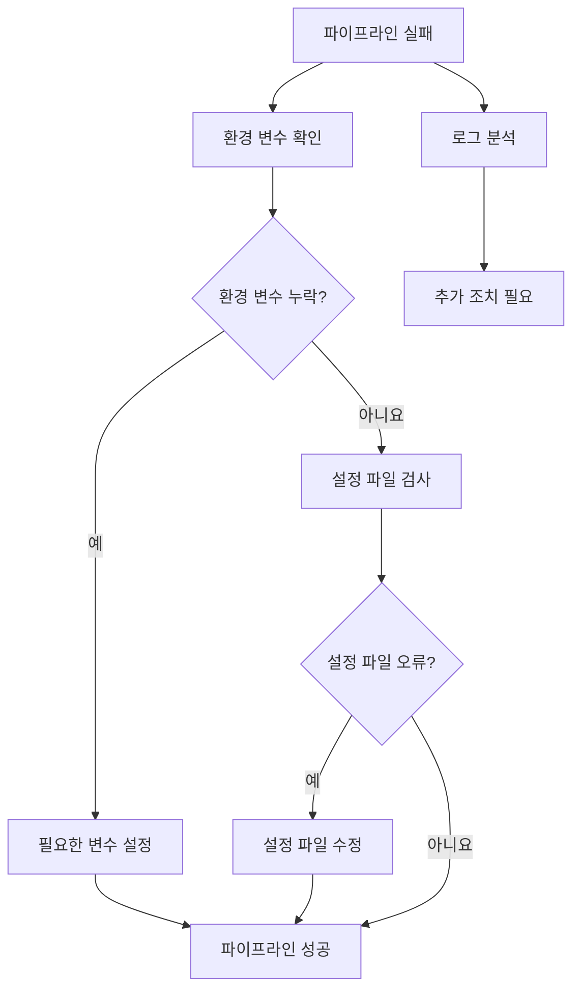
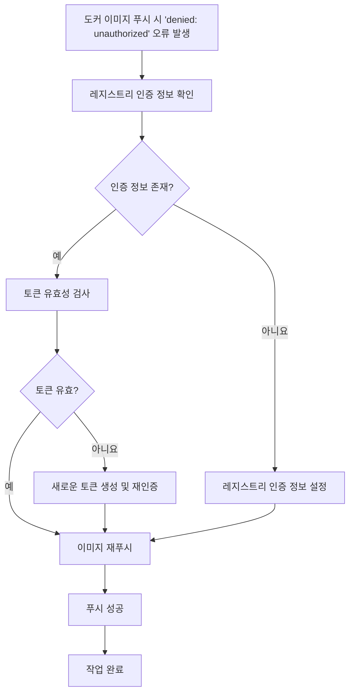

# Deep Dive - 트러블슈팅

## 🔍 시나리오 1: CI/CD 파이프라인 실패

### 트러블슈팅 흐름도

**참고 이미지**:
- [이미지 보기](https://docs.example.com/image1.png)

### 🔍 시나리오 설명

GitHub Actions 파이프라인이 예상치 못한 오류로 중단됨

### 🔬 원인 분석

환경 변수 누락 또는 설정 파일 오류로 인한 파이프라인 실행 중단

### 🔎 원인 확인 방법

GitHub Actions 워크플로우 로그 확인: `gh workflow view <workflow-name> --json logs`

환경 변수 존재 여부 확인: `echo $<VARIABLE_NAME>`

설정 파일 문법 검사: `yml-lint .github/workflows/<workflow-name>.yml`

컨테이너 이미지 빌드 로그 확인: `docker logs <container-id>`

### 🔧 수정 방법

필요한 환경 변수 설정: `export <VARIABLE_NAME>=<value>`

워크플로크 파일 수정 후 재저장: `git add .github/workflows/<workflow-name>.yml`

파이프라인 재실행: `gh workflow run <workflow-name>`

Docker 이미지 재빌드: `docker build -t <image-name> .`

### ✔️ 정상 확인 방법

파이프라인 완료 상태 확인: `gh workflow list`

빌드된 이미지 검증: `docker images | grep <image-name>`

최종 빌드 아рте플랙트 존재 여부 확인: `ls target/`

---

## 🔍 시나리오 2: 컨테이너 레지스트리 연결 실패

### 트러블슈팅 흐름도

**참고 이미지**:
- [이미지 보기](https://docs.example.com/image1.png)

### 🔍 시나리오 설명

Docker 이미지 푸시 시 'denied: unauthorized' 오류 발생

### 🔬 원인 분석

레지스트리 인증 정보 누락 또는 잘못된 토큰 사용

### 🔎 원인 확인 방법

Docker 로그 확인: `docker logs <container-id>`

인증 정보 존재 여부 확인: `cat ~/.docker/config.json`

레지스트리 토큰 유효성 검사: `curl -u <username>:<token> <registry-url>/v2/`

레지스트리 네트워크 연결 확인: `docker info | grep Registry`

### 🔧 수정 방법

신규 토큰 생성 및 설정: `docker login --username <username> --password-stdin`

config.json 파일 수정: `nano ~/.docker/config.json`

레지스트리 인증 정보 재등록: `docker logout && docker login`

이미지 푸시 재시도: `docker push <repository>:<tag>`

### ✔️ 정상 확인 방법

레지스트리 인증 성공 여부 확인: `curl -u <username>:<token> <registry-url>/v2/`

이미지 목록 확인: `docker images`

레지스트리에 이미지 존재 여부 확인: `curl -u <username>:<token> <registry-url>/v2/<repository>/tags/list`

---

