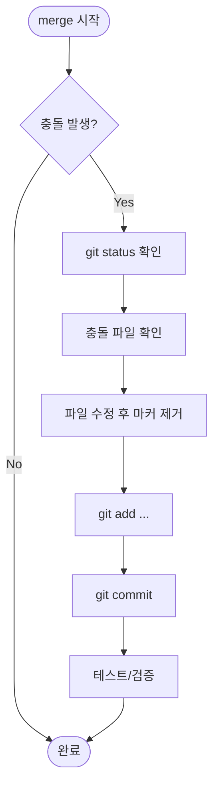
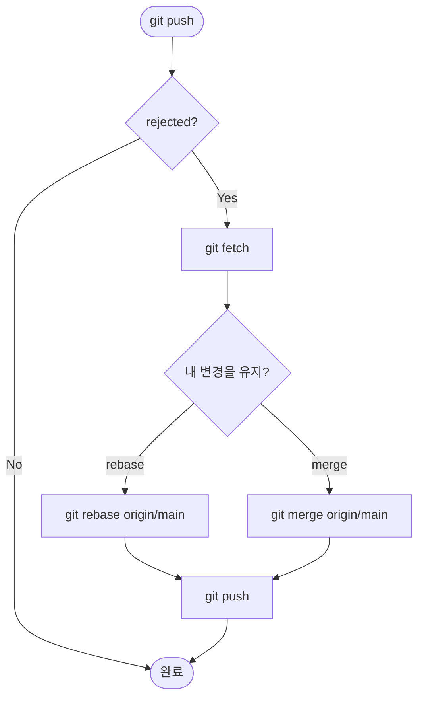

# Deep Dive - 트러블슈팅

## 시나리오 1: 병합(merge) 중 충돌(conflict) 발생

### 트러블슈팅 흐름도



### 시나리오 설명

<details>
<summary>문제 상황 보기</summary>

- 증상: `git merge`를 실행했더니 자동 병합이 멈추고, 파일에 `<<<<<<<`, `=======`, `>>>>>>>` 마커가 생김
- 환경: 두 사람이 같은 파일의 같은 줄 근처를 각자 수정한 뒤 병합 시도
- 에러 메시지(예시):
  - `CONFLICT (content): Merge conflict in README.md`
  - `Automatic merge failed; fix conflicts and then commit the result.`

</details>

### 원인 분석

<details>
<summary>원인 분석 보기</summary>

Git은 "3-way merge"로 자동 병합을 시도합니다. 하지만 같은 파일/같은 영역을 서로 다르게 바꿔서 자동으로 하나를 선택할 수 없는 경우 충돌이 납니다. 충돌은 "실패"가 아니라, 사람이 의도를 선택해야 하는 지점이 드러난 것입니다.

</details>

### 원인 확인 방법

<details>
<summary>진단 단계 보기</summary>

```bash
# Step 1: 현재 충돌 상태 확인
git status

# Step 2: 어떤 파일이 충돌인지 확인
git diff --name-only --diff-filter=U

# Step 3: 충돌 마커 위치 확인
git diff
```

</details>

### 수정 방법

<details>
<summary>해결 단계 보기</summary>

```bash
# Fix step 1: 충돌 파일을 열어 <<<<<<<, =======, >>>>>>> 구간을 의도대로 정리
# (에디터로 수정 후 저장)

# Fix step 2: 충돌 해결 표시
git add README.md

# Fix step 3: 병합 커밋 생성
git commit
```

</details>

### 정상 확인 방법

<details>
<summary>검증 단계 보기</summary>

```bash
# Verify step 1: 충돌이 모두 해결됐는지 확인
git status

# Verify step 2: 병합 커밋/히스토리 확인
git log --oneline --decorate -n 5
```

</details>

---

## 시나리오 2: push가 거절됨 (non-fast-forward)

### 트러블슈팅 흐름도



### 시나리오 설명

<details>
<summary>문제 상황 보기</summary>

- 증상: 로컬에서 커밋 후 `git push` 했는데 원격이 거절함
- 환경: 다른 사람이 먼저 원격(main)에 커밋을 올려서, 로컬 브랜치가 원격보다 뒤쳐짐
- 에러 메시지(예시):
  - `rejected (non-fast-forward)`
  - `Updates were rejected because the remote contains work that you do not have locally.`

</details>

### 원인 분석

<details>
<summary>원인 분석 보기</summary>

원격 브랜치에 로컬에 없는 커밋이 생겼습니다. Git은 기본적으로 "원격 히스토리를 덮어쓰는" push를 막습니다(협업 안전장치). 따라서 먼저 원격 변경을 가져와서(fetch/pull) 내 작업을 그 위에 올려야 합니다.

</details>

### 원인 확인 방법

<details>
<summary>진단 단계 보기</summary>

```bash
# Step 1: 원격 변경 가져오기 (작업트리는 건드리지 않음)
git fetch origin

# Step 2: 내 브랜치와 원격 브랜치 차이 확인
git log --oneline --decorate --graph --left-right main...origin/main

# Step 3: 어떤 파일이 다른지 확인(선택)
git diff main..origin/main
```

</details>

### 수정 방법

<details>
<summary>해결 단계 보기</summary>

```bash
# 방법 A: rebase (히스토리를 깔끔하게 유지)
git rebase origin/main
git push origin main

# 방법 B: merge (병합 커밋으로 합류)
# git merge origin/main
# git push origin main
```

</details>

### 정상 확인 방법

<details>
<summary>검증 단계 보기</summary>

```bash
# Verify step 1: push가 성공했고, 로컬과 원격이 같은지 확인
git fetch origin
git status

# Verify step 2: 원격과 동일한 커밋인지 확인
git rev-parse main
git rev-parse origin/main
```

</details>

---
