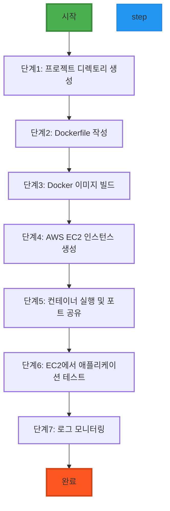

# 👉 Hands-on Lab - Step 1

## 🎯 실습 개요

**제목**: DevOps 실습: Docker와 AWS CLI로 웹 애플리케이션 배포

**목적**: Docker와 AWS CLI를 활용해 웹 애플리케이션을 빌드하고 배포하는 DevOps 프로세스를 실습합니다.

**학습 목표**:
- Docker 컨테이너를 생성하고 실행하는 방법 익히기
- AWS CLI를 사용해 EC2 인스턴스 생성 및 애플리케이션 배포
- CI/CD 파이프라인의 기본 흐름 이해
- 서비스 배포 후 상태 모니터링 방법 학습

**예상 소요 시간**: 45분

**난이도**: Beginner

### 실습 흐름도



**참고 이미지**:
- [이미지 보기](https://docs.example.com/image1.png)
- [이미지 보기](https://docs.example.com/image2.png)

## 📋 사전 요구사항

- Docker Desktop 24.0+ 설치
  - 설치 가이드: https://docs.docker.com/desktop/install/
- AWS CLI 설치 및 설정
  - 설치: https://docs.aws.amazon.com/cli/latest/userguide/getting-started-install.html
  - 설정: https://docs.aws.amazon.com/cli/latest/userguide/cli-configure-quickstart.html
- AWS 계정 생성 (링크 포함)
  - AWS 계정 생성: https://aws.amazon.com/ko/getting-started/

## ⚙️ 환경 설정

Docker Desktop을 실행하고 'Docker Desktop' 아이콘 확인 (https://docs.docker.com/desktop/install/)

AWS CLI 설정: aws configure 명령어로 액세스 키와 리전 설정 (https://docs.aws.amazon.com/cli/latest/userguide/cli-configure-quickstart.html)

---

## 👉 Step 1: 프로젝트 디렉토리 생성

**목표**: 워크스페이스 디렉토리 구조를 준비합니다.

**명령어**:

```bash
mkdir devops-practice && cd devops-practice

```

**예상 출력**:

```

현재 디렉토리가 devops-practice로 변경됨

```

**확인 방법**:

```bash
pwd

```

**문제 해결**:
- 문제: 디렉토리 생성 실패 → sudo 권한 필요: sudo mkdir devops-practice
- 문제: 경로 접근 권한 오류 → chmod 777 devops-practice

