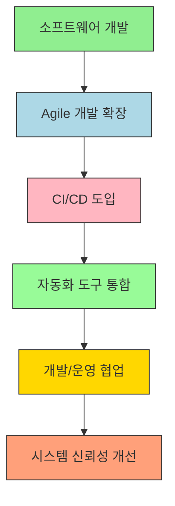
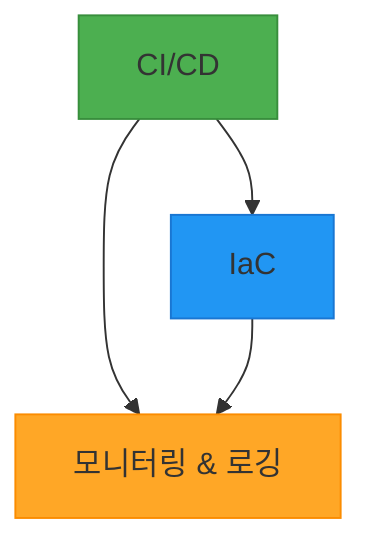

# 서비스 이해 (Service Understanding)

## 📚 1. 배경 정보

DevOps는 소프트웨어 개발(Development)과 IT 운영(Operations)을 통합하여 협업 효율성을 높이고, 제품 배포 속도를 가속화하는 프로세스입니다. Agile 개발의 확장으로 시작되어 CI/CD(Continuous Integration/Continuous Delivery) 및 자동화 도구를 기반으로 하며, 개발자와 운영팀 간의 갈등을 해결하고 시스템 신뢰성을 개선하는 목표를 가집니다.

### 인포그래픽

**참고 이미지**:
- [이미지 보기](https://docs.example.com/image1.png)

## 🔑 2. 핵심 개념

- CI/CD (Continuous Integration/Continuous Delivery)
- Infrastructure as Code (IaC)
- Monitoring & Logging

### 인포그래픽

**참고 이미지**:
- [이미지 보기](https://docs.example.com/ci-cd-iac.png)
- [이미지 보기](https://docs.example.com/monitoring-logging.png)

## ⚖️ 3. 장단점

**장점**:
- 개발 및 운영 팀 간의 협업 효율성 향상
- 빠른 배포 주기와 시스템 안정성 확보
- 자동화를 통한 인력 및 시간 절약

**단점**:
- 새로운 도구 및 프로세스 학습에 시간 소요
- 자동화 과도한 의존 시 수동 점검 소홀 가능성

## 💡 4. 자주 사용되는 사례

1. 지속적 통합/배포(CI/CD)를 통한 빠른 기능 출시
2. 클라우드 인프라스트럭처 관리(IaC)를 통한 자동화
3. 실시간 모니터링 및 로그 분석을 통한 시스템 오류 감지

## 🔗 5. 연관 서비스

- CI/CD
- Infrastructure as Code (IaC)
- Monitoring & Logging

## 📖 6. 공식 문서 링크

- [Microsoft DevOps 문서](https://learn.microsoft.com/ko-kr/devops/)
- [DevOps 인스티튜트 공식 문서](https://www.devopsinstitute.com/what-is-devops/)

