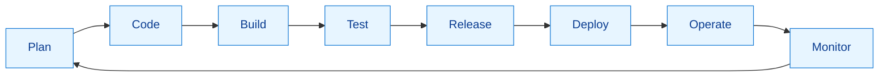
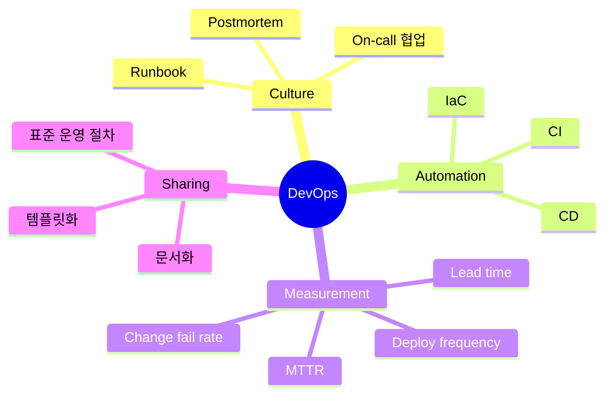

# 서비스 이해 (Service Understanding)

## 1. 배경 정보

배경 정보 보기

### 왜 DevOps가 생겼나 (배경 스토리)

2017년 11월, 8명 규모의 웹팀이 월 1회 정기 배포를 하던 시절을 떠올려 봅시다. 배포 당일(금요일 22:00), 기능은 단순했는데도 장애가 자주 났습니다. 원인은 늘 비슷했습니다.

- 개발 PC에서는 정상인데 운영 서버에서는 실패: 라이브러리 버전/환경 차이
- 배포 절차가 문서가 아니라 "사람 머리"에 있음: 담당자가 없으면 진행 불가
- QA/보안 점검이 막판에 몰림: 배포 직전 수정 -> 더 큰 리스크

이 팀이 경험한 'Before/After'는 DevOps가 해결하려는 문제를 그대로 보여줍니다.

- Before(3개월 평균): 배포 리드타임 10일, 배포 실패 10건 중 3건, MTTR(복구) 90분
- After(6개월 개선): 리드타임 2일, 배포 실패 10건 중 1건, MTTR 20분

핵심은 "도구 하나"가 아니라, 개발과 운영이 같은 목표와 같은 흐름(피드백 루프)을 공유하도록 프로세스/자동화/문화가 함께 바뀐 것입니다.

### 인포그래픽

## 2. 핵심 개념

핵심 개념 보기

DevOps는 보통 "CALMS"로 요약합니다. 이 5개가 동시에 돌아가야 실무에서 효과가 납니다.

- Culture(문화): blame 대신 learn. 장애를 개인 탓이 아니라 시스템 결함으로 보고 재발 방지에 투자
- Automation(자동화): 빌드/테스트/배포/롤백을 스크립트로 표준화해서 재현성 확보
- Lean(린): 작은 배치, 짧은 피드백. 크게 한 번에 배포하지 않고 작게 자주 배포
- Measurement(측정): 배포 빈도, 변경 리드타임, 변경 실패율, MTTR 같은 지표로 개선을 확인
- Sharing(공유): 운영 노하우/장애 포스트모템/런북을 팀 자산으로 축적

그리고 "DevOps 파이프라인" 관점에서 자주 쓰는 용어는 아래입니다.

- CI(Continuous Integration): 작은 변경을 자주 통합하고 자동 테스트로 품질을 확인
- CD(Continuous Delivery/Deployment): 배포 가능한 상태를 지속적으로 유지(Delivery)하거나 자동 배포(Deployment)
- Trunk-based development: 긴 브랜치 대신 짧은 브랜치/빠른 병합으로 통합 비용을 낮춤
- IaC(Infrastructure as Code): 인프라를 코드로 관리하여 재현성/검토/롤백을 가능하게 함
- Observability(관찰성): 로그/메트릭/트레이싱으로 "지금 무슨 일이 벌어지는지"를 빠르게 설명 가능하게 함

### 인포그래픽

## 3. 장단점

장단점 보기

**장점**:
- 배포 리스크를 줄이면서 속도를 높임: "크게 한 번" 대신 "작게 자주"로 실패의 폭을 제한
- 재현 가능한 운영: 사람의 기억이 아니라 코드/파이프라인/런북으로 운영 품질을 표준화
- 장애 대응이 빨라짐: 모니터링/로그/롤백 절차가 자동화될수록 MTTR이 줄어듦
- 협업 비용 감소: 개발-운영 간 요청/승인/전달 과정을 줄이고 같은 목표로 정렬

**단점**:
- 초기 투자 비용: CI/CD, 관찰성, IaC, 보안 자동화는 만들고 유지하는 비용이 필요
- 문화 충돌 가능: "내 일/네 일" 경계를 깨야 해서 역할/책임 재정의가 필요
- 지표 오남용 위험: 배포 빈도만 올리고 품질을 희생하면 오히려 실패율이 증가할 수 있음

## 4. 자주 사용되는 사례

사용 사례 보기

1. 빠른 제품 실험이 필요한 팀: 기능 플래그/자동 배포/모니터링을 통해 실험 -> 측정 -> 개선 루프를 단축
2. 운영 안정성이 중요한 서비스: 배포 전 자동 테스트/정책 검사, 배포 후 자동 검증과 롤백으로 장애 확산을 방지
3. 여러 팀이 하나의 플랫폼을 공유하는 조직: 표준 템플릿(파이프라인, IaC, 모니터링)을 제공해 팀별 편차를 줄임

## 5. 연관 서비스

연관 서비스 보기

- 형상관리: Git, GitHub/GitLab/Bitbucket
- CI/CD: GitHub Actions, Jenkins, GitLab CI, Argo Workflows
- 컨테이너/오케스트레이션: Docker, Kubernetes
- IaC: Terraform, CloudFormation
- 관찰성: Prometheus, Grafana, Loki/ELK, OpenTelemetry
- 대안/보완 개념: SRE(Site Reliability Engineering), Platform Engineering

## 6. 공식 문서 링크

- [Git Documentation](https://git-scm.com/doc)
- [Git Reference](https://git-scm.com/docs)
- [Git Book (Pro Git)](https://git-scm.com/book/en/v2)
- [GitHub Docs](https://docs.github.com/)
- [GitHub Actions Documentation](https://docs.github.com/actions)
- [Docker Docs (다음 일차 예고)](https://docs.docker.com/)

## 7. 추가 자료

- 팀 내 공유 문서 템플릿: 배포 체크리스트, 장애 포스트모템 템플릿, 런북(운영 절차) 템플릿
