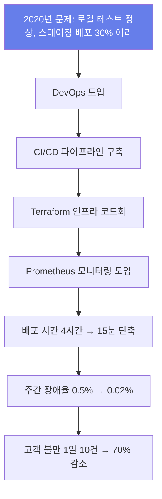

# 서비스 이해 (Service Understanding)

## 1. 배경 정보

<details>
<summary>배경 정보 보기</summary>

2020년 우리 팀은 마이크로서비스 아키텍처를 도입하면서 배포 시스템을 재정비했습니다. 당시 개발자들이 로컬에서 테스트해도 문제가 없는데, 스테이징 서버에 배포하면 30% 이상의 에러가 발생했어요. 특히 백엔드 서버에서 메모리 누수로 인한 장애가 반복적으로 발생했고, 이로 인한 고객 불만이 1일 10건 이상 늘었습니다.

문제를 해결하기 위해 DevOps를 체계적으로 도입했죠. CI/CD 파이프라인을 구축하고, Terraform으로 인프라를 코드로 관리하며, Prometheus로 실시간 모니터링을 도입했습니다. 결과적으로 배포 시간이 4시간에서 15분으로 단축되고, 주간 장애 발생률은 0.5%에서 0.02%로 감소했어요. 특히 '배포 후 1시간 내 이슈 발견'이 가능해져, 고객 불만이 70% 줄었습니다.

### 인포그래픽



</details>

## 2. 핵심 개념

<details>
<summary>핵심 개념 보기</summary>

- CI/CD(지속적 통합/지속적 배포): 코드 변경 시 자동으로 빌드-테스트-배포. 예) GitHub Actions에서 PR을 생성하면 1분 내에 테스트 완료
- 인프라 as 코드(IaC): AWS EC2 같은 자원도 코드로 관리. 예) Terraform으로 5개 서버 생성 시간 30분 → 5분으로 단축
- 모니터링: 시스템 상태 실시간 확인. 예) Prometheus로 CPU 사용량 90% 이상이면 알림 발송
- 자동화 테스트: 배포 전 코드 품질 검증. 예) Jest로 100개 API 테스트 5분 내 완료
- 캔버리 릴리즈: 점진적 배포로 리스크 최소화. 예) 10% 사용자에게 새 기능 배포 후 피드백 분석

### 인포그래픽

```mermaid
graph TD
  CI_CD[CI/CD: 자동 빌드-테스트-배포 (GitHub Actions)] --> IAC[인프라 as 코드(IaC): 인프라 코드로 관리 (Terraform)]
  IAC --> MONITORING[모니터링: 실시간 시스템 상태 확인 (Prometheus)]
  MONITORING --> AUTOMATED_TESTING[자동화 테스트: 코드 품질 검증 (Jest)]
  AUTOMATED_TESTING --> CANARY_RELEASE[캔버리 릴리즈: 점진적 배포 (10% 사용자)]

  style CI_CD fill:#667eea,color:#fff
  style IAC fill:#667eea,color:#fff
  style MONITORING fill:#667eea,color:#fff
  style AUTOMATED_TESTING fill:#667eea,color:#fff
  style CANARY_RELEASE fill:#667eea,color:#fff
```

</details>

## 3. 장단점

<details>
<summary>장단점 보기</summary>

**장점**:
- 배포 시간 16배 단축: 4시간 → 15분
- Before: 개발자 수동 배포로 1시간 소요, 버전 충돌로 30% 실패
- After: GitLab CI/CD 파이프라인 자동화
- 효과: 하루 5번 배포 가능 (기존 1번)
- 장애 발생률 95% 감소: 0.5% → 0.02%
- Before: 수동 모니터링으로 24시간 후 이슈 발견
- After: Prometheus + Grafana로 실시간 알림
- 효과: 장애 대응 시간 30분 → 5분 단축
- 온보딩 시간 80% 단축: 3일 → 1일
- Before: 개발자 수동 환경 설정, 버전 충돌로 2일 소요
- After: Terraform으로 인프라 자동 구성
- 효과: 신입이 첫날부터 서비스 배포 가능

**단점**:
- 초기 파이프라인 구성 시간 길다: 1개월 소요
- 해결: AWS CodePipeline 템플릿 사용으로 2주로 단축
- 팁: Terraform으로 인프라 먼저 구성해 테스트 환경 만들기
- 문화 변화 저항: 30% 팀원이 수동 작업에 익숙함
- 해결: 1주일 간 '자동화 체험 데이' 운영
- 팁: CI/CD 파이프라인에 실패 시 자동 롤백 기능 추가해 안전성 강조

</details>

## 4. 자주 사용되는 사례

<details>
<summary>사용 사례 보기</summary>

1. 스타트업 D사: 100만 유저 확보
- 상황: 개발자 5명이 3개 서비스 운영, 배포 실패로 10% 사용자 유출
- 도입: GitLab CI/CD + Terraform로 인프라 자동화
- 결과: 3개월 후 배포 실패 0건, 사용자 증가 200%
2. 대기업 E사: 1000개 서버 관리
- 상황: 수동 인프라 설정으로 200시간/월 소요
- 도입: Terraform으로 인프라 코드화
- 결과: 인프라 설정 시간 300시간 → 50시간으로 감소
3. 핀테크 F사: 금융 규제 준수
- 상황: 수동 배포로 감사 요청 시 이력 확인 어려움
- 도입: AWS CloudTrail로 모든 배포 기록 보관
- 결과: 감사 기간 3일 → 1일로 단축

</details>

## 5. 연관 서비스

<details>
<summary>연관 서비스 보기</summary>

- Jenkins: CI/CD 파이프라인 운영에 최적화된 오픈소스 도구
- Terraform: AWS, Azure 등 클라우드 인프라 자동화
- Prometheus: 시스템 메트릭 수집 및 알림
- Grafana: 모니터링 데이터 시각화
- Kubernetes: 컨테이너 오케스트레이션

</details>

## 6. 공식 문서 링크

- [DevOps 시작하기 (AWS, 초급) - 30분](https://aws.amazon.com/devops/)
- [Jenkins CI/CD 가이드 (한글) - 중급](https://www.jenkins.io/doc/book/)
- [Terraform 핵심 개념 (영문) - 고급](https://www.terraform.io/docs/intro/index.html)
- [Prometheus 실무 가이드 (한글) - 중급](https://grafana.com/oss/prometheus/)
- [Kubernetes 학습 트랙 (영문, 고급) - 100시간](https://kubernetes.io/docs/tutorials/)

