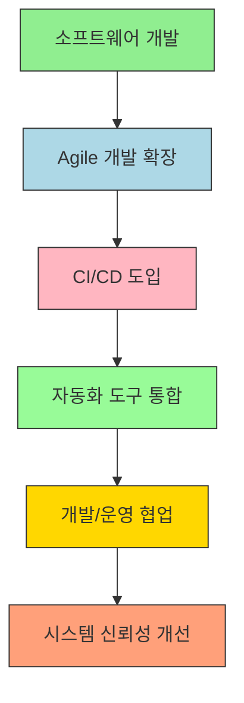

# 📘 Week 1 - Day 1

<div style="display: flex; justify-content: space-between; align-items: center; padding: 10px; background: linear-gradient(135deg, #667eea 0%, #764ba2 100%); border-radius: 10px; color: white;">
  <span style="color: rgba(255,255,255,0.5); padding: 8px 16px;">⬅️ 이전</span>
  <a href="../README.md" style="color: white; text-decoration: none; padding: 8px 16px; background: rgba(255,255,255,0.3); border-radius: 5px; font-weight: bold;">🏠 목차</a>
  <a href="deep_dive.md" style="color: white; text-decoration: none; padding: 8px 16px; background: rgba(255,255,255,0.2); border-radius: 5px; font-weight: bold;">다음: 🔍 Deep Dive ➡️</a>
</div>

---

# 서비스 이해 (Service Understanding)

## 📚 1. 배경 정보

DevOps는 소프트웨어 개발(Development)과 IT 운영(Operations)을 통합하여 협업 효율성을 높이고, 제품 배포 속도를 가속화하는 프로세스입니다. 이는 Agile 개발의 확장으로 시작되었으며, CI/CD(Continuous Integration/Continuous Delivery) 및 자동화 도구를 기반으로 합니다. 개발자와 운영팀 간의 갈등을 해결하고 시스템 신뢰성을 개선하는 것이 목표입니다.

### 💬 설명
DevOps는 "개발자와 운영팀이 함께 일하는 방식"을 말합니다. 예를 들어, 기존에 개발팀이 앱을 만들고, 운영팀이 서버에 올리는 과정이 별도로 진행되었지만, DevOps는 이 두 과정을 하나로 통합해 앱 개발부터 배포까지 모든 단계를 자동화하고 협업하는 방식입니다. 이는 앱 개발 속도를 높이고, 실수를 줄이며, 시스템을 안정적으로 운영할 수 있도록 합니다.

### 인포그래픽



### 실생활 비유
DevOps는 "집 짓기"를 예로 생각해보세요. 개발팀이 집 설계도를 만들고, 운영팀이 집을 짓는 과정을 별도로 진행하면 시간이 많이 걸립니다. DevOps는 설계도와 건설을 동시에 진행하고, 설계도를 바탕으로 자동으로 집을 짓는 방식입니다. 이렇게 하면 시간이 절약되고, 집의 상태를 실시간으로 확인할 수 있습니다.

### 참고 자료
- [Microsoft DevOps 문서](https://learn.microsoft.com/ko-kr/devops/)에서 DevOps의 정의와 배경을 확인할 수 있습니다.
- [DevOps 인스티튜트 공식 문서](https://www.devopsinstitute.com/what-is-devops/)에서 DevOps의 역사와 핵심 원칙을 읽을 수 있습니다.

## 🔑 2. 핵심 개념

### 1. CI/CD (Continuous Integration/Continuous Delivery)
**정의**: 코드를 자동으로 통합하고 배포하는 프로세스입니다. 개발자들이 변경 사항을 빈번히 통합하고, 자동 테스트를 통해 안정성을 유지하는 방식입니다.

**예시**: 기존에 개발자가 앱을 수정하고, 운영팀이 서버에 올리는 과정이 별도로 진행되었지만, CI/CD는 개발자가 코드를 변경하면 자동으로 테스트하고, 문제가 없다면 바로 배포하는 방식입니다. 예를 들어, 넷플릭스는 CI/CD를 통해 매일 수천 번의 코드 변경을 자동으로 테스트하고 배포합니다.

**실생활 비유**: CI/CD는 "집을 짓는 데 필요한 자재를 매일 조금씩 배달하고, 매일 지붕을 씌우는 방식"입니다. 이렇게 하면 집을 빠르게 완성할 수 있고, 문제가 발생하면 즉시 수정할 수 있습니다.

### 2. Infrastructure as Code (IaC)
**정의**: 인프라스트럭처(서버, 데이터베이스 등)를 코드로 작성하는 개념입니다. 코드를 통해 서버 환경을 자동으로 구성하고 관리하는 방식입니다.

**예시**: AWS나 Azure 같은 클라우드 서비스에서 서버를 만들 때, IaC를 사용하면 코드로 서버 설정을 정의하고, 필요할 때 자동으로 서버를 생성합니다. 예를 들어, IaC를 사용하면 "이 서버에 8GB 메모리, 2개의 CPU, MySQL 데이터베이스를 설치하라"는 코드로 서버를 자동으로 구성할 수 있습니다.

**실생활 비유**: IaC는 "집을 짓는 데 사용하는 설계도"를 코드로 만든 것처럼 생각해보세요. 설계도를 바탕으로 건물을 자동으로 짓는 방식입니다. 이렇게 하면 설계도를 바꿔도 건물을 쉽게 재구성할 수 있습니다.

### 3. Monitoring & Logging
**정의**: 앱이나 시스템의 상태를 실시간으로 확인하고, 문제가 발생했을 때 로그를 분석해 원인을 파악하는 방식입니다.

**예시**: 앱이 실행 중에 오류가 발생하면, Monitoring은 "어떤 서버에서 오류가 발생했는지"를 알려주고, Logging은 "어떤 코드에서 문제가 생겼는지"를 로그 파일로 제공합니다. 예를 들어, Google은 Monitoring을 통해 전 세계 서버의 상태를 실시간으로 확인하고, Logging을 통해 문제 발생 시 원인을 분석합니다.

**실생활 비유**: Monitoring & Logging은 "집의 전기 사용량을 실시간으로 확인하고, 전기 과다 사용 시 원인을 파악하는 것"입니다. 이렇게 하면 집을 안전하게 관리할 수 있습니다.

### 인포그래픽

```mermaid
graph TD
  A[CI/CD] --> B[인프라스트럭처 애스 코드(IaC)]
  A --> C[모니터링 & 로깅]
  B --> C
  style A fill:#4CAF50,stroke:#388E3C
  style B fill:#2196F3,stroke:#1976D2
  style C fill:#FFA726,stroke:#FB8C00

```

### 참고 자료
- [CI/CD 개념 설명](https://learn.microsoft.com/ko-kr/devops/continuous-integration/continuous-integration)에서 Microsoft의 CI/CD 정의를 확인할 수 있습니다.
- [IaC 개념 설명](https://learn.microsoft.com/ko-kr/devops/infrastructure-as-code/what-is-infrastructure-as-code)에서 IaC의 구체적 적용 방식을 읽을 수 있습니다.
- [Monitoring & Logging 개념 설명](https://learn.microsoft.com/ko-kr/devops/monitoring/)에서 Monitoring & Logging의 역할을 확인할 수 있습니다.

## ⚖️ 3. 장단점

### ✅ 장점
- **협업 효율성 향상**: 개발팀과 운영팀이 같은 목표를 위해 협업할 수 있어, 소통이 원활합니다. 예를 들어, 개발팀이 서버에 문제를 발견하면 운영팀이 즉시 대응할 수 있습니다.
- **빠른 배포 주기**: CI/CD를 통해 코드 변경을 즉시 테스트하고 배포할 수 있어, 앱을 빠르게 업데이트할 수 있습니다. 예를 들어, Netflix는 매일 수천 번의 코드 변경을 자동으로 배포합니다.
- **시스템 안정성 확보**: 자동화 도구를 사용해 실수를 줄이고, 시스템을 안정적으로 운영할 수 있습니다. 예를 들어, IaC를 통해 서버 설정을 코드로 관리하면, 설정 오류를 줄일 수 있습니다.
- **인력 및 시간 절약**: 자동화 도구를 사용해 반복 작업을 줄이고, 인력이 다른 작업에 집중할 수 있습니다. 예를 들어, Monitoring을 통해 실시간으로 문제를 감지하면, 수동 점검을 줄일 수 있습니다.

### ⚠️ 단점
- **학습 시간 필요**: CI/CD, IaC, Monitoring & Logging 등 새로운 도구와 프로세스를 배우는 시간이 필요합니다. 예를 들어, GitHub Actions를 사용해 CI/CD를 설정하려면, 기본적인 Git 기능을 알아야 합니다.
- **자동화 의존도**: 자동화 도구에 너무 의존하면, 수동 점검을 소홀히 할 수 있습니다. 예를 들어, Monitoring 도구에만 의존하면, 시스템 문제가 발생했을 때 수동으로 확인하는 과정이 생략될 수 있습니다.
- **복잡한 설정**: IaC를 사용하면, 코드로 인프라를 구성해야 하므로, 설정 오류가 발생할 수 있습니다. 예를 들어, Terraform을 사용해 서버를 구성하면, 코드에 오류가 있으면 서버가 정상적으로 동작하지 않을 수 있습니다.

### 참고 자료
- [DevOps의 장단점](https://www.devopsinstitute.com/what-is-devops/)에서 DevOps의 장단점을 읽을 수 있습니다.

## 💡 4. 자주 사용되는 사례

### 1. 지속적 통합/배포(CI/CD)
**설명**: 개발자가 코드 변경을 자동으로 통합하고, 테스트 후 바로 배포하는 방식입니다. 이는 앱의 업데이트 속도를 높이고, 실수를 줄입니다.
- **실무 예시**: 구글은 CI/CD를 통해 매일 수천 번의 코드 변경을 자동으로 테스트하고 배포합니다.
- **비유**: "집을 짓는 데 필요한 자재를 매일 조금씩 배달하고, 매일 지붕을 씌우는 방식"입니다.

### 2. 클라우드 인프라스트럭처 관리(IaC)
**설명**: 인프라스트럭처(서버, 데이터베이스 등)를 코드로 작성해 자동으로 구성하는 방식입니다. 이는 서버 설정 오류를 줄이고, 효율적인 관리를 가능하게 합니다.
- **실무 예시**: AWS에서 IaC를 사용해 서버를 자동으로 구성하고, 필요할 때 즉시 확장할 수 있습니다.
- **비유**: "집을 짓는 데 사용하는 설계도"를 코드로 만든 것처럼 생각해보세요. 설계도를 바탕으로 건물을 자동으로 짓는 방식입니다.

### 3. 실시간 모니터링 및 로그 분석
**설명**: 앱이나 시스템의 상태를 실시간으로 확인하고, 문제가 발생했을 때 로그를 분석해 원인을 파악하는 방식입니다. 이는 시스템을 안정적으로 운영하는 데 도움이 됩니다.
- **실무 예시**: AWS CloudWatch는 시스템의 상태를 실시간으로 확인하고, 로그를 분석해 문제 원인을 파악합니다.
- **비유**: "집의 전기 사용량을 실시간으로 확인하고, 전기 과다 사용 시 원인을 파악하는 것"입니다.

### 참고 자료
- [CI/CD 사례](https://learn.microsoft.com/ko-kr/devops/continuous-integration/continuous-integration)에서 Microsoft의 CI/CD 사례를 확인할 수 있습니다.
- [IaC 사례](https://learn.microsoft.com/ko-kr/devops/infrastructure-as-code/what-is-infrastructure-as-code)에서 IaC의 실제 적용 방식을 읽을 수 있습니다.
- [Monitoring & Logging 사례](https://learn.microsoft.com/ko-kr/devops/monitoring/)에서 Monitoring & Logging의 활용 사례를 확인할 수 있습니다.

## 🔗 5. 연관 서비스

### 1. CI/CD
- **설명**: 코드를 자동으로 통합하고 배포하는 프로세스입니다. DevOps의 핵심 기능 중 하나입니다.
- **실무 예시**: GitHub Actions, Jenkins, Azure DevOps 등이 CI/CD 도구로 사용됩니다.

### 2. Infrastructure as Code (IaC)
- **설명**: 인프라스트럭처(서버, 데이터베이스 등)를 코드로 작성하는 개념입니다. IaC는 자동화된 인프라 관리를 가능하게 합니다.
- **실무 예시**: Terraform, AWS CloudFormation, Azure Resource Manager 등이 IaC 도구로 사용됩니다.

### 3. Monitoring & Logging
- **설명**: 앱이나 시스템의 상태를 실시간으로 확인하고, 로그를 분석해 원인을 파악하는 방식입니다. 시스템 안정성을 확보하는 데 필수적입니다.
- **실무 예시**: Prometheus, Grafana, AWS CloudWatch, Azure Monitor 등이 Monitoring & Logging 도구로 사용됩니다.

### 참고 자료
- [CI/CD 도구](https://learn.microsoft.com/ko-kr/devops/continuous-integration/continuous-integration)에서 CI/CD 도구를 확인할 수 있습니다.
- [IaC 도구](https://learn.microsoft.com/ko-kr/devops/infrastructure-as-code/what-is-infrastructure-as-code)에서 IaC 도구를 읽을 수 있습니다.
- [Monitoring & Logging 도구](https://learn.microsoft.com/ko-kr/devops/monitoring/)에서 Monitoring & Logging 도구를 확인할 수 있습니다.

## 📖 6. 공식 문서 링크

- [Microsoft DevOps 문서](https://learn.microsoft.com/ko-kr/devops/)
- [DevOps 인스티튜트 공식 문서](https://www.devopsinstitute.com/what-is-devops/)

---

<div style="text-align: center; padding: 20px; background: linear-gradient(135deg, #f093fb 0%, #f5576c 100%); border-radius: 10px; color: white; margin: 20px 0;">
  <h3 style="margin: 0 0 10px 0;">🎓 Week 1 - Day 1 학습 완료!</h3>
  <p style="margin: 0; opacity: 0.9;">다음 단계로 계속 진행하세요</p>
</div>

<div style="display: flex; justify-content: space-between; align-items: center; padding: 15px; background: linear-gradient(135deg, #667eea 0%, #764ba2 100%); border-radius: 10px;">
  <span style="color: rgba(255,255,255,0.5); padding: 10px 20px;">⬅️ 이전</span>
  <a href="../README.md" style="color: white; text-decoration: none; padding: 10px 20px; background: rgba(255,255,255,0.3); border-radius: 5px; font-weight: bold; font-size: 14px;">🏠<br/><span style="font-size: 12px;">목차로</span></a>
  <a href="deep_dive.md" style="color: white; text-decoration: none; padding: 10px 20px; background: rgba(255,255,255,0.2); border-radius: 5px; font-weight: bold; font-size: 14px;">다음 ➡️<br/><span style="font-size: 12px; opacity: 0.8;">🔍 Deep Dive</span></a>
</div>

---

<div style="text-align: center; padding: 10px; color: #666; font-size: 12px;">
  <p>💡 <strong>Tip:</strong> 실습 중 문제가 발생하면 공식 문서를 참고하세요</p>
  <p style="margin-top: 5px;">📅 Week 1 Day 1 | 🎯 DevOps 6개월 교육과정</p>
</div>

---

<div style="text-align: center; padding: 20px; background: linear-gradient(135deg, #f093fb 0%, #f5576c 100%); border-radius: 10px; color: white; margin: 20px 0;">
  <h3 style="margin: 0 0 10px 0;">🎓 Week 1 - Day 1 학습 완료!</h3>
  <p style="margin: 0; opacity: 0.9;">다음 단계로 계속 진행하세요</p>
</div>

<div style="display: flex; justify-content: space-between; align-items: center; padding: 15px; background: linear-gradient(135deg, #667eea 0%, #764ba2 100%); border-radius: 10px;">
  <span style="color: rgba(255,255,255,0.5); padding: 10px 20px;">⬅️ 이전</span>
  <a href="../README.md" style="color: white; text-decoration: none; padding: 10px 20px; background: rgba(255,255,255,0.3); border-radius: 5px; font-weight: bold; font-size: 14px;">🏠<br/><span style="font-size: 12px;">목차로</span></a>
  <a href="deep_dive.md" style="color: white; text-decoration: none; padding: 10px 20px; background: rgba(255,255,255,0.2); border-radius: 5px; font-weight: bold; font-size: 14px;">다음 ➡️<br/><span style="font-size: 12px; opacity: 0.8;">🔍 Deep Dive</span></a>
</div>


---

<div style="text-align: center; padding: 20px; background: linear-gradient(135deg, #f093fb 0%, #f5576c 100%); border-radius: 10px; color: white; margin: 20px 0;">
  <h3 style="margin: 0 0 10px 0;">🎓 Week 1 - Day 1 학습 완료!</h3>
  <p style="margin: 0; opacity: 0.9;">다음 단계로 계속 진행하세요</p>
</div>

<div style="display: flex; justify-content: space-between; align-items: center; padding: 15px; background: linear-gradient(135deg, #667eea 0%, #764ba2 100%); border-radius: 10px;">
  <span style="color: rgba(255,255,255,0.5); padding: 10px 20px;">⬅️ 이전</span>
  <a href="../README.md" style="color: white; text-decoration: none; padding: 10px 20px; background: rgba(255,255,255,0.3); border-radius: 5px; font-weight: bold; font-size: 14px;">🏠<br/><span style="font-size: 12px;">목차로</span></a>
  <a href="deep_dive.md" style="color: white; text-decoration: none; padding: 10px 20px; background: rgba(255,255,255,0.2); border-radius: 5px; font-weight: bold; font-size: 14px;">다음 ➡️<br/><span style="font-size: 12px; opacity: 0.8;">🔍 Deep Dive</span></a>
</div>

---

<div style="text-align: center; padding: 10px; color: #666; font-size: 12px;">
  <p>💡 <strong>Tip:</strong> 실습 중 문제가 발생하면 공식 문서를 참고하세요</p>
  <p style="margin-top: 5px;">📅 Week 1 Day 1 | 🎯 DevOps 6개월 교육과정</p>
</div>
