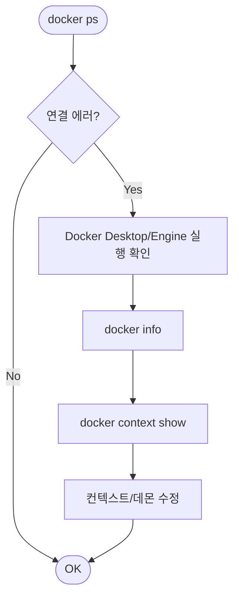
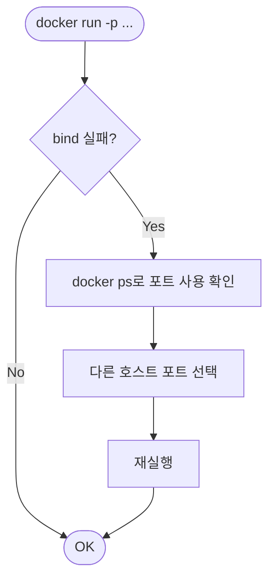

# Deep Dive - 트러블슈팅

## 시나리오 1: Docker 데몬에 연결할 수 없음

### 트러블슈팅 흐름도



### 시나리오 설명

<details>
<summary>문제 상황 보기</summary>

- 증상: `docker ps` 같은 명령이 모두 실패
- 환경: Docker Desktop이 꺼져 있거나, 잘못된 context를 사용하거나, 권한 문제
- 에러 메시지(예시):
  - `Cannot connect to the Docker daemon. Is the docker daemon running?`
  - `error during connect: ...`

</details>

### 원인 분석

<details>
<summary>원인 분석 보기</summary>

Docker CLI는 Docker Daemon에 요청을 보내야 합니다. 데몬이 실행되지 않았거나, CLI가 다른 context(원격/WSL 등)로 설정되어 있으면 연결이 거절됩니다. 일부 환경에서는 사용자 권한 문제로 소켓에 접근하지 못할 수도 있습니다.

</details>

### 원인 확인 방법

<details>
<summary>진단 단계 보기</summary>

```bash
# Step 1: 클라이언트/서버 버전 확인
docker version

# Step 2: 데몬 상태 확인(상세)
docker info

# Step 3: 현재 context 확인
docker context ls
docker context show
```

</details>

### 수정 방법

<details>
<summary>해결 단계 보기</summary>

```bash
# Fix 1: Docker Desktop/Engine을 실행하고, 엔진이 Running 상태인지 확인

# Fix 2: context가 이상하면 기본값으로 전환
docker context use default

# Fix 3(리눅스): 권한 문제라면 docker 그룹 관련 공식 문서를 참고
```

</details>

### 정상 확인 방법

<details>
<summary>검증 단계 보기</summary>

```bash
docker ps
docker run --rm hello-world
```

</details>

---

## 시나리오 2: 포트 바인딩 실패 (address already in use)

### 트러블슈팅 흐름도



### 시나리오 설명

<details>
<summary>문제 상황 보기</summary>

- 증상: `docker run -p 80:80 ...` 실행 시 컨테이너가 뜨지 않음
- 환경: 호스트 포트가 이미 점유됨(브라우저/다른 서비스/이전 컨테이너 등)
- 에러 메시지(예시):
  - `bind: address already in use`

</details>

### 원인 분석

<details>
<summary>원인 분석 보기</summary>

`-p HOST:CONTAINER`는 호스트 포트를 바인딩합니다. 호스트 포트가 이미 사용 중이면 Docker는 바인딩을 할 수 없어 실패합니다. 초반 실습에서 가장 자주 나오는 에러입니다.

</details>

### 원인 확인 방법

<details>
<summary>진단 단계 보기</summary>

```bash
# Step 1: 실행 중인 컨테이너가 같은 포트를 쓰는지 확인
docker ps --format "table {{.Names}}\t{{.Ports}}"

# Step 2(Windows): netstat로 포트 점유 확인(선택)
# netstat -ano | findstr :80
```

</details>

### 수정 방법

<details>
<summary>해결 단계 보기</summary>

```bash
# 해결: 다른 호스트 포트를 사용
docker run -d --name web -p 8080:80 nginx:alpine

# 또는 기존 컨테이너 정리 후 재실행
# docker stop web && docker rm web
```

</details>

### 정상 확인 방법

<details>
<summary>검증 단계 보기</summary>

```bash
docker ps
curl -I http://localhost:8080
```

</details>

---

