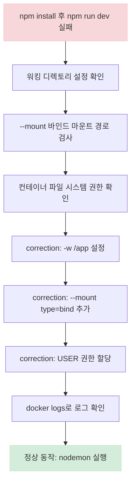
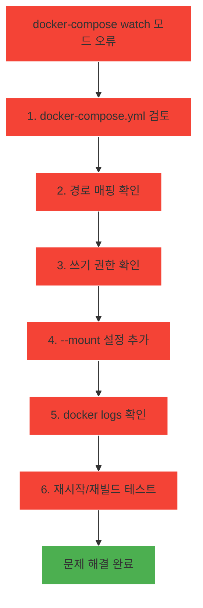

---

# 📘 Week 1 - Day 2

  <a href="service_understanding.md" style="color: white; text-decoration: none; padding: 8px 16px; background: rgba(255,255,255,0.2); border-radius: 5px; font-weight: bold;">⬅️ 이전: 📚 서비스 이해</a>
  <a href="../README.md" style="color: white; text-decoration: none; padding: 8px 16px; background: rgba(255,255,255,0.3); border-radius: 5px; font-weight: bold;">🏠 목차</a>
  <a href="handson_step1.md" style="color: white; text-decoration: none; padding: 8px 16px; background: rgba(255,255,255,0.2); border-radius: 5px; font-weight: bold;">다음: 🛠️ Hands-on Lab - Step 1 ➡️</a>

---

# Deep Dive - 트러블슈팅

## 🔍 시나리오 1: Docker 컨테이너가 정상적으로 실행되지 않는 문제

### 트러블슈팅 흐름도

### 🔍 시나리오 설명

npm install이 완료된 후 `npm run dev` 명령어 실행 시 컨테이너가 즉시 종료되거나 실행되지 않는 경우입니다. 이는 컨테이너 내부 파일 시스템 접근 권한 또는 경로 설정 문제로 인해 발생합니다.

### 💬 개념 설명

**워킹 디렉토리**: 컨테이너가 시작될 때 기본으로 접근하는 디렉토리입니다. 예를 들어, `/app` 디렉토리가 워킹 디렉토리라면 `npm run dev` 명령어는 이 디렉토리에서 실행됩니다.

**바인드 마운트**: 호스트 컴퓨터의 파일/디렉토리를 컨테이너에 연결하는 기능입니다. 이는 개발 중에 호스트의 파일 변경사항이 컨테이너에 실시간으로 반영되도록 합니다.

**권한 설정**: 파일/디렉토리 접근 권한을 조절하는 설정입니다. 컨테이너가 특정 파일에 쓰기 권한이 없으면 실행이 중단됩니다.

### 🔬 원인 분석

워킹 디렉토리 설정 누락 또는 바인드 마운트 경로 오류로 인한 파일 시스템 접근 권한 문제입니다. 예를 들어, `npm run dev`가 실행되는 디렉토리 권한이 없거나, 호스트 파일이 컨테이너에 연결되지 않아 파일 접근이 거부됩니다.

### 🔎 원인 확인 방법

1. `docker inspect <container-id>` 명령어로 컨테이너 파일 시스템 구조 확인
2. `docker logs -f <container-id>`로 로그 확인 및 npm install 실패 사항 파악
3. `ls -la /app` 명령어로 컨테이너 내 작업 디렉토리 권한 확인
4. `docker-compose.yml` 파일에서 working_dir 설정이 `-w /app`로 명시되었는지 확인

### 🔧 수정 방법

1. `docker run` 명령어에 `--workdir /app` 옵션 추가 (워킹 디렉토리 설정)
2. `docker-compose.yml` 파일에서 `command` 필드에 `sh -c "npm install && npm run dev"` 명시 (명령어 실행 방식 변경)
3. `docker-compose up --build` 명령어로 이미지 재빌드 (변경 사항 반영)
4. `chmod -R 777 /app` 명령어로 컨테이너 디렉토리 권한 재설정 (권한 문제 해결)

### ✔️ 정상 확인 방법

1. `docker logs -f <container-id>`로 nodemon 실행 여부 확인
2. `npm run dev` 명령어 실행 후 서버 로그 확인
3. `src/index.js` 파일 변경 후 nodemon 재시작 여부 확인
4. `docker stats` 명령어로 컨테이너 리소스 사용량 모니터링

---

## 🔍 시나리오 2: watch 모드에서 파일 변경이 동기화되지 않는 문제

### 트러블슈팅 흐름도

### 🔍 시나리오 설명

`docker-compose`의 watch 모드 설정이 적용되지 않거나, 파일 변경 사항이 컨테이너에 반영되지 않는 경우입니다. 이는 경로 매핑 오류 또는 권한 설정 부족으로 인해 발생합니다.

### 💬 개념 설명

**경로 매핑**: 호스트 컴퓨터의 디렉토리를 컨테이너에 연결하는 설정입니다. 예를 들어, `./web:/app/web`는 호스트의 `web` 디렉토리를 컨테이너의 `web` 디렉토리에 연결합니다.

**쓰기 권한**: 파일/디렉토리에 쓰기 권한이 없으면 변경사항이 반영되지 않습니다. 컨테이너가 호스트 파일에 접근할 수 없는 경우 동기화가 실패합니다.

### 🔬 원인 분석

`docker-compose.yml` 파일에서 watch 경로 매핑 설정이 잘못되었거나, 타겟 디렉토리 쓰기 권한이 부족한 경우입니다. 예를 들어, `./web:/app/web` 경로가 잘못 설정되어 파일 접근이 거부될 수 있습니다.

### 🔎 원인 확인 방법

1. `docker-compose config` 명령어로 watch 설정 정확성 확인
2. `docker inspect <container-id>`로 타겟 디렉토리 경로 확인
3. `ls -la /app/web` 명령어로 타겟 디렉토리 권한 확인
4. `docker-compose down && docker-compose up` 명령어로 서비스 재시작 후 동기화 테스트

### 🔧 수정 방법

1. `docker-compose.yml` 파일에서 watch 경로를 `./web:/app/web`로 수정 (경로 매핑 설정)
2. `COPY --chown=app:app ./web /app/web` 명령어로 초기 파일 복사 (권한 설정)
3. `docker-compose up --build` 명령어로 이미지 재빌드 (변경 사항 반영)
4. `chmod -R 777 /app/web` 명령어로 타겟 디렉토리 권한 재설정 (권한 문제 해결)

### ✔️ 정상 확인 방법

1. `./web/App.jsx` 파일 변경 후 `docker logs -f <container-id>`로 동기화 확인
2. `docker-compose restart <service-name>` 명령어로 서비스 재시작 테스트
3. `npm install` 후 `package.json` 변경 시 이미지 재빌드 여부 확인
4. `docker-compose down && docker-compose up` 명령어로 서비스 상태 검증

---

  <h3 style="margin: 0 0 10px 0;">🎓 Week 1 - Day 2 학습 완료!</h3>
  
다음 단계로 계속 진행하세요

  <a href="service_understanding.md" style="color: white; text-decoration: none; padding: 10px 20px; background: rgba(255,255,255,0.2); border-radius: 5px; font-weight: bold; font-size: 14px;">⬅️ 이전 📚 서비스 이해</a>
  <a href="../README.md" style="color: white; text-decoration: none; padding: 10px 20px; background: rgba(255,255,255,0.3); border-radius: 5px; font-weight: bold; font-size: 14px;">🏠 목차로</a>
  <a href="handson_step1.md" style="color: white; text-decoration: none; padding: 10px 20px; background: rgba(255,255,255,0.2); border-radius: 5px; font-weight: bold; font-size: 14px;">다음 ➡️ 🛠️ Hands-on Lab - Step 1</a>

---

  
💡 <strong>Tip:</strong> 실습 중 문제가 발생하면 공식 문서를 참고하세요

  
📅 Week 1 Day 2 | 🎯 DevOps 6개월 교육과정

