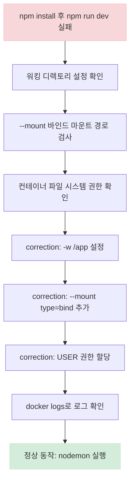
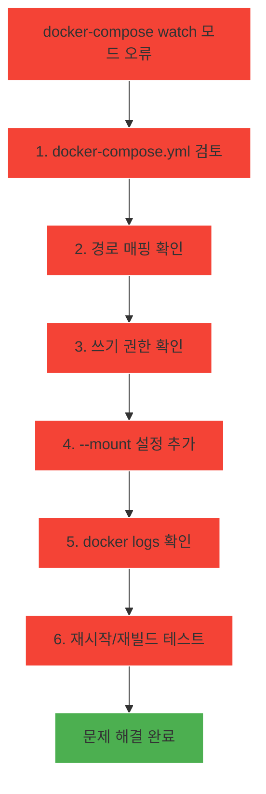

# Deep Dive - 트러블슈팅

## 🔍 시나리오 1: Docker 컨테이너가 정상적으로 실행되지 않는 문제

### 트러블슈팅 흐름도

**참고 이미지**:
- [이미지 보기](https://docs.docker.com/engine/reference/run/#mount-points)
- [이미지 보기](https://docs.docker.com/compose/compose-file/#mounts)
- [이미지 보기](https://docs.docker.com/storage/bind-mounts/)

### 🔍 시나리오 설명

npm install 후 npm run dev 명령어가 실행되지 않거나 컨테이너가 즉시 종료되는 현상

### 🔬 원인 분석

워킹 디렉토리 설정 누락 또는 바인드 마운트 경로 오류로 인한 파일 시스템 접근 권한 문제

### 🔎 원인 확인 방법

docker inspect <container-id> 명령어로 컨테이너 파일 시스템 구조 확인

docker logs -f <container-id>로 로그 확인 및 npm install 실패 사항 파악

ls -la /app 명령어로 컨테이너 내 작업 디렉토리 권한 확인

docker-compose.yml 파일에서 working_dir 설정이 -w /app로 명시되었는지 확인

### 🔧 수정 방법

docker run 명령어에 --workdir /app 옵션 추가

docker-compose.yml 파일에서 command 필드에 sh -c "npm install && npm run dev" 명시

docker-compose up --build 명령어로 이미지 재빌드

chmod -R 777 /app 명령어로 컨테이너 디렉토리 권한 재설정

### ✔️ 정상 확인 방법

docker logs -f <container-id>로 nodemon 실행 여부 확인

npm run dev 명령어 실행 후 서버 로그 확인

src/index.js 파일 변경 후 nodemon 재시작 여부 확인

docker stats 명령어로 컨테이너 리소스 사용량 모니터링

---

## 🔍 시나리오 2: watch 모드에서 파일 변경이 동기화되지 않는 문제

### 트러블슈팅 흐름도

**참고 이미지**:
- [이미지 보기](https://docs.docker.com/compose/compose-file/#mounts)
- [이미지 보기](https://docs.docker.com/engine/reference/run/#mount-points)
- [이미지 보기](https://docs.docker.com/compose/reference/build/)

### 🔍 시나리오 설명

docker-compose watch 모드 설정이 적용되지 않거나 파일 변경 사항이 반영되지 않는 현상

### 🔬 원인 분석

docker-compose.yml 파일에서 watch 경로 매핑 설정이 잘못되었거나 타겟 디렉토리 쓰기 권한 부족

### 🔎 원인 확인 방법

docker-compose config 명령어로 watch 설정 정확성 확인

docker inspect <container-id>로 타겟 디렉토리 경로 확인

ls -la /app/web 명령어로 타겟 디렉토리 권한 확인

docker-compose down && docker-compose up 명령어로 서비스 재시작 후 동기화 테스트

### 🔧 수정 방법

docker-compose.yml 파일에서 watch 경로를 ./web:/app/web로 수정

COPY --chown=app:app ./web /app/web 명령어로 초기 파일 복사

docker-compose up --build 명령어로 이미지 재빌드

chmod -R 777 /app/web 명령어로 타겟 디렉토리 권한 재설정

### ✔️ 정상 확인 방법

./web/App.jsx 파일 변경 후 docker logs -f <container-id>로 동기화 확인

docker-compose restart <service-name> 명령어로 서비스 재시작 테스트

npm install 후 package.json 변경 시 이미지 재빌드 여부 확인

docker-compose down && docker-compose up 명령어로 서비스 상태 검증

---

