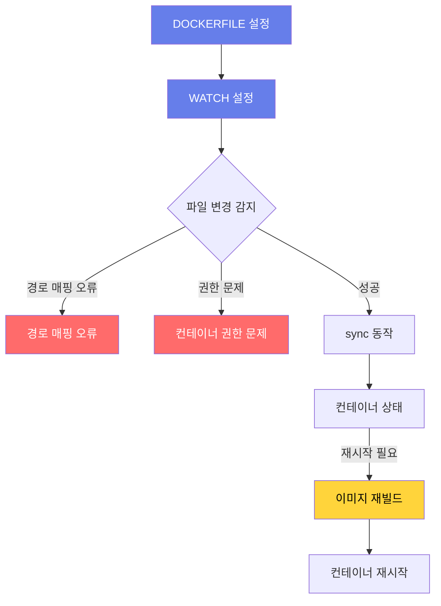

# Deep Dive - 트러블슈팅

## 시나리오 1: npm install 실패 시나리오

### 트러블슈팅 흐름도

```mermaid
flowchart TD
  Node_Start[시작] --> CheckMounts{마운트 정상?}
  CheckMounts -->|Yes| CheckPermissions{권한 정상?}
  CheckPermissions -->|Yes| VerifyWorkingDir{작업 디렉토리 확인}
  VerifyWorkingDir --> RunInstall[npm install 실행]
  RunInstall --> CheckLogs{로그 확인}
  CheckLogs -->|오류 없음| Success[성공]
  CheckLogs -->|오류| FixMounts[마운트 수정]
  CheckLogs --> FixPermissions[권한 수정]
  FixMounts --> CheckLogs
  FixPermissions --> CheckLogs
  CheckMounts -->|No| FixMounts
  CheckPermissions -->|No| FixPermissions
  style Node_Start fill:#667eea,color:#fff
  style Success fill:#51cf66,color:#fff
  style Error fill:#ff6b6b,color:#fff
  caption Docker 컨테이너 npm install 오류 해결 흐름도
```


### 시나리오 설명

<details>
<summary>문제 상황 보기</summary>

Docker 컨테이너가 시작되지 않거나 npm install 단계에서 오류 발생

</details>

### 원인 분석

<details>
<summary>원인 분석 보기</summary>

호스트 디렉토리와 컨테이너의 작업 디렉토리 매핑 오류 또는 권한 문제

</details>

### 원인 확인 방법

<details>
<summary>진단 단계 보기</summary>

docker ps -a 명령으로 컨테이너 상태 확인

docker logs <container-id>로 로그 확인

docker inspect <container-id>로 바인드 마운트 경로 확인

npm install 명령어가 정상적으로 실행되는지 호스트에서 테스트

컨테이너 내 /app 디렉토리 권한 확인: ls -ld /app

</details>

### 수정 방법

<details>
<summary>해결 단계 보기</summary>

Dockerfile에서 WORKDIR /app 명시하여 작업 디렉토리 설정

docker run --rm -v $(pwd):/app node:24-alpine sh -c "npm install" 명령으로 의존성 설치

docker-compose up --build로 이미지 재빌드

docker run --rm -v $(pwd):/app --user $(id -u):$(id -g) node:24-alpine sh -c "npm install" 명령으로 권한 문제 해결

docker-compose down && docker-compose up -d로 컨테이너 재시작

</details>

### 정상 확인 방법

<details>
<summary>검증 단계 보기</summary>

docker logs -f <container-id>로 npm install 로그 확인

npm run dev 명령어가 정상적으로 실행되는지 확인

호스트 파일 변경 후 컨테이너 내 /app 디렉토리 파일 동기화 확인

docker exec -it <container-id> sh로 컨테이너 내 파일 권한 확인

docker ps로 컨테이너 상태 확인

</details>

---

## 시나리오 2: watch 모드 동기화 실패 시나리오

### 트러블슈팅 흐름도




### 시나리오 설명

<details>
<summary>문제 상황 보기</summary>

Docker Compose watch 설정으로 파일 변경 시 컨테이너가 재시작되지 않음

</details>

### 원인 분석

<details>
<summary>원인 분석 보기</summary>

watch 설정의 경로 매핑 오류 또는 파일 변경 감지 로직 결함

</details>

### 원인 확인 방법

<details>
<summary>진단 단계 보기</summary>

docker-compose config 명령으로 서비스 설정 검증

docker-compose logs -f <service-name>로 로그 확인

docker inspect <container-id>로 마운트 경로 확인

docker run --rm -v $(pwd):/app node:24-alpine sh -c "touch /app/test.txt" 명령으로 파일 생성 테스트

docker-compose down && docker-compose up --build로 컨테이너 재시작

</details>

### 수정 방법

<details>
<summary>해결 단계 보기</summary>

docker-compose.yml의 watch 설정에서 경로 매핑 확인: path: ./web, target: /app/web

docker-compose.yml에서 action: sync+restart로 설정 변경

docker-compose.yml의 ignore 항목에서 node_modules/ 제외

docker-compose up --build로 이미지 재빌드

docker-compose down && docker-compose up -d로 컨테이너 재시작

</details>

### 정상 확인 방법

<details>
<summary>검증 단계 보기</summary>

web 디렉토리 파일 변경 후 docker-compose logs -f로 동기화 로그 확인

docker-compose down && docker-compose up -d로 컨테이너 재시작

npm install 후 package.json 변경 시 이미지 재빌드 확인

docker exec -it <container-id> sh로 파일 변경 여부 확인

docker ps로 컨테이너 상태 확인

</details>

---

