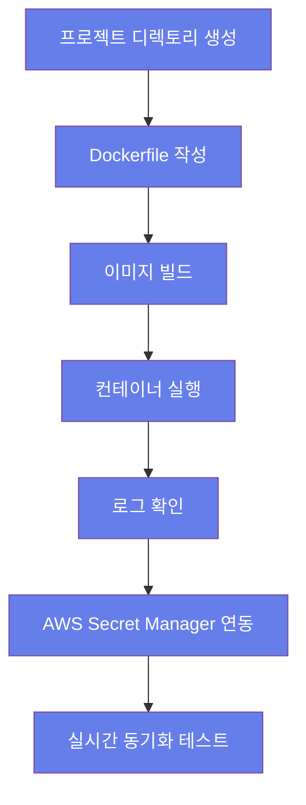

# Hands-on Lab - Step 1

## 실습 개요

**제목**: Docker 실습: 개발 환경 구성

**목적**: Docker를 사용해 개발 환경을 구성하고 실시간 코드 동기화 및 컨테이너 실행을 연습합니다

**학습 목표**:
- Dockerfile 작성 및 이미지 빌드
- 포트 매핑 및 바인드 마운트 설정
- 실시간 코드 동기화 기능 활용
- 컨테이너 로그 확인 및 디버깅
- AWS Secret Manager와의 통합 설정

**예상 소요 시간**: 45분

**난이도**: Beginner

### 실습 흐름도




## 사전 요구사항

<details>
<summary>사전 요구사항 보기</summary>

- Docker Desktop 24.0+ 설치
  - 설치 가이드: https://docs.docker.com/desktop/install/
- AWS CLI 구성
  - 설치: https://docs.aws.amazon.com/cli/latest/userguide/getting-started-install.html
  - 설정: https://docs.aws.amazon.com/cli/latest/userguide/cli-configure-quickstart.html
- 기본 Docker 명령어 이해 (링크 포함)
  - 공식 문서: https://docs.docker.com/engine/reference/commandline/cli/

</details>

## 환경 설정

<details>
<summary>환경 설정 보기</summary>

Docker Desktop 설치 및 실행
  - 설정 가이드: https://docs.docker.com/desktop/install/

AWS CLI 설정 및 테스트
  - AWS CLI 설치 후 aws configure 명령어로 기본 설정 수행

</details>

---

## Step 1: 프로젝트 디렉토리 생성

**목표**: 개발에 필요한 디렉토리를 생성합니다

**명령어**:
<details>
<summary>명령어 보기</summary>

```bash
mkdir myapp && cd myapp
```

</details>

**예상 출력**:
<details>
<summary>예상 출력 보기</summary>

```
현재 디렉토리가 myapp으로 변경됨
```

</details>

**확인 방법**:
<details>
<summary>확인 방법 보기</summary>

```bash
pwd
```

</details>

**문제 해결**:
<details>
<summary>문제 해결 보기</summary>

- 문제: 디렉토리 생성 실패 → 권한 문제 확인: ls -ld myapp
- 문제: 경로 접근 거부 → sudo 권한으로 재시도

</details>

