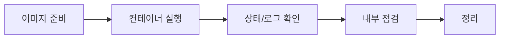

# Hands-on Lab - Step 1

## 실습 개요

**제목**: Docker 첫날 실습: hello-world -> nginx 실행 -> 기본 운영 명령

**목적**: Docker의 최소 워크플로우(이미지 가져오기 -> 컨테이너 실행 -> 상태/로그 확인 -> 정리)를 반복해, 이후 Dockerfile/Compose 학습의 기반을 만듭니다.

**학습 목표**:
- Docker Engine(daemon/cli)과 image/container의 차이를 설명한다
- `docker run/ps/logs/exec/stop/rm`로 컨테이너를 관리한다
- 데몬 연결/포트 충돌 같은 대표 이슈를 진단/해결한다

**예상 소요 시간**: 60-90분

**난이도**: Beginner

### 실습 흐름도



## 사전 요구사항

<details>
<summary>사전 요구사항 보기</summary>

- Docker Desktop 설치(Windows/macOS)
  - 설치 가이드(공식): https://docs.docker.com/desktop/install/
- (Linux) Docker Engine 설치
  - 설치 가이드(공식): https://docs.docker.com/engine/install/
- curl 준비(HTTP 확인용)
  - 문서(공식): https://curl.se/docs/

</details>

## 환경 설정

<details>
<summary>환경 설정 보기</summary>

- Docker 상태 확인
  - 명령어: `docker info`
  - 문서(공식): https://docs.docker.com/reference/cli/docker/system/info/
- CLI 레퍼런스 준비
  - 문서(공식): https://docs.docker.com/reference/cli/docker/

</details>

---

## Step 1: Docker 설치/실행 상태 확인

**목표**: Docker CLI가 데몬에 연결되는지 확인하고, 버전/환경 정보를 확인합니다.

**명령어**:
<details>
<summary>명령어 보기</summary>

```bash
docker --version
docker info
```

</details>

**예상 출력**:
<details>
<summary>예상 출력 보기</summary>

```
Client: Docker Engine - Community
...
Server: Docker Desktop
...
```

</details>

**확인 방법**:
<details>
<summary>확인 방법 보기</summary>

```bash
docker version
```

</details>

**문제 해결**:
<details>
<summary>문제 해결 보기</summary>

- `Cannot connect to the Docker daemon` -> Docker Desktop/Engine 실행 후 재시도(공식: https://docs.docker.com/desktop/install/)
- 이미지 pull이 느리거나 실패 -> 프록시 설정 확인(공식: https://docs.docker.com/network/proxy/)

</details>

