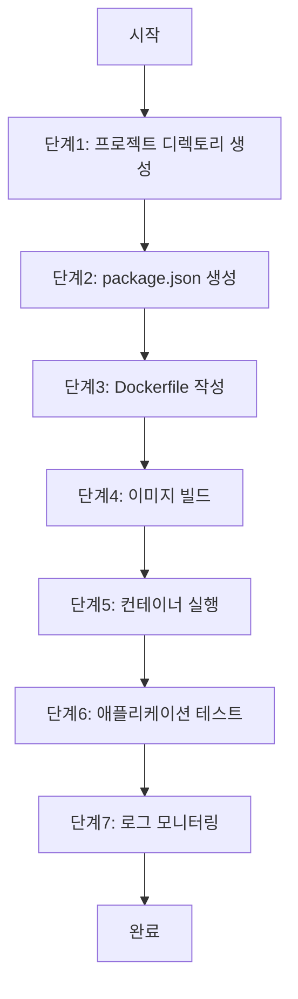

# 👉 Hands-on Lab - Step 1

## 🎯 실습 개요

**제목**: Docker 실습: 개발 환경 구성

**목적**: Node.js 애플리케이션을 Docker 컨테이너로 실행하고 실시간 코드 변경을 통한 개발 환경을 설정합니다

**학습 목표**:
- Dockerfile 작성
- bind mount을 사용한 실시간 코드 동기화
- nodemon을 통한 개발 서버 실행
- Docker 로그 확인 방법 이해

**예상 소요 시간**: 45분

**난이도**: Beginner

### 실습 흐름도



**참고 이미지**:
- [이미지 보기](https://docs.example.com/docker-command-example.png)
- [이미지 보기](https://docs.example.com/sync-restart-example.png)
- [이미지 보기](https://docs.example.com/bind-mount-diagram.png)

## 📋 사전 요구사항

- Docker Desktop 24.0+ 설치
  - 설치 가이드: https://docs.docker.com/desktop/install/
- AWS CLI 구성
  - 설치: https://docs.aws.amazon.com/cli/latest/userguide/getting-started-install.html
  - 설정: https://docs.aws.amazon.com/cli/latest/userguide/cli-configure-quickstart.html
- Node.js 기본 지식
  - 공식 문서: https://nodejs.org/en/docs/

## ⚙️ 환경 설정

Docker Desktop 설치 및 구성
  - 설정 가이드: https://docs.docker.com/desktop/get-started/

AWS CLI 구성
  - 설정 가이드: https://docs.aws.amazon.com/cli/latest/userguide/cli-configure-quickstart.html

---

## 👉 Step 1: 프로젝트 디렉토리 생성

**목표**: 작업 디렉토리 생성

**명령어**:

```bash
mkdir myapp && cd myapp

```

**예상 출력**:

```

myapp 디렉토리 생성됨

```

**확인 방법**:

```bash
ls

```

**문제 해결**:
- 문제: 디렉토리 생성 실패
  해결: sudo 권한으로 다시 시도

