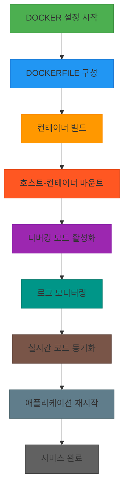

# 📘 Week 1 - Day 2

<div style="display: flex; justify-content: space-between; align-items: center; padding: 10px; background: linear-gradient(135deg, #667eea 0%, #764ba2 100%); border-radius: 10px; color: white;">
  <span style="color: rgba(255,255,255,0.5); padding: 8px 16px;">⬅️ 이전</span>
  <a href="../README.md" style="color: white; text-decoration: none; padding: 8px 16px; background: rgba(255,255,255,0.3); border-radius: 5px; font-weight: bold;">🏠 목차</a>
  <a href="deep_dive.md" style="color: white; text-decoration: none; padding: 8px 16px; background: rgba(255,255,255,0.2); border-radius: 5px; font-weight: bold;">다음: 🔍 Deep Dive ➡️</a>
</div>

---

# 서비스 이해 (Service Understanding)

## 📚 1. 배경 정보

Docker는 애플리케이션을 **포장하고 실행하는 방법**을 제공하는 오픈소스 플랫폼입니다.  
**컨테이너**(Container) 기술을 사용해, 개발자가 컴퓨터에 설치한 프로그램을 **완전한 환경**과 함께 포장할 수 있습니다.  

### 🔑 핵심 개념 정의
- **컨테이너화(Containerization)**: 애플리케이션과 필요한 라이브러리, 설정 등을 하나의 "상자"로 포장하는 기술입니다.  
  예: 텍스트 편집기 프로그램을 실행하려면 운영체제(OS)와 다른 프로그램이 필요합니다.  
  컨테이너는 이 모든 것을 하나의 "상자"로 묶어서, 다른 컴퓨터에서도 동일하게 실행할 수 있게 합니다.  

- **바인드 마운트(Bind Mount)**: 호스트 컴퓨터의 파일을 컨테이너에 연결하는 기능입니다.  
  예: 개발자가 컴퓨터에서 파일을 수정하면, 컨테이너도 실시간으로 변경사항을 반영할 수 있습니다.  

- **Dockerfile**: 컨테이너를 만들기 위한 "레시피"입니다.  
  예: "이 컴퓨터에 Node.js를 설치하고, index.js 파일을 실행하라"는 내용이 포함됩니다.  

- **Watch 모드**: 개발 중인 코드를 실시간으로 감시해, 변경사항이 생기면 자동으로 재시작하는 기능입니다.  

- **Sync+Restart 동작**: 코드 변경 시 컨테이너를 자동으로 다시 실행해, 실시간으로 결과를 확인할 수 있습니다.  

### 인포그래픽



**실습 예시**:  
1. `docker run -v /home/user/code:/app -d myapp` 명령어로,  
   - 호스트의 `/home/user/code` 폴더를 컨테이너의 `/app` 폴더에 연결  
   - `myapp` 컨테이너를 백그라운드에서 실행  
2. 코드를 수정하면 자동으로 컨테이너가 재시작됩니다.  

**참고 이미지**:
- [Docker 로그 명령어](https://docs.docker.com/engine/reference/commandline/logs/)
- [바인드 마운트 설정](https://docs.docker.com/engine/reference/run/#mount-points)
- [Dockerfile 작성 방법](https://docs.docker.com/engine/reference/commandline/buildx_build/)

## 🔑 2. 핵심 개념

### 1. 컨테이너화(Containerization)
- **정의**: 애플리케이션을 실행하기 위한 모든 필수 파일(코드, 라이브러리, 설정 등)을 하나의 "상자"로 포장하는 기술  
- **필요성**:  
  - 개발 환경과 운영 환경에서 동일하게 실행  
  - "환경 설정"을 따로 관리할 필요 없음  
- **예시**:  
  - 텍스트 편집기 프로그램을 실행하려면 OS와 다른 프로그램이 필요  
  - 컨테이너는 이 모든 것을 포함하여 실행 가능  

### 2. 바인드 마운트(Bind Mount)
- **정의**: 호스트 컴퓨터의 파일을 컨테이너에 연결하는 기능  
- **필요성**:  
  - 개발 중인 코드를 실시간으로 컨테이너에 반영  
  - 로그 확인, 파일 수정 시 즉시 반영  
- **예시**:  
  - 호스트의 `/home/user/code` 폴더를 컨테이너의 `/app` 폴더에 연결  
  - 코드를 수정하면 컨테이너도 자동으로 변경사항을 읽습니다  

### 3. Dockerfile
- **정의**: 컨테이너를 만들기 위한 "레시피"  
- **필요성**:  
  - 일관된 환경을 생성  
  - 개발자 간 공유가 용이  
- **예시**:  
  - `FROM node:16`  
  - `WORKDIR /app`  
  - `COPY . .`  
  - `CMD ["node", "index.js"]`  

### 4. Watch 모드
- **정의**: 개발 중인 코드를 실시간으로 감시하는 기능  
- **필요성**:  
  - 코드 변경 시 자동 재시작  
  - 실시간으로 결과를 확인 가능  
- **예시**:  
  - `docker run -v /home/user/code:/app -d --name myapp -p 3000:3000 myapp`  
  - 코드를 수정하면 자동으로 재시작  

### 5. Sync+Restart 동작
- **정의**: 코드 변경 시 컨테이너를 자동으로 재시작하는 기능  
- **필요성**:  
  - 개발 중에 실시간으로 결과 확인  
  - 반복적인 "재시작" 명령어 입력 필요 없음  
- **예시**:  
  - `docker run -v /home/user/code:/app -d --name myapp -p 3000:3000 myapp`  
  - 코드를 수정하면 자동으로 재시작  

### 인포그래픽

```mermaid
graph TD
  A[컨테이너화(Containerization)] --> B[바인드 마운트(Bind Mount)]
  A --> C[Dockerfile]
  D[Watch 모드] --> E[Sync+Restart 동작]
  B --> F[호스트 디렉토리 마운트]
  C --> G[이미지 생성]
  D --> H[실시간 파일 동기화]
  E --> I[이미지 재빌드]
  I --> J[컨테이너 재시작]
  H --> K[파일 변경 감지]
  K --> L[동기화/재시작 로직]

```

**실습 예시**:  
1. `docker run -v /home/user/code:/app -d myapp` 명령어로,  
   - 호스트의 `/home/user/code` 폴더를 컨테이너의 `/app` 폴더에 연결  
   - `myapp` 컨테이너를 백그라운드에서 실행  
2. 코드를 수정하면 자동으로 컨테이너가 재시작됩니다.  

**참고 이미지**:
- [Docker 로그 명령어](https://docs.docker.com/engine/reference/commandline/logs/)
- [바인드 마운트 설정](https://docs.docker.com/engine/reference/run/#mount-points)
- [Dockerfile 작성 방법](https://docs.docker.com/engine/reference/commandline/buildx_build/)

## ⚖️ 3. 장단점

**장점**:
- **환경 독립성**: 개발/생산 환경 간 일관성 유지  
  - 예: 개발자 A가 작성한 코드는 개발자 B의 컴퓨터에서도 동일하게 실행  
- **실시간 개발 지원**: 코드 변경 시 자동 재구성  
  - 예: 코드를 수정하면 자동으로 컨테이너가 재시작  
- **리소스 효율성**: 가상화 기반의 가벼운 가상 머신  
  - 예: 1개의 물리 서버에 여러 컨테이너 실행 가능  

**단점**:
- **학습 곡선**: 컨테이너 네트워크 및 볼륨 관리 복잡성  
  - 예: 여러 컨테이너 간 통신 설정이 필요  
- **리소스 소비**: 멀티컨테이너 환경에서 메모리/CPU 사용량 증가  
  - 예: 10개의 컨테이너를 동시에 실행하면 자원 사용량이 증가

## 💡 4. 자주 사용되는 사례

1. **Node.js 웹 애플리케이션 개발**  
   - `npm install` 후 `npm run dev` 명령어로 개발 서버 실행  
   - `docker run -v /home/user/code:/app -d myapp` 명령어로 컨테이너 실행  
   - 코드 변경 시 자동 재시작  

2. **Python Flask 프레임워크 실시간 개발**  
   - `flask run` 명령어로 개발 서버 실행  
   - `docker run -v /home/user/code:/app -d myapp` 명령어로 컨테이너 실행  
   - 코드 변경 시 자동 재시작  

3. **Jupyter Notebook 기반 데이터 과학 환경 구축**  
   - `jupyter notebook` 명령어로 노트북 실행  
   - `docker run -v /home/user/notebooks:/app -d myapp` 명령어로 컨테이너 실행  
   - 코드 변경 시 자동 재시작

## 🔗 5. 연관 서비스

- **Kubernetes**: 여러 컨테이너를 관리하는 클러스터 시스템  
  - 예: 여러 서버에 분산된 컨테이너를 통합 관리  
- **Docker Compose**: 여러 컨테이너를 함께 실행하는 도구  
  - 예: 데이터베이스와 웹 애플리케이션을 함께 실행  
- **Docker Swarm**: 컨테이너를 클러스터로 관리하는 도구  
  - 예: 여러 서버에 분산된 컨테이너를 통합 관리

## 📖 6. 공식 문서 링크

- [Docker 공식 문서](https://docs.docker.com/)


---

<div style="text-align: center; padding: 20px; background: linear-gradient(135deg, #f093fb 0%, #f5576c 100%); border-radius: 10px; color: white; margin: 20px 0;">
  <h3 style="margin: 0 0 10px 0;">🎓 Week 1 - Day 2 학습 완료!</h3>
  <p style="margin: 0; opacity: 0.9;">다음 단계로 계속 진행하세요</p>
</div>

<div style="display: flex; justify-content: space-between; align-items: center; padding: 15px; background: linear-gradient(135deg, #667eea 0%, #764ba2 100%); border-radius: 10px;">
  <span style="color: rgba(255,255,255,0.5); padding: 10px 20px;">⬅️ 이전</span>
  <a href="../README.md" style="color: white; text-decoration: none; padding: 10px 20px; background: rgba(255,255,255,0.3); border-radius: 5px; font-weight: bold; font-size: 14px;">🏠<br/><span style="font-size: 12px;">목차로</span></a>
  <a href="deep_dive.md" style="color: white; text-decoration: none; padding: 10px 20px; background: rgba(255,255,255,0.2); border-radius: 5px; font-weight: bold; font-size: 14px;">다음 ➡️<br/><span style="font-size: 12px; opacity: 0.8;">🔍 Deep Dive</span></a>
</div>

---

<div style="text-align: center; padding: 10px; color: #666; font-size: 12px;">
  <p>💡 <strong>Tip:</strong> 실습 중 문제가 발생하면 공식 문서를 참고하세요</p>
  <p style="margin-top: 5px;">📅 Week 1 Day 2 | 🎯 DevOps 6개월 교육과정</p>
</div>
