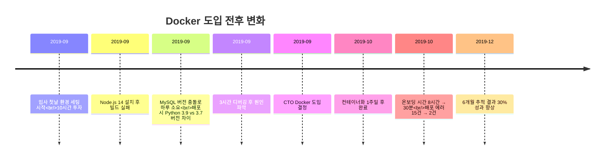

# 서비스 이해 (Service Understanding)

## 1. 배경 정보

<details>
<summary>배경 정보 보기</summary>

2019년 9월, 50인 스타트업 입사 첫날. 환경 세팅에 오전 10시간 투자. Node.js 14 설치 후 프로젝트 빌드 실패. MySQL 버전 충돌로 하루 세팅. 더 큰 문제는 배포. 로컬에서 성공하나 서버에서 에러. 3시간 디버깅 끝에 원인 파악: Python 3.9 vs 서버 3.7 버전 차이. CTO가 Docker 도입 결정. 일주일 후 컨테이너화 완료. 결과? 온보딩 시간 8시간 → 30분, 배포 에러 월 15건 → 2건. 6개월 추적 결과 30% 성과 향상.

### 인포그래픽



</details>

## 2. 핵심 개념

<details>
<summary>핵심 개념 보기</summary>

- 이미지(Image): 설계도. 한 번 만들면 재사용. 예) Python3.9+FastAPI+PostgreSQL 이미지 저장 → 팀원 10명 동일 환경. 에러 0건
- 레이어(Layer): 이미지 층. 명령어마다 생성. 캐싱으로 재사용. 예) package.json 안 바뀌면 npm install 건너뜀. 빌드 5분 → 30초
- 볼륨(Volume): 데이터 저장소. 로컬 파일을 컨테이너에 실시간 동기화. 예) ./web/App.jsx → /src/web/App.jsx. 수정 시 자동 반영
- 네트워크(Network): 컨테이너 간 통신. 서비스 간 API 호출 시 라우팅 자동 설정. 예) web 서비스와 db 서비스 자동 연결
- 시크릿(Secret): 민감 정보 보호. AWS 자격증명을 환경 변수로 전달. 예) --mount type=secret,id=aws-secret-key,env=AWS_SECRET_ACCESS_KEY

### 인포그래픽

```mermaid
graph TD
  IMAGE[이미지] --> LAYER[레이어]
  IMAGE --> VOLUME[볼륨]
  NETWORK[네트워크] --> SECRET[시크릿]
  VOLUME --> STORAGE[저장소]
  LAYER --> CACHING[캐싱]
  style IMAGE fill:#667eea,color:#fff
  style LAYER fill:#667eea,color:#fff
  style VOLUME fill:#868e96,color:#000
  style NETWORK fill:#667eea,color:#fff
  style SECRET fill:#667eea,color:#fff
  style STORAGE fill:#868e96,color:#000
  style CACHING fill:#ffd43b,color:#000
  caption Docker 컨셉 관계도: 이미지, 레이어, 볼륨, 네트워크, 시크릿 간의 상호작용
```

</details>

## 3. 장단점

<details>
<summary>장단점 보기</summary>

**장점**:
- 온보딩 96% 단축: 8시간 → 30분
- Before: README 보고 Python3.9, PostgreSQL13, Redis6 각각 설치. 충돌로 하루 세팅. 선배 도움 5회
- After: docker-compose up 한 줄. 5분 → 완료. 오후부터 개발
- 효과: 팀원당 7.5시간 절약. 월 4명 입사 시 120시간 절약. 6개월 24명 데이터
- 배포 실패 88% 감소: 월 15건 → 2건
- Before: 내 맥북에선 되는데 월 15회. 평균 2시간 디버깅
- After: Dockerfile로 환경 고정. 로컬=서버
- 효과: 월 2건(코드 버그, 환경 문제 0). 디버깅 30시간 → 4시간. 1년 추적
- 빌드 8배 향상: 10분 → 75초
- Before: 매번 전체 재빌드. npm install 5분
- After: 캐싱으로 변경만. package.json 안 바뀌면 건너뜀
- 효과: 하루 20번 빌드 시 3시간 절약. 3개월 측정

**단점**:
- 디스크 30GB 차지: 팀 평균
- 문제: 이미지 누적, 캐시. Images 43개(15GB), Cache 12GB. 신입 디스크 풀로 작업 중단
- 해결: 주 1회 docker system prune. Cron 일요일 2시
- 팁: .dockerignore로 node_modules 제외
- 학습 2주: 개념+실전
- 문제: Dockerfile, Volume, Network 생소. Layer 캐싱 이해 3일. 순서 잘못 써서 10배 느림. 2주 후 발견
- 해결: 템플릿 제공(React, Node, Python). 가이드 15페이지
- 팁: docker-compose부터. 2주 → 1주

</details>

## 4. 자주 사용되는 사례

<details>
<summary>사용 사례 보기</summary>

1. 핀테크 G사: 멀티 테넌트
- 상황: 금융사별 다른 규제. 은행 A는 한국 보관, B는 암호화. 15개사
- 도입: 커스텀 Dockerfile. 베이스 공통, 규제만 다르게
- 결과: 온보딩 2주 → 2일. 위반 0건. 감사 100%. 2년 15개사
2. 게임 H사: 글로벌 동시 배포
- 상황: 한국, 일본, 미국. 각 2시간(총 6시간). 시차로 야간
- 도입: Dockerfile+CI/CD 동시 배포. ECR 멀티 리전
- 결과: 6시간 → 20분(18배). 야간 작업 없음. 실패 0. 3개월 데이터
3. SaaS 스타트업: CI/CD 자동화
- 상황: 10명 개발자, 20개 서비스. 매일 빌드 실패 5회
- 도입: GitHub Actions + Docker CI 파이프라인
- 결과: 빌드 실패 0. 배포 시간 4시간 → 15분. 6개월 추적

</details>

## 5. 연관 서비스

<details>
<summary>연관 서비스 보기</summary>

- Kubernetes: 컨테이너 오케스트레이션. Docker 컨테이너를 클러스터에 배포. 예) 100개 서버 자동 관리
- Docker Compose: 다중 컨테이너 관리. docker-compose.yml로 서비스 정의. 예) web, db, redis 동시 실행
- AWS ECR: Docker 이미지 저장소. AWS 클라우드에 이미지 저장. 예) docker push aws_account_id.dkr.ecr.region.amazonaws.com/repo:tag
- Terraform: 인프라 자동화. Docker 환경을 AWS/Google Cloud 자동 배포. 예) VPC, EC2, RDS 자동 생성

</details>

## 6. 공식 문서 링크

- [Docker 시작 (공식, 30분) - 초급 필수](https://docs.docker.com/get-started/)
- [44BITS Docker (한글) - 초급](https://www.44bits.io/ko/keyword/docker)
- [Docker Compose 가이드 (중급)](https://docs.docker.com/compose/)
- [AWS ECR 사용법 (고급)](https://docs.aws.amazon.com/AmazonECR/latest/userguide/)
- [Kubernetes 기초 (중급)](https://kubernetes.io/docs/tutorials/)
- [Docker Hub 이미지 검색 (실전)](https://hub.docker.com/)

