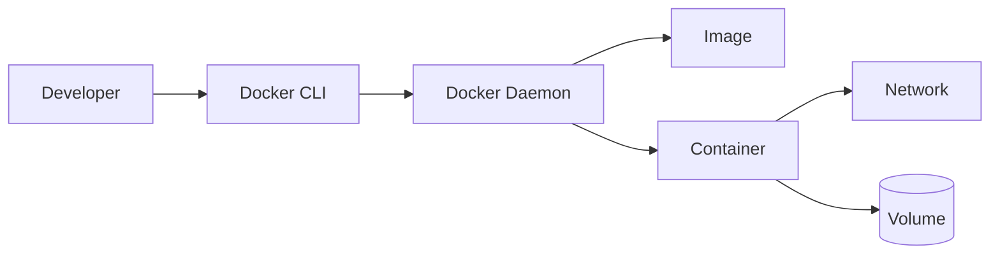
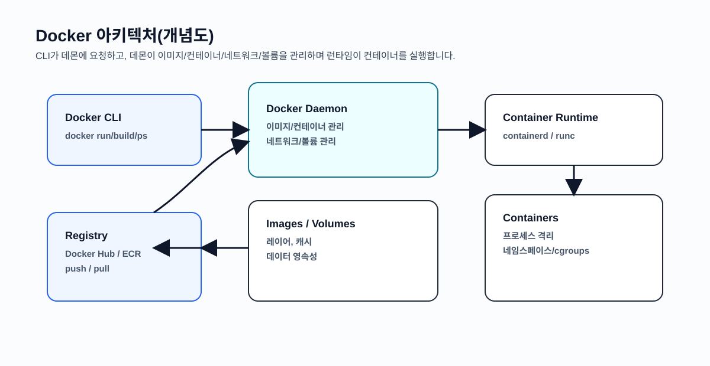
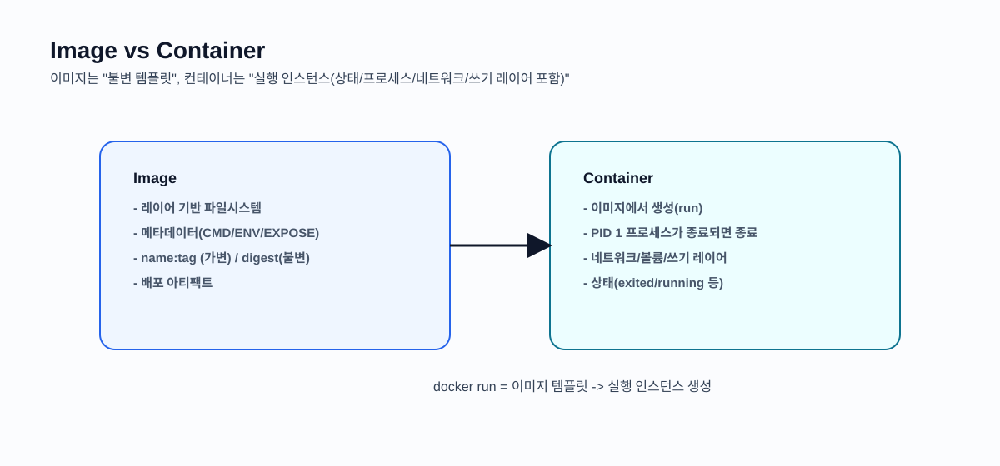
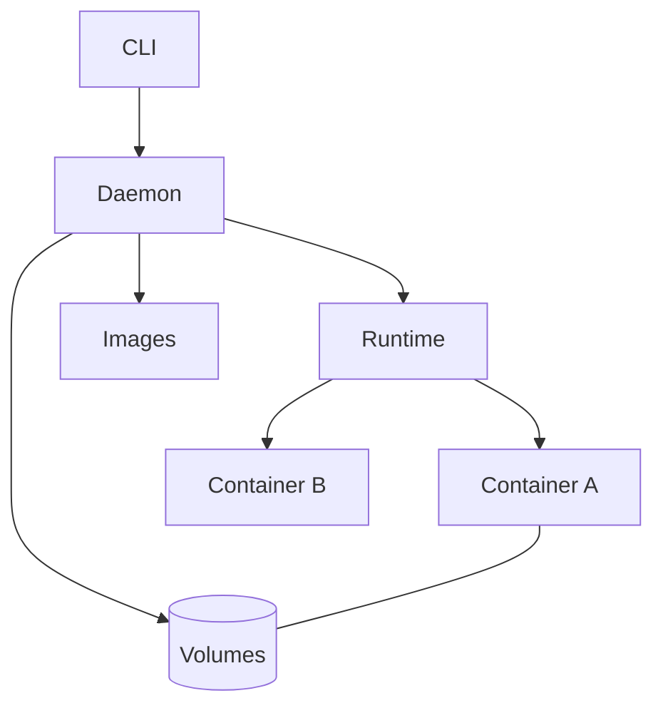

# 서비스 이해 (Service Understanding)

## 1. 배경 정보

배경 정보 보기

### Docker는 왜 나왔나

배포가 어려운 이유는 "코드"만 옮기면 끝나지 않기 때문입니다. 런타임, OS 의존성, 라이브러리 버전, 설정 파일, 권한, 네트워크까지 맞아야 동일하게 동작합니다. 2010년대 초반 많은 팀이 아래 같은 문제를 반복해서 겪었습니다.

- 개발 PC에서는 정상인데 운영 서버에서는 실패(환경 차이)
- 신규 입사자의 로컬 환경 세팅에 반나절~1일 소요(문서 편차/누락)
- 배포는 위험하니 한 번에 몰아서(큰 배치) 진행 -> 실패 시 영향이 커짐

Docker는 "애플리케이션 + 의존성 + 실행 방법"을 이미지(Image)로 패키징하고, 어디서든 동일하게 실행(재현성)하도록 만들면서, VM보다 가볍게(빠른 기동/높은 밀도) 운영할 수 있는 접근으로 빠르게 확산했습니다.

Before/After를 숫자로 보면 감이 더 잘 옵니다.

- Before: 환경 세팅 4시간, 배포 리드타임 3일, 환경 이슈로 핫픽스 월 2회
- After: 환경 세팅 20분, 배포 리드타임 1일, 환경 이슈로 핫픽스 월 0~1회

핵심은 "코드를 옮긴다"가 아니라 "실행 가능한 환경을 같이 옮긴다"입니다.

### 인포그래픽

출처: https://commons.wikimedia.org/wiki/File:Docker_(container_engine)_logo.svg

출처: https://commons.wikimedia.org/wiki/File:Containers.svg

출처: https://commons.wikimedia.org/wiki/File:Docker-on-physical.svg

## 2. 핵심 개념

핵심 개념 보기

- Image(이미지): 컨테이너를 만들기 위한 "불변 템플릿". 레이어(layer) 단위로 캐시/재사용 가능
- Container(컨테이너): 이미지로부터 생성된 "실행 인스턴스". 프로세스 격리(네임스페이스)와 자원 제한(cgroups) 활용
- Registry(레지스트리): 이미지를 저장/배포(Docker Hub, ECR, GHCR 등)
- Dockerfile: 이미지를 만드는 레시피. 단계/캐시 설계가 빌드 속도와 이미지 크기에 큰 영향
- Network/Volume: 컨테이너 통신(포트/네임해결)과 데이터 영속성(컨테이너 생명주기와 분리)의 기본

Docker Engine을 트러블슈팅 관점에서 단순화하면 아래로 정리할 수 있습니다.

- Docker CLI: 사용자가 명령을 내리는 클라이언트
- Docker Daemon: 이미지/컨테이너/네트워크/볼륨을 관리하는 서버 프로세스
- Container runtime: 컨테이너 실행 담당(containerd/runc 등)

### 인포그래픽

출처: https://commons.wikimedia.org/wiki/File:Diagram_of_the_docker_installation.png

## 3. 장단점

장단점 보기

**장점**:
- 재현성: 개발/테스트/운영에서 동일한 실행 환경을 유지하기 쉬움
- 속도: 이미지를 준비해두면 컨테이너는 수 초 내 기동 가능
- 운영 밀도: VM보다 가볍게 여러 워크로드를 한 호스트에서 운영 가능
- 표준화: Dockerfile/Compose로 팀 표준을 만들면 온보딩/배포가 빨라짐

**단점**:
- 보안 설계 필요: 커널을 공유하므로 권한, 이미지 취약점, 비밀(Secret) 관리가 중요
- 데이터/네트워크 학습 필요: 볼륨/포트 매핑/브리지 네트워크가 초기 진입장벽이 될 수 있음

## 4. 자주 사용되는 사례

사용 사례 보기

1. 로컬 개발환경 표준화: DB/캐시까지 포함한 스택을 Compose로 한 번에 구성
2. CI 격리: 빌드/테스트 환경을 이미지로 고정해 결과 일관성 확보
3. 배포 단위 표준화: 서비스별 이미지를 배포 아티팩트로 삼아 파이프라인 단순화

## 5. 연관 서비스

연관 서비스 보기

- Docker Compose: 멀티 컨테이너 앱 구성/실행
- Kubernetes: 컨테이너 오케스트레이션
- BuildKit: 빌드 캐시/성능 최적화
- containerd/runc: 런타임 계층
- 대안: Podman(daemon-less), nerdctl(containerd CLI)

## 6. 공식 문서 링크

- [Docker Docs](https://docs.docker.com/)
- [Docker Desktop Install](https://docs.docker.com/desktop/install/)
- [Docker Engine Install](https://docs.docker.com/engine/install/)
- [docker run](https://docs.docker.com/reference/cli/docker/container/run/)
- [docker ps](https://docs.docker.com/reference/cli/docker/container/ls/)
- [docker logs](https://docs.docker.com/reference/cli/docker/container/logs/)
- [docker exec](https://docs.docker.com/reference/cli/docker/container/exec/)

## 7. 추가 자료

- 팀 표준: 이미지 태그 전략(불변 태그), 컨테이너/이미지 정리 정책, 로컬 개발환경 템플릿(Compose)
- 외부 참고(이미지/도표가 포함된 페이지)
  - Docker 시작하기(공식): https://docs.docker.com/get-started/
  - Docker 네트워킹 개요(공식): https://docs.docker.com/network/
