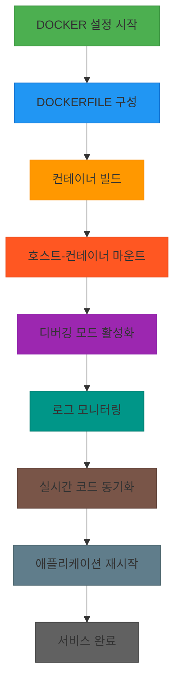

# 서비스 이해 (Service Understanding)

## 📚 1. 배경 정보

Docker은 애플리케이션 패키징 및 실행을 위한 오픈소스 플랫폼으로, 컨테이너 기반의 가상화 기술을 제공합니다. 개발 환경에서 `--mount` 옵션을 사용해 호스트와 컨테이너 간 파일 시스템을 바인드 마운트하고, `docker logs` 명령으로 로그를 확인할 수 있습니다. 또한 `watch` 모드를 통해 코드 변경 시 자동 재구성 및 재시작을 지원합니다.

### 인포그래픽



**참고 이미지**:
- [이미지 보기](https://docs.docker.com/engine/reference/commandline/logs/)
- [이미지 보기](https://docs.docker.com/engine/reference/run/#mount-points)
- [이미지 보기](https://docs.docker.com/engine/reference/commandline/buildx_build/)

## 🔑 2. 핵심 개념

- 컨테이너화(Containerization)
- 바인드 마운트(Bind Mount)
- Dockerfile
- Watch 모드
- Sync+Restart 동작

### 인포그래픽

```mermaid
graph TD
  A[컨테이너화(Containerization)] --> B[바인드 마운트(Bind Mount)]
  A --> C[Dockerfile]
  D[Watch 모드] --> E[Sync+Restart 동작]
  B --> F[호스트 디렉토리 마운트]
  C --> G[이미지 생성]
  D --> H[실시간 파일 동기화]
  E --> I[이미지 재빌드]
  I --> J[컨테이너 재시작]
  H --> K[파일 변경 감지]
  K --> L[동기화/재시작 로직]

```

**참고 이미지**:
- [이미지 보기](https://docs.example.com/image1.png)
- [이미지 보기](https://docs.example.com/image2.png)
- [이미지 보기](https://docs.example.com/image3.png)

## ⚖️ 3. 장단점

**장점**:
- 환경 독립성: 개발/생산 환경 간 일관성 유지
- 실시간 개발 지원: 코드 변경 시 자동 재구성
- 리소스 효율성: 가상화 기반의 가벼운 가상 머신

**단점**:
- 학습 곡선: 컨테이너 네트워크 및 볼륨 관리 복잡성
- 리소스 소비: 멀티컨테이너 환경에서 메모리/CPU 사용량 증가

## 💡 4. 자주 사용되는 사례

1. Node.js 웹 애플리케이션 개발 (npm install + dev 명령어)
2. Python Flask 프레임워크 실시간 개발
3. Jupyter Notebook 기반 데이터 과학 환경 구축

## 🔗 5. 연관 서비스

- Kubernetes
- Docker Compose
- Docker Swarm

## 📖 6. 공식 문서 링크

- [Docker 공식 문서](https://docs.docker.com/)

