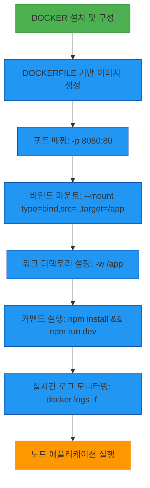
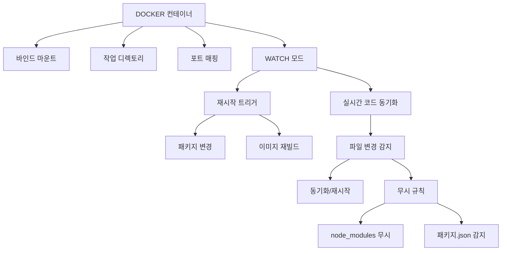

# 서비스 이해 (Service Understanding)

## 1. 배경 정보

배경 정보 보기

Docker는 애플리케이션을 포트 매핑, 바인드 마운트, 작업 디렉토리 설정 등을 통해 패키징하여 실행 가능한 컨테이너로 배포하는 오픈소스 플랫폼입니다. 예를 들어, Node.js 애플리케이션을 실행할 때 `node:24-alpine` 이미지를 기반으로 컨테이너를 생성하고, `npm install`과 `npm run dev` 명령어로 개발 서버를 시작합니다. Docker는 개발 환경에서 실시간 코드 변경을 지원하는 `watch` 모드와 같은 기능을 통해 생산성을 높입니다. 또한, `docker logs` 명령어로 컨테이너 로그를 실시간으로 확인할 수 있습니다.

### 인포그래픽

**참고 이미지**:
- [이미지 보기](https://docs.docker.com/engine/reference/run/#mount-volume--v-or--volume)
- [이미지 보기](https://docs.docker.com/compose/reference/build/)
- [이미지 보기](https://docs.docker.com/engine/reference/commandline/logs/)

## 2. 핵심 개념

핵심 개념 보기

- 바인드 마운트 (Bind Mount)
- 작업 디렉토리 (Working Directory)
- 포트 매핑 (Port Mapping)
- Watch 모드 (Real-time Code Sync)

### 인포그래픽

**참고 이미지**:
- [이미지 보기](https://docs.docker.com/engine/reference/run/#mount-points)
- [이미지 보기](https://docs.docker.com/engine/reference/run/#working-directory)
- [이미지 보기](https://docs.docker.com/engine/reference/run/#port-mapping)
- [이미지 보기](https://docs.docker.com/compose/reference/watch/)

## 3. 장단점

장단점 보기

**장점**:
- 애플리케이션의 환경을 포트와 디렉토리 기준으로 단일화하여 이동성 향상
- 리소스 효율화 및 격리된 실행 환경 제공
- CI/CD 파이프라인과의 연동으로 배포 속도 향상

**단점**:
- 복잡한 네트워크 구성 시 관리 난이도 증가
- 컨테이너 이미지 최소화 시 악의적 코드 감지 어려움

## 4. 자주 사용되는 사례

사용 사례 보기

1. 개발 환경에서 실시간 코드 변경 지원 (예: Node.js + Nginx)
2. 마이크로서비스 아키텍처 기반의 배포
3. CI/CD 파이프라인에서 의존성 변경 시 재빌드 자동화

## 5. 연관 서비스

연관 서비스 보기

- Kubernetes
- Docker Compose
- AWS ECS

## 6. 공식 문서 링크

- [Docker 공식 문서](https://docs.docker.com/)
- [Docker Compose 문서](https://docs.docker.com/compose/)

