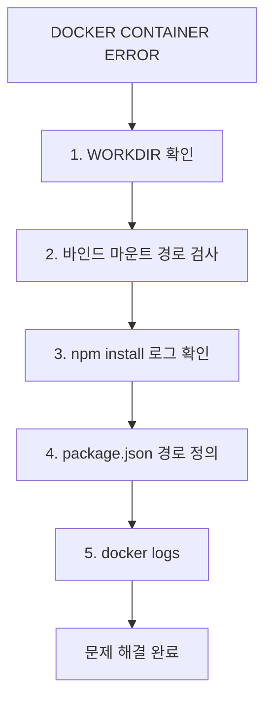

# Deep Dive - 트러블슈팅

## 시나리오 1: Docker 컨테이너가 시작되지 않는 문제

### 트러블슈팅 흐름도



**참고 이미지**:
- [이미지 보기](https://docs.example.com/image1.png)


### 시나리오 설명

<details>
<summary>문제 상황 보기</summary>

Docker 컨테이너가 실행 시 'nodemon'이 시작되지 않고 오류가 발생합니다. 로그에서 'npm install'이 완료되지 않았습니다.

</details>

### 원인 분석

<details>
<summary>원인 분석 보기</summary>

WORKDIR 설정 누락 또는 바인드 마운트 경로 오류로 패키지 설치가 정상적으로 수행되지 않았습니다.

</details>

### 원인 확인 방법

<details>
<summary>진단 단계 보기</summary>

docker inspect <container-id> 명령어로 컨테이너 설정 확인

docker logs <container-id>로 로그 확인하여 npm install 단계에서 중단되었는지 확인

Dockerfile에서 WORKDIR 설정이 '/app'로 명시되었는지 확인

--mount type=bind 파라미터에서 src와 target 경로가 일치하는지 확인

alpine 기반 이미지에서 bash 대신 sh를 사용하는지 확인

</details>

### 수정 방법

<details>
<summary>해결 단계 보기</summary>

docker run 명령어에 -w /app 파라미터 추가하여 작업 디렉토리 설정

Dockerfile에 WORKDIR /app 명령어 추가

BIND_MOUNT 설정 시 src와 target 경로를 일치시키는 예: -v ./src:/app/src

npm install 명령어 실행 전에 yarn cache clean 또는 npm cache clean --force 수행

docker build --no-cache 옵션으로 이미지 재빌드

</details>

### 정상 확인 방법

<details>
<summary>검증 단계 보기</summary>

docker logs -f <container-id>로 로그 확인

npm install이 완료되었는지, nodemon이 실행되었는지 확인

docker ps 명령어로 컨테이너 상태 확인

바인드 마운트 파일 변경 후 동기화가 이루어지는지 테스트

docker stats로 컨테이너 자원 사용량 확인

</details>

---

## 시나리오 2: 바인드 마운트 파일 동기화 실패

### 트러블슈팅 흐름도

`mermaid
graph TD
  A[파일 변경 후 컨테이너 파일 업데이트 실패] --> B[1. 바인드 마운트 설정 확인]
  B --> C[2. watch 모드 활성화 여부 확인]
  C --> D[3. 타겟 경로 권한 검사]
  D --> E[4. Docker Compose 파일 수정]
  E --> F[5. 서비스 재시작]
  F --> G[문제 해결 완료]
  subgraph Dockerfile_설정
    H[USER 권한 설정] --> I[ COPY --chown 사용]
    J[SSH 마운트] --> K[비밀번호 관리]
  end
  style A fill:#ffcccc,stroke:#ff0000
  style G fill:#ccffcc,stroke:#00ff00
  classDef errorNode fill:#ff9999,stroke:#ff0000
  classDef fixNode fill:#99ff99,stroke:#00ff00
  class C,D errorNode
  class E,F fixNode
```

**참고 이미지**:
- [이미지 보기](https://docs.docker.com/compose/reference/options/#mount-settings)
- [이미지 보기](https://docs.docker.com/engine/reference/run/#mount-settings)
- [이미지 보기](https://docs.docker.com/engine/reference/commandline/dockerd/#mounts)


### 시나리오 설명

<details>
<summary>문제 상황 보기</summary>

Docker Compose에서 바인드 마운트 설정 후 파일 변경 시 컨테이너 내 파일이 업데이트되지 않습니다.

</details>

### 원인 분석

<details>
<summary>원인 분석 보기</summary>

watch 모드 설정 누락 또는 타겟 경로 권한 부족으로 파일 동기화가 제한되었습니다.

</details>

### 원인 확인 방법

<details>
<summary>진단 단계 보기</summary>

docker-compose.yml 파일에서 bind mount 설정이 올바르게 구성되었는지 확인

docker-compose up --build 후 로그 확인

컨테이너 내 타겟 경로 권한을 docker ps로 확인

docker inspect <container-id>로 마운트 경로 확인

docker-compose 파일에서 watch 모드 설정이 포함되었는지 확인

</details>

### 수정 방법

<details>
<summary>해결 단계 보기</summary>

docker-compose.yml에 volumes: - type: bind, source: ./src, target: /app/src 추가

COPY --chown=app 명령어로 파일 권한 설정

docker-compose up --build --force-recreate 수행

docker-compose down 후 다시 up 실행

docker-compose 파일에 watch: - action: sync, path: ./src, target: /app/src 추가

</details>

### 정상 확인 방법

<details>
<summary>검증 단계 보기</summary>

src 디렉토리 파일 변경 후 docker logs 확인

docker-compose 파일에서 ignore 규칙이 올바르게 설정되었는지 확인

docker-compose up --build --force-recreate 수행 후 동기화 테스트

docker inspect <container-id>로 마운트 상태 확인

docker stats로 파일 변경 시 리소스 변화 확인

</details>

---

