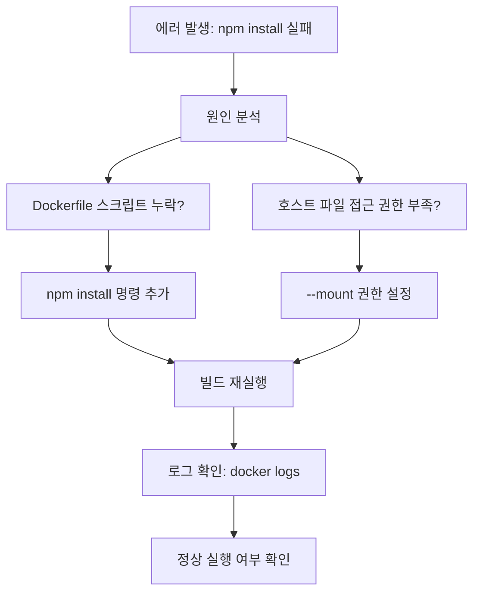
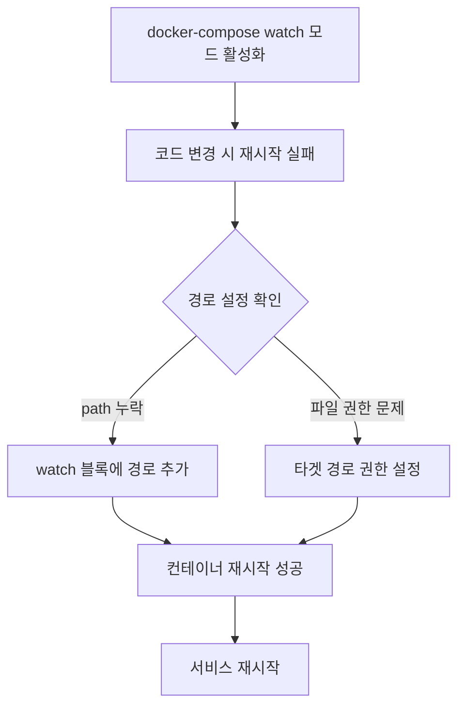

# Deep Dive - 트러블슈팅

## 시나리오 1: npm install 실패로 인한 컨테이너 시작 실패

### 트러블슈팅 흐름도

**참고 이미지**:
- [이미지 보기](https://docs.example.com/dockerfile-structure.png)
- [이미지 보기](https://docs.example.com/bind-mount-example.png)
- [이미지 보기](https://docs.example.com/npm-install-flow.png)

### 시나리오 설명

문제 상황 보기

Docker 컨테이너가 시작 시 npm install 단계에서 오류 발생하여 애플리케이션이 실행되지 않음

### 원인 분석

원인 분석 보기

Dockerfile에 명시된 의존성 설치 스크립트가 누락되거나, 호스트 파일 시스템 접근 권한이 부족함

### 원인 확인 방법

진단 단계 보기

docker logs <container-id> 명령어로 로그 확인

docker inspect <container-id>로 바인드 마운트 경로 확인

npm install 명령어가 실행된 호스트 디렉토리 권한 확인 (ls -l ./web)

Dockerfile의 WORKDIR 및 COPY 명령어 검토

node_modules 폴더가 바인드 마운트 대상에 포함되는지 확인

### 수정 방법

해결 단계 보기

Dockerfile에 RUN npm install 추가 후 재빌드 (docker-compose build)

--mount type=bind 옵션에서 src=.,target=/app 설정 확인

docker run --rm -v $(pwd):/app node:24-alpine sh -c 'npm install && npm run dev' 테스트

COPY --chown=node:node /path/to/file ./app 경로로 파일 권한 설정

docker-compose up --build 명령어로 전체 재빌드

### 정상 확인 방법

검증 단계 보기

docker logs -f <container-id>로 nodemon 로그 확인

npm install --dry-run으로 의존성 설치 가능성 점검

docker exec <container-id> ls -l /app/node_modules 명령어로 파일 권한 확인

docker-compose down && docker-compose up으로 서비스 재시작

src/index.js 파일 변경 후 bundler가 실시간으로 업데이트되는지 확인

---

## 시나리오 2: Watch 모드에서 파일 동기화 실패

### 트러블슈팅 흐름도

**참고 이미지**:
- [이미지 보기](https://docs.example.com/image1.png)
- [이미지 보기](https://docs.example.com/ssh-mount.png)

### 시나리오 설명

문제 상황 보기

docker-compose watch 모드가 활성화되었지만, 코드 변경 시 컨테이너 재시작되지 않음

### 원인 분석

원인 분석 보기

watch 블록에서 path 설정이 누락되거나, target 경로의 파일 권한이 설정되지 않음

### 원인 확인 방법

진단 단계 보기

docker-compose.yml 파일에서 web 서비스 watch 블록 확인

docker-compose logs <service-name>로 로그 확인

docker inspect <container-id>로 바인드 마운트 설정 검토

docker run --rm -v $(pwd):/app node:24-alpine sh -c 'ls -la /app' 명령어로 경로 확인

docker exec <container-id> id 사용자 권한 확인

### 수정 방법

해결 단계 보기

watch 블록에 path: ./web, target: /app/web 추가

COPY --chown=node:node ./web /app/web 명령어로 파일 권한 설정

docker-compose up --build 명령어로 서비스 재빌드

docker run --rm -v $(pwd):/app:z node:24-alpine sh -c 'touch /app/test.txt' 테스트

docker-compose.yml에서 volumes 섹션에 :z 옵션 추가

### 정상 확인 방법

검증 단계 보기

web/App.jsx 파일 변경 후 docker logs 확인

docker-compose down && docker-compose up으로 서비스 재시작

docker exec <container-id> ls -l /app/web 명령어로 파일 권한 확인

docker-compose watch 명령어로 실시간 모니터링 확인

npm install 후 package.json 변경 시 이미지 재빌드 여부 확인

---

