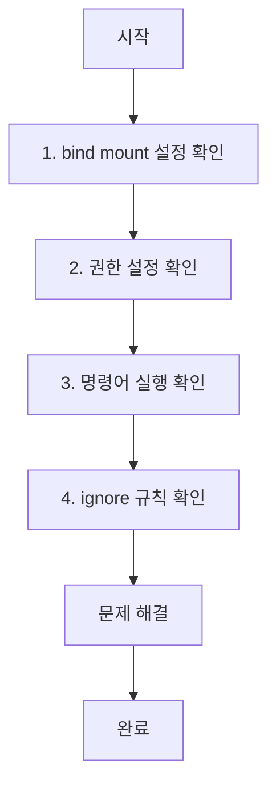

# Deep Dive - 트러블슈팅

## 시나리오 1: 컨테이너가 정상적으로 시작되지 않는 문제

### 🔍 개념 설명
- **Docker 이미지**: 실행 가능한 애플리케이션 패키지로, 컨테이너가 실행될 때 사용됩니다.
- **Docker Compose**: 복잡한 Docker 환경을 구성하는 YAML 파일로, 여러 컨테이너를 관리합니다.
- **npm**: JavaScript 프로젝트에서 패키지 관리자를 의미합니다.
- **포트 매핑**: 호스트 컴퓨터와 컨테이너가 서로 통신할 수 있도록 설정하는 것입니다. 예를 들어, `3000:3000`은 호스트의 3000 포트가 컨테이너의 3000 포트로 연결됩니다.
- **bind mount**: 호스트 컴퓨터의 파일 시스템을 컨테이너에 마운트하여 실시간으로 파일 변경을 반영할 수 있는 기능입니다.

### 📌 사전 지식 요구사항
- Docker가 설치되어 있으며, 기본 명령어(`docker run`, `docker ps`)를 사용할 수 있어야 합니다.
- `npm install` 명령어를 사용할 수 있어야 합니다.

---

## 트러블슈팅 흐름도
```mermaid
graph TD
  Start[Docker 컨테이너 시작 오류] --> Step1[npm install 로그 확인]
  Step1 --> Step2[포트 매핑 확인: -p 3000:3000]
  Step2 --> Step3[기본 이미지(node:24-alpine) 및 명령어 확인]
  Step3 --> Step4[동기화+재시작 설정: watch + sync+restart]
  Step4 --> Step5[파일 변경 감지: package.json/requirements.txt]
  Step5 --> End[문제 해결 완료]
```

### 📌 시나리오 설명
Docker 컨테이너가 시작되지 않거나, `npm install` 과정에서 오류가 발생했습니다.  
예: `npm install`이 실패하거나, `http://localhost:3000`에 접근할 수 없는 경우.

---

### 🔍 원인 분석
1. **npm 패키지 설치 실패**: `npm install`이 정상적으로 실행되지 않았을 수 있습니다.
2. **포트 매핑 오류**: `3000` 포트가 올바르게 매핑되지 않았을 수 있습니다.
3. **WORKDIR 설정 누락**: Dockerfile에서 작업 디렉터리(`/app`)를 명시적으로 설정하지 않았을 수 있습니다.
4. **동기화 설정 누락**: `watch` 모드에서 파일 변경 감지를 위해 `sync+restart` 설정이 누락되었을 수 있습니다.

---

### ✅ 원인 확인 방법
1. `docker logs <container-id>` 명령어로 컨테이너 로그를 확인하세요.  
   - `npm install`이 실행되었는지 확인합니다.
2. `docker ps -a` 명령어로 컨테이너 상태를 점검하세요.  
   - 정상적으로 실행 중인지 확인합니다.
3. `docker inspect <container-id>` 명령어로 포트 매핑 설정을 확인하세요.  
   - `-p 3000:3000`이 올바르게 설정되었는지 확인합니다.
4. Dockerfile에서 `WORKDIR /app`이 설정되었는지 확인하세요.  
   - 작업 디렉터리가 명확히 설정되어야 합니다.

---

### ✅ 수정 방법
1. 명시적으로 `npm install`을 실행하세요:  
   ```bash
   sh -c "npm install && npm run dev"
   ```
2. 포트 매핑을 확인하세요:  
   ```bash
   docker run -p 3000:3000 <image-name>
   ```
3. Dockerfile에 `WORKDIR /app` 추가:  
   ```dockerfile
   WORKDIR /app
   ```
4. 이미지 재빌드 후 컨테이너 재시작:  
   ```bash
   docker-compose build
   docker-compose up --build
   ```

---

### ✅ 정상 확인 방법
1. 로그를 실시간으로 확인하세요:  
   ```bash
   docker logs -f <container-id>
   ```
2. `nodemon`이 실행 중인지 확인하세요.  
   - 파일 변경 감지가 정상적으로 작동하는지 확인합니다.
3. `http://localhost:3000`에 접근해 응답이 있는지 확인하세요.
4. `docker stats` 명령어로 리소스 사용량을 점검하세요.

---

## 시나리오 2: watch 모드에서 파일 변경사항이 반영되지 않는 문제

### 🔍 개념 설명
- **bind mount**: 호스트 컴퓨터의 파일 시스템을 컨테이너에 마운트하여, 실시간으로 파일 변경을 반영할 수 있는 기능입니다.  
  예: 호스트의 `src/index.js` 파일 변경 → 컨테이너의 `/app` 디렉터리에 자동 반영.
- **watch 모드**: `nodemon`과 같은 도구가 파일 변경을 감지하고 자동 재시작하는 기능입니다.

---

## 트러블슈팅 흐름도


### 📌 시나리오 설명
Docker Compose의 `watch` 모드에서 소스 코드 변경이 컨테이너에 반영되지 않습니다.  
예: `src/index.js` 파일을 수정해도 컨테이너에 반영되지 않는 경우.

---

### 🔍 원인 분석
1. **bind mount 설정 누락**: Docker Compose 파일에 `bind mount` 설정이 누락되었을 수 있습니다.
2. **권한 설정 누락**: 호스트 파일 권한이 컨테이너에 반영되지 않았을 수 있습니다.
3. **ignore 규칙 설정**: 특정 파일 변경을 무시하는 설정이 있을 수 있습니다.

---

### ✅ 원인 확인 방법
1. `docker inspect <container-id>` 명령어로 볼륨 마운트 설정을 확인하세요.  
   - `--mount type=bind,src=.,target=/app`이 설정되었는지 확인합니다.
2. 호스트 파일 권한을 확인하세요.  
   - `src/index.js` 파일이 `node` 사용자에게 권한이 있는지 확인합니다.
3. `docker-compose.yml` 파일에서 `watch` 설정이 올바르게 구성되었는지 확인하세요.  
   - `watch: sync`가 설정되었는지 확인합니다.
4. `npm install`이 성공적으로 수행되었는지 확인하세요.  
   - 패키지가 정상적으로 설치되었는지 확인합니다.

---

### ✅ 수정 방법
1. `--mount` 옵션 추가:  
   ```bash
   docker run --mount type=bind,src=.,target=/app <image-name>
   ```
2. Dockerfile에 `COPY --chown=node:node . /app` 추가:  
   ```dockerfile
   COPY --chown=node:node . /app
   ```
3. `docker-compose.yml` 파일에서 `watch: sync` 설정:  
   ```yaml
   services:
     app:
       build: .
       volumes:
         - .:/app
       command: npm run dev
       watch: sync
   ```
4. 서비스 재구성 및 재시작:  
   ```bash
   docker-compose up --build
   docker-compose restart
   ```

---

### ✅ 정상 확인 방법
1. 로그를 실시간으로 확인하세요:  
   ```bash
   docker logs -f <container-id>
   ```
2. `src/index.js` 파일을 수정하고, 변경사항이 컨테이너에 반영되는지 확인하세요.  
   - `nodemon` 로그에서 파일 변경을 감지하는지 확인합니다.
3. `docker-compose ps` 명령어로 서비스 상태를 점검하세요.  
   - 서비스가 정상적으로 실행 중인지 확인합니다.
4. 서비스 재배포:  
   ```bash
   docker-compose down && docker-compose up
   ```

---

## 📌 요약 및 핵심 포인트
| 항목 | 설명 |
|------|------|
| **Docker 이미지** | 실행 가능한 애플리케이션 패키지 |
| **포트 매핑** | 호스트와 컨테이너 간의 통신 설정 |
| **bind mount** | 호스트 파일 시스템을 컨테이너에 실시간으로 연결 |
| **watch 모드** | 파일 변경 감지 및 자동 재시작 기능 |
| **npm install** | JavaScript 프로젝트에서 필요한 패키지를 설치 |