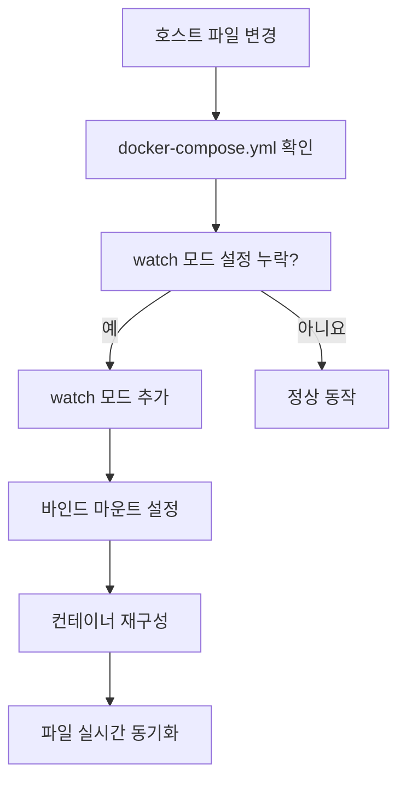

# Deep Dive - 트러블슈팅

## 시나리오 1: npm install이 실패하여 개발 서버 실행 오류

### 트러블슈팅 흐름도

`mermaid
graph TD
  A[npm install 실패] --> B[WORKDIR 누락 확인]
  B --> C[DOCKERFILE 수정: WORKDIR /app]
  C --> D[package.json 경로 재설정]
  D --> E[npm run dev 정상 실행]
  E --> F[결과: 개발 서버 시작]
  F --> G[로그 확인: nodemon 시작]
  G --> H[실시간 코드 변경 감지]
  H --> I[앱 재빌드/재시작]
```


### 시나리오 설명

<details>
<summary>문제 상황 보기</summary>

Docker 컨테이너가 실행 시 npm install 단계에서 오류 발생 후 npm run dev 명령어가 실행되지 않음

</details>

### 원인 분석

<details>
<summary>원인 분석 보기</summary>

Dockerfile에서 WORKDIR 설정 누락으로 인해 package.json 경로가 잘못 인식됨

</details>

### 원인 확인 방법

<details>
<summary>진단 단계 보기</summary>

docker logs <container-id> 명령어로 컨테이너 로그 확인

npm install 명령어 실행 시 경로가 /app이 아닌 다른 위치로 설정되었는지 확인

Dockerfile에서 WORKDIR /app 설정이 있는지 확인

package.json 파일이 호스트 머신의 ./web 디렉토리에 위치하는지 확인

docker-compose.yml 파일에서 bind mount 경로가 정확하게 설정되었는지 확인

</details>

### 수정 방법

<details>
<summary>해결 단계 보기</summary>

Dockerfile에 WORKDIR /app 추가 후 재빌드: RUN WORKDIR /app && npm install

docker-compose.yml 파일에서 bind mount 경로 수정: - ./web:/app/web

docker build --no-cache . 명령어로 이미지 재빌드

docker run --rm -v $(pwd)/web:/app/web <image-id> npm install 명령어로 수동 테스트

docker-compose up --build 명령어로 전체 서비스 재시작

</details>

### 정상 확인 방법

<details>
<summary>검증 단계 보기</summary>

docker logs -f <container-id> 명령어로 로그 확인

npm install이 성공적으로 완료되었는지 확인

nodemon이 실행되어 src/index.js 파일을 모니터링하는지 확인

코드 수정 후 변경사항이 즉시 반영되는지 테스트

docker-compose down && docker-compose up 명령어로 상태 복원

</details>

---

## 시나리오 2: bind mount 파일 변경 시 실시간 동기화 실패

### 트러블슈팅 흐름도



**참고 이미지**:
- [이미지 보기](https://docs.docker.com/compose/compose-file/#watch)
- [이미지 보기](https://docs.docker.com/storage/bind-mounts/)
- [이미지 보기](https://docs.docker.com/compose/reference/build/)


### 시나리오 설명

<details>
<summary>문제 상황 보기</summary>

호스트 파일 변경 후 Docker 컨테이너 내 파일이 자동으로 업데이트되지 않음

</details>

### 원인 분석

<details>
<summary>원인 분석 보기</summary>

docker-compose.yml 파일의 watch 모드 설정 누락으로 인해 파일 변경 감지 기능 비활성화

</details>

### 원인 확인 방법

<details>
<summary>진단 단계 보기</summary>

docker-compose.yml 파일에서 watch 섹션이 정의되었는지 확인

target 경로가 /app/web과 같은 컨테이너 내 실제 경로로 설정되었는지 확인

docker-compose up --build 명령어로 서비스 재시작 후 로그 확인

호스트 파일 변경 시 컨테이너 로그에서 변경 사항 감지 메시지 확인

SELinux 정책이 bind mount 경로에 영향을 주는지 확인: ls -Z <target-path>

</details>

### 수정 방법

<details>
<summary>해결 단계 보기</summary>

docker-compose.yml 파일에 watch 섹션 추가: - action: sync+restart path: ./web target: /app/web

docker-compose.yml 파일에서 bind mount 경로에 :z 옵션 추가: - type: bind source: ./web target: /app/web:z

docker-compose up --build --force-recreate 명령어로 서비스 재구성

docker run -d --name test-container -v $(pwd)/web:/app/web:z <image-id> 명령어로 단독 테스트

docker-compose down && docker-compose up -d 명령어로 환경 복원

</details>

### 정상 확인 방법

<details>
<summary>검증 단계 보기</summary>

호스트 파일 변경 후 docker logs -f <container-id> 명령어로 로그 확인

변경된 파일이 컨테이너 내 /app/web 경로에 자동 동기화되는지 확인

nodemon이 변경된 파일을 감지하고 재시작하는지 확인

docker-compose down && docker-compose up -d 명령어로 상태 확인

docker volume inspect <volume-name> 명령어로 볼륨 상태 검증

</details>

---

