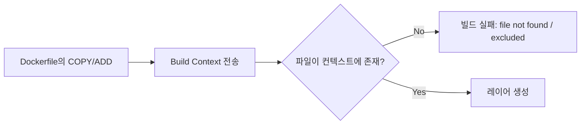
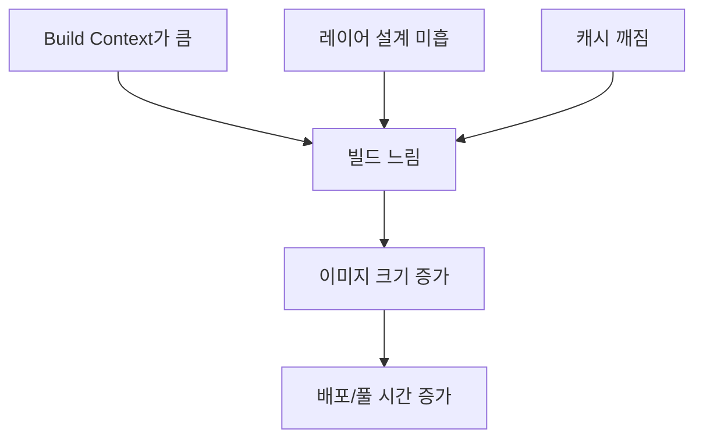

# Deep Dive - 트러블슈팅


## 시나리오 1: `COPY failed: file not found in build context` (빌드 컨텍스트/`.dockerignore` 문제)

### 트러블슈팅 흐름도



### 시나리오 설명

<details>
<summary>문제 상황 보기</summary>

- 증상: `docker build` 중 `COPY` 단계에서 빌드가 실패한다.
- 환경: 로컬에서 Dockerfile로 이미지를 빌드(예: `docker build -t app:dev .`)
- 에러 메시지(예시):
  - `COPY failed: file not found in build context or excluded by .dockerignore: stat ...: file does not exist`

</details>

### 원인 분석

<details>
<summary>원인 분석 보기</summary>

이 에러는 Dockerfile 문법 자체가 틀렸다기보다, "빌드 컨텍스트"에 대상 파일이 없어서 발생하는 경우가 대부분입니다.

대표 원인
- 현재 디렉터리에서 빌드하지 않았다: Dockerfile은 맞는데 `docker build`를 다른 폴더에서 실행하여 컨텍스트가 달라짐
- 경로가 틀렸다: `COPY app/config.yaml /app/`인데 실제로는 `apps/config.yaml`에 존재
- `.dockerignore`가 과하게 제외했다: `config/`를 제외하거나, `**/*.env`처럼 패턴이 광범위해서 필요한 파일까지 제외
- 대소문자 이슈: Windows/macOS에서는 통과하던 경로가 Linux 컨테이너 빌드 환경에서는 실패(케이스 센서티브)

핵심은 "Docker는 `docker build`에서 지정한 컨텍스트 밖의 파일을 접근할 수 없다"는 점입니다.

</details>

### 원인 확인 방법

<details>
<summary>진단 단계 보기</summary>

```bash
# Step 1: 빌드 컨텍스트(현재 디렉터리)와 Dockerfile 위치 확인
pwd
ls -la

# Step 2: Dockerfile에 적힌 COPY 경로가 실제로 존재하는지 확인
grep -nE "^(COPY|ADD)\\b" Dockerfile
# (PowerShell 대안) Select-String -Path Dockerfile -Pattern '^(COPY|ADD)\\b'

# 예: COPY ./config/nginx.conf /etc/nginx/conf.d/default.conf
ls -la ./config

# Step 3: .dockerignore가 필요한 파일을 제외하고 있는지 확인
test -f .dockerignore && cat .dockerignore

# Step 4: BuildKit 출력에서 컨텍스트 전송 로그 확인(선택)
DOCKER_BUILDKIT=1 docker build --progress=plain -t tmp:debug .
```

</details>

### 수정 방법

<details>
<summary>해결 단계 보기</summary>

```bash
# Fix 1: 올바른 디렉터리에서 빌드 실행 (Dockerfile/파일이 있는 폴더)
cd /path/to/project
docker build -t app:dev .

# Fix 2: Dockerfile의 COPY 경로를 실제 구조에 맞게 수정
# 예: COPY apps/config/nginx.conf ...

# Fix 3: .dockerignore에서 필요한 경로 제외를 해제하거나 예외 패턴 추가
# 예: config/ 를 제외하고 있었다면 제거
# 또는 예외: !config/nginx.conf
```

</details>

### 정상 확인 방법

<details>
<summary>검증 단계 보기</summary>

```bash
# Verify 1: 빌드가 끝까지 성공하는지 확인
docker build -t app:dev .

# Verify 2: 이미지가 생성되었는지 확인
docker image ls | head
```

</details>

---

## 시나리오 2: 이미지가 너무 크고 빌드가 느리다 (레이어/캐시/컨텍스트 설계 문제)

### 트러블슈팅 흐름도




### 시나리오 설명

<details>
<summary>문제 상황 보기</summary>

- 증상:
  - `docker build`가 항상 느리고, 사소한 수정에도 전체가 다시 빌드된다.
  - 빌드 산출 이미지 크기가 과도하게 크다(예: 수백 MB~GB).
- 환경: 애플리케이션 이미지를 Dockerfile로 빌드하여 CI/CD 또는 로컬에서 반복 빌드.
- 에러 메시지: 보통 명확한 에러는 없고 "성능 문제"로 나타난다.

</details>

### 원인 분석

<details>
<summary>원인 분석 보기</summary>

가장 흔한 원인은 세 가지입니다.

1) 빌드 컨텍스트가 불필요하게 크다
- `.git/`, `node_modules/`, 빌드 산출물(`dist/`, `target/`) 등을 통째로 컨텍스트에 포함하면, 매번 컨텍스트 전송 자체가 느려집니다.

2) 레이어가 캐시 친화적으로 구성되어 있지 않다
- 자주 바뀌는 파일을 먼저 `COPY`하면 이후 단계 캐시가 깨져서 매번 `RUN`이 다시 실행됩니다.

3) 이미지에 "실행에 필요 없는 것"이 들어간다
- 빌드 도구, 컴파일러, 테스트 데이터 등이 최종 이미지에 포함되면 크기가 커집니다. 멀티스테이지 빌드로 "빌드용"과 "런타임용"을 분리해야 합니다.

</details>

### 원인 확인 방법

<details>
<summary>진단 단계 보기</summary>

```bash
# Step 1: 빌드 로그에서 컨텍스트 전송 크기/시간 확인 (BuildKit 권장)
DOCKER_BUILDKIT=1 docker build --progress=plain -t tmp:perf .
# 출력 중 "transferring context"가 크거나 오래 걸리면 컨텍스트 문제 가능성이 큼

# Step 2: 이미지 레이어/크기 확인
docker image ls | head
docker history --no-trunc tmp:perf | head -n 20

# Step 3: 캐시가 왜 깨지는지 확인 (Dockerfile에서 COPY 순서 점검)
grep -nE "^(FROM|COPY|ADD|RUN)\\b" Dockerfile
# (PowerShell 대안) Select-String -Path Dockerfile -Pattern '^(FROM|COPY|ADD|RUN)\\b'
```

</details>

### 수정 방법

<details>
<summary>해결 단계 보기</summary>

```bash
# Fix 1: .dockerignore 추가/정리 (컨텍스트 최소화)
# 아래 내용을 .dockerignore 파일로 생성/저장
# .git
# node_modules
# dist
# target
# *.log

# Fix 2: Dockerfile 레이어 순서 개선(변경이 적은 것부터)
# 예: 의존성 파일(package-lock.json 등)을 먼저 COPY하고 install을 먼저 수행한 뒤,
# 애플리케이션 소스는 마지막에 COPY

# Fix 3: 멀티스테이지 빌드로 최종 이미지에서 빌드 도구 제거
# (builder 스테이지에서 빌드 후 런타임 스테이지에 산출물만 COPY)
```

</details>

### 정상 확인 방법

<details>
<summary>검증 단계 보기</summary>

```bash
# Verify 1: 빌드 시간이 줄고, 캐시가 재사용되는지 확인
DOCKER_BUILDKIT=1 docker build --progress=plain -t app:optimized .
DOCKER_BUILDKIT=1 docker build --progress=plain -t app:optimized .
# 두 번째 빌드에서 CACHED가 많이 보이면 정상

# Verify 2: 이미지 크기 비교
docker image ls
```

</details>

---
