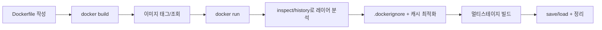

# Hands-on Lab - Step 1

## 실습 개요

**제목**: Docker 이미지 기초 실습: Dockerfile로 이미지 빌드하고 레이어/캐시를 이해하기

**목적**: Docker 이미지(Image)를 "배포 가능한 아티팩트"로 다루기 위해, Dockerfile 작성 -> `docker build` -> 실행/검증 -> 레이어/캐시 분석 -> 컨텍스트 최적화(.dockerignore) -> 멀티스테이지 빌드(맛보기) -> `save/load`까지 한 번에 경험합니다.

**학습 목표**:
- Dockerfile의 최소 구성(`FROM`, `COPY`, `CMD/ENTRYPOINT`)을 이해하고 이미지 빌드를 수행한다
- 이미지 태그(tag)와 다이제스트(digest)의 성격 차이를 설명하고 태깅 전략을 세울 수 있다
- 레이어(layer)와 빌드 캐시가 어떻게 동작하는지 확인하고, `.dockerignore`로 컨텍스트를 최적화한다
- 멀티스테이지 빌드의 목적(최종 이미지 슬림화)과 적용 포인트를 이해한다

**예상 소요 시간**: 90분

**난이도**: Beginner/Intermediate

### 실습 흐름도



## 사전 요구사항

<details>
<summary>사전 요구사항 보기</summary>

- Docker Desktop 설치(Windows/macOS)
  - 공식: https://docs.docker.com/desktop/install/
- (Linux) Docker Engine 설치
  - 공식: https://docs.docker.com/engine/install/
- Dockerfile 기본 문법
  - 공식: https://docs.docker.com/reference/dockerfile/
- `docker build`/`docker image` CLI 레퍼런스
  - 공식: https://docs.docker.com/reference/cli/docker/buildx/build/
  - 공식: https://docs.docker.com/reference/cli/docker/image/
- HTTP 확인용 도구(선택: curl)
  - 공식: https://curl.se/docs/

</details>

## 환경 설정

<details>
<summary>환경 설정 보기</summary>

- Docker 동작 확인
  - 명령어: `docker info`
  - 공식: https://docs.docker.com/reference/cli/docker/system/info/
- BuildKit 사용(권장)
  - BuildKit은 최신 Docker 빌드 엔진이며, 캐시/출력 가독성에 유리합니다.
  - 필요시 `DOCKER_BUILDKIT=1`로 활성화할 수 있습니다.

</details>

---

## Step 1: 첫 번째 이미지 만들기(nginx + 정적 페이지)

**목표**: Dockerfile로 아주 간단한 웹 이미지(정적 HTML)를 빌드하고 `name:tag`로 이미지를 생성한다.

**명령어**:
<details>
<summary>명령어 보기</summary>

```bash
# 1) 작업 폴더 준비
mkdir -p docker-image-basics/web
cd docker-image-basics/web

# 2) 아래 파일 2개를 생성하세요 (에디터로 생성해도 됩니다)
# - index.html
# - Dockerfile

# index.html (예시)
# <h1>Hello Docker Image</h1>
# <p>Built by Dockerfile</p>

# Dockerfile (예시)
# FROM nginx:alpine
# COPY index.html /usr/share/nginx/html/index.html

# 3) 이미지 빌드
docker build -t img-lab:web-v1 .
```

</details>

**예상 출력**:
<details>
<summary>예상 출력 보기</summary>

```
...
 => [internal] load build definition from Dockerfile
 => [internal] load .dockerignore
 => [1/2] FROM docker.io/library/nginx:alpine
 => [2/2] COPY index.html /usr/share/nginx/html/index.html
 => exporting to image
 => => naming to docker.io/library/img-lab:web-v1
```

</details>

**확인 방법**:
<details>
<summary>확인 방법 보기</summary>

```bash
docker image ls img-lab:web-v1
```

</details>

**문제 해결**:
<details>
<summary>문제 해결 보기</summary>

- `pull access denied` / `i/o timeout` -> 네트워크/프록시/사내망 설정 확인, 이미지 풀 가능한지 점검(공식 프록시 문서: https://docs.docker.com/network/proxy/)
- `Cannot locate specified Dockerfile` -> 파일명이 정확히 `Dockerfile`인지, 현재 디렉터리에 있는지 확인
- `COPY failed: file not found in build context` -> `index.html` 경로/이름 확인, `.dockerignore`가 제외하지 않았는지 확인

</details>
