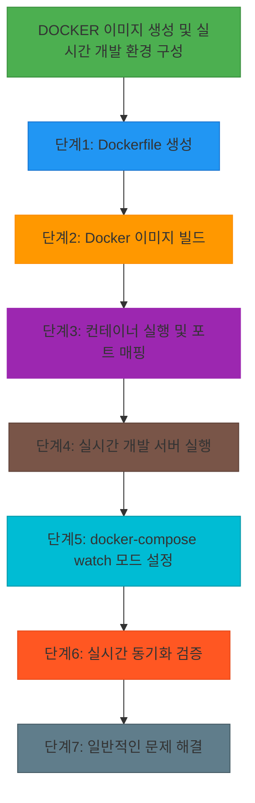

# Hands-on Lab - Step 1

## 실습 개요

**제목**: Docker 이미지 생성 및 실시간 개발 환경 구성

**목적**: Docker 이미지를 생성하고 실시간 코드 변경을 통한 개발 환경을 설정하는 방법을 학습합니다.

**학습 목표**:
- Dockerfile 작성
- Docker 이미지 빌드
- 컨테이너 실행 및 포트 매핑
- 바인드 마운트 구성
- watch 모드 설정
- 실시간 코드 동기화 검증
- 일반적인 문제 해결

**예상 소요 시간**: 45분

**난이도**: Beginner

### 실습 흐름도


**참고 이미지**:
- [이미지 보기](https://docs.docker.com/develop/develop-images/dockerfile-best-practices/)
- [이미지 보기](https://docs.docker.com/compose/compose-file/compose-file-v3/)
- [이미지 보기](https://docs.docker.com/engine/reference/commandline/logs/)


## 사전 요구사항

<details>
<summary>사전 요구사항 보기</summary>

- Docker Desktop 설치
- Node.js 프로젝트 파일
- docker-compose CLI 설치

</details>

## 환경 설정

<details>
<summary>환경 설정 보기</summary>

깃허브에서 프로젝트 클론: git clone https://github.com/yourusername/yourproject.git

프로젝트 디렉토리로 이동: cd yourproject

docker-compose.yml 파일 생성

</details>

---

## Step 1: Dockerfile 생성

**목표**: node:24-alpine 기반 Dockerfile 작성

**명령어**:
<details>
<summary>명령어 보기</summary>

`````bash
#!/bin/sh
FROM node:24-alpine
WORKDIR /app
COPY package*.json ./
RUN npm install
EXPOSE 3000
CMD ["sh", "-c", "npm install && npm run dev"]
```
</details>

**예상 출력**:
<details>
<summary>예상 출력 보기</summary>

```
Dockerfile 파일 생성 완료
```

</details>

**확인 방법**:
<details>
<summary>확인 방법 보기</summary>

```bash
ls -l Dockerfile
```

</details>

**문제 해결**:
<details>
<summary>문제 해결 보기</summary>

- 문제: Dockerfile 문법 오류 → 해결: docker build --no-cache 명령어로 재빌드
- 문제: 경로 오류 → 해결: pwd 명령어로 현재 경로 확인

</details>

