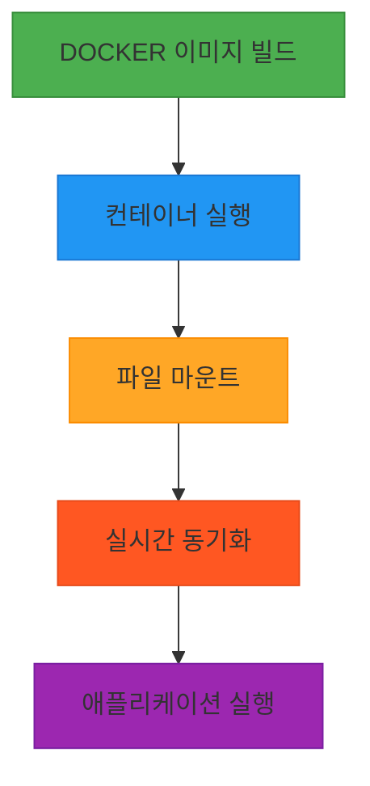
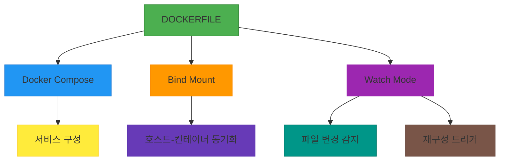

# 서비스 이해 (Service Understanding)

## 1. 배경 정보

배경 정보 보기

Docker Images는 애플리케이션을 실행하기 위한 가상화된 환경을 제공하는 컨테이너 기반의 소프트웨어 패키징 기술입니다. Dockerfile을 통해 애플리케이션의 종속성과 설정을 정의하여 이미지로 빌드하고, 이를 통해 일관된 환경에서 애플리케이션을 실행할 수 있습니다. 예를 들어, `node:24-alpine` 이미지를 기반으로 npm 패키지를 설치하고 개발 서버를 실행하는 방식이 사용됩니다. 또한, `--mount` 옵션을 통해 호스트와 컨테이너 간 파일 시스템을 공유하며, `watch` 모드를 활용한 실시간 코드 동기화도 가능합니다.

### 인포그래픽

**참고 이미지**:
- [이미지 보기](https://docs.docker.com/engine/reference/builder/images/dockerfile-structure.png)
- [이미지 보기](https://docs.docker.com/engine/reference/commandline/run/docker-run-mount.png)
- [이미지 보기](https://docs.docker.com/compose/reference/overview/compose-watch-sync.png)

## 2. 핵심 개념

핵심 개념 보기

- Dockerfile: 이미지 빌드에 사용되는 텍스트 기반 지시어 파일
- Bind Mount: 호스트 파일 시스템을 컨테이너에 마운트하여 실시간 동기화
- Watch Mode: 파일 변경 시 자동으로 컨테이너를 재구성하는 기능
- Docker Compose: 다중 서비스 구성 및 관리에 사용되는 YAML 파일

### 인포그래픽

**참고 이미지**:
- [이미지 보기](https://docs.example.com/image1.png)
- [이미지 보기](https://docs.example.com/image2.png)
- [이미지 보기](https://docs.example.com/image3.png)

## 3. 장단점

장단점 보기

**장점**:
- 환경 일관성: 개발, 테스트, 배포 환경에서 동일한 설정을 제공
- 포트ability: 다양한 운영체제에서 동일하게 실행 가능
- 실시간 동기화: `watch` 모드로 개발 중 코드 변경 즉시 반영

**단점**:
- 학습 곡선: Dockerfile 구조 및 네트워크 설정 이해 필요
- 보안 리스크: `--mount`로 노출된 파일 시스템이 해킹 위험

## 4. 자주 사용되는 사례

사용 사례 보기

1. React 애플리케이션 개발: `./web` 디렉토리 변경 시 자동 재빌드
2. Microservices 아키텍처: 각 서비스별 독립 Docker 이미지 배포
3. CI/CD 파이프라인: GitHub Actions에서 Docker 이미지 자동 빌드 및 배포

## 5. 연관 서비스

연관 서비스 보기

- Docker Compose
- Kubernetes
- Dockerfile
- AWS ECR

## 6. 공식 문서 링크

- [Docker Images 공식 문서](https://docs.docker.com/engine/reference/builder/)
- [공식 문서](https://docs.docker.com/compose/compose-file/)

