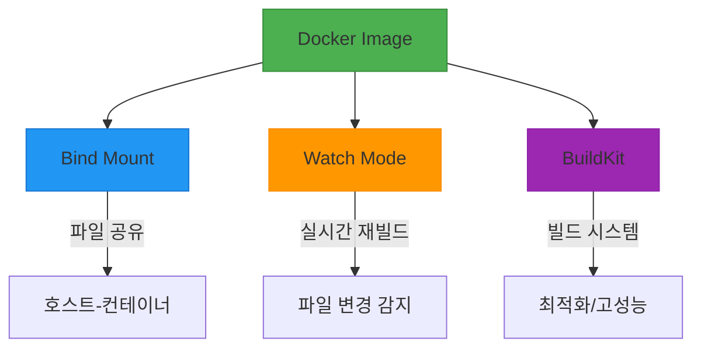

# 서비스 이해 (Service Understanding)

## 1. 배경 정보

<details>
<summary>배경 정보 보기</summary>

Docker Images는 애플리케이션을 실행하기 위한 가상의 운영체제 환경을 제공하는 컨테이너의 기반이 됩니다. Dockerfile을 통해 정의된 명령어로 이미지가 빌드되며, `node:24-alpine`과 같은 기반 이미지를 사용하여 애플리케이션을 실행합니다. `--mount` 옵션을 통해 호스트와 컨테이너 간 파일 시스템을 공유하고, `watch` 모드는 파일 변경 시 실시간으로 애플리케이션을 재구성하는 기능을 제공합니다.

### 인포그래픽

`mermaid
graph TD
  A[DOCKERFILE 생성] --> B[이미지 빌드]
  B --> C[컨테이너 실행]
  C --> D[--mount 파일 시스템 공유]
  C --> E[-w 작업 디렉토리 설정]
  E --> F[WATCH 모드 활성화]
  F --> G[실시간 애플리케이션 재구성]
  style A fill:#4CAF50,stroke:#388E3C
  style B fill:#2196F3,stroke:#0D47A1
  style C fill:#FF9800,stroke:#FB8C00
  style D fill:#9C27B0,stroke:#7E34A5
  style E fill:#00BCD4,stroke:#0097A7
  style F fill:#FF5722,stroke:#E64A19
  style G fill:#607D8B,stroke:#455A64
```

</details>

## 2. 핵심 개념

<details>
<summary>핵심 개념 보기</summary>

- Docker Image: 컨테이너 실행에 필요한 가상 환경
- Bind Mount: 호스트와 컨테이너 간 파일 시스템 공유
- Watch Mode: 파일 변경 시 실시간 재빌드 기능
- BuildKit: Docker 이미지 빌드 시스템

### 인포그래픽



**참고 이미지**:
- [이미지 보기](https://docs.example.com/image1.png)
- [이미지 보기](https://docs.example.com/dockerfile-example.png)
- [이미지 보기](https://docs.example.com/ssh-mount.png)

</details>

## 3. 장단점

<details>
<summary>장단점 보기</summary>

**장점**:
- 환경 통일성: 개발/생산 환경의 일관성을 보장
- 실시간 업데이트: `watch` 모드로 코드 변경 시 즉시 반영
- 포트ability: 다양한 OS에서 동일하게 실행 가능

**단점**:
- 종속성 변경 시 전체 재빌드 필요: `package.json` 변경 시 이미지 재빌드
- 보안 리스크: `--mount`로 민감 정보 노출 가능성

</details>

## 4. 자주 사용되는 사례

<details>
<summary>사용 사례 보기</summary>

1. React 애플리케이션 개발: `npm run dev` 시 실시간 리로딩
2. 미니 서비스 배포: 다수의 컨테이너 간 데이터 공유
3. CI/CD 파이프라인: 자동화된 이미지 빌드 및 배포

</details>

## 5. 연관 서비스

<details>
<summary>연관 서비스 보기</summary>

- Docker Compose
- Kubernetes

</details>

## 6. 공식 문서 링크

- [Docker Images 공식 문서](https://docs.docker.com/engine/reference/commandline/images/)
- [Docker BuildKit 설명서](https://docs.docker.com/buildkit/)

