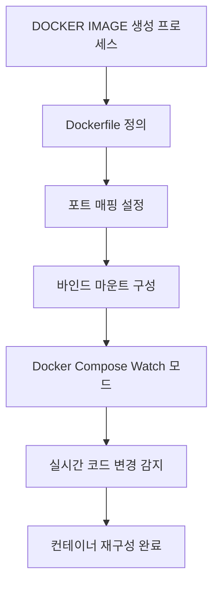

# 서비스 이해 (Service Understanding)

## 1. 배경 정보

<details>
<summary>배경 정보 보기</summary>

Docker Images는 애플리케이션을 실행하기 위한 가상의 운영체제 이미지입니다. 이는 컨테이너화된 환경에서 애플리케이션을 실행하는 기반이 됩니다. Dockerfile이라는 텍스트 파일을 통해 명령어와 설정을 정의하면, 이 파일을 기반으로 Docker 이미지를 생성할 수 있습니다. 

### 포트 매핑과 바인드 마운트
포트 매핑은 호스트 컴퓨터와 컨테이너 간의 네트워크 통신을 설정하는 기능입니다. 예를 들어, 호스트의 3000번 포트를 컨테이너의 3000번 포트로 연결하면, 외부에서 호스트의 3000번 포트를 통해 애플리케이션에 접근할 수 있습니다. 바인드 마운트는 호스트 컴퓨터의 파일/디렉토리를 컨테이너에 연결하여 실시간 데이터 공유가 가능하게 합니다. 

### Docker Compose Watch 모드
Docker Compose의 Watch 모드는 파일 변경을 감지해 컨테이너를 자동으로 재구성하는 기능입니다. 개발 중에는 코드 변경 시 자동 재구성으로 실시간으로 결과를 확인할 수 있습니다.

### 인포그래픽



**참고 이미지**:
- [Dockerfile 정의](https://docs.docker.com/engine/reference/builder/)
- [포트 매핑 설정](https://docs.docker.com/engine/reference/run/#mount-settings)
- [Docker Compose Watch 모드](https://docs.docker.com/compose/compose-file/#watch)
</details>

## 2. 핵심 개념

<details>
<summary>핵심 개념 보기</summary>

### Docker Images
Docker 이미지는 애플리케이션을 실행하기 위한 가상 운영체제 템플릿입니다. 이는 컨테이너가 실행되는 기반이 되며, Dockerfile을 통해 정의된 설정을 기반으로 생성됩니다. 예를 들어, Node.js 애플리케이션을 실행하기 위해 `node:24-alpine`라는 기반 이미지를 사용할 수 있습니다.

### 바인드 마운트 (Bind Mounts)
호스트 컴퓨터의 파일/디렉토리를 컨테이너에 연결하여 실시간 데이터 공유가 가능합니다. 예를 들어, `--mount type=bind,src=.,target=/app` 명령어를 사용하면, 현재 디렉토리의 파일을 컨테이너의 `/app` 경로에 연결합니다. 이로 인해 코드 변경 시 컨테이너가 자동으로 재구성됩니다.

### Watch Mode
Docker Compose에서 파일 변경을 감지해 컨테이너를 자동으로 재구성하는 기능입니다. `docker-compose up --build` 명령어를 실행하면, `docker-compose.yml` 파일에 `volumes` 설정을 추가해 실시간으로 코드 변경을 감지할 수 있습니다.

### 시크릿 마운트 (Secret Mounts)
보안 정보(예: AWS 키)를 컨테이너에 안전하게 전달하는 기능입니다. `--mount type=secret,src=/path/to/secret,target=/app/secret`처럼 파일 또는 환경 변수를 사용해 보안 정보를 전달할 수 있습니다.

### 인포그래픽

```mermaid
graph TD
  Start[DOCKER 개념 개요] --> DockerImages[DOCKER 이미지]
  Start --> BindMounts[바인드 마운트]
  Start --> WatchMode[워치 모드]
  Start --> SecretMounts[시크릿 마운트]

  DockerImages --> ImageDetails[이미지 구성]
  ImageDetails --> BaseImage[기반 이미지 (node:24-alpine)]
  ImageDetails --> Command[명령어 (npm install && npm run dev)]

  BindMounts --> MountSyntax[마운트 문법]
  MountSyntax --> BindExample[예: --mount type=bind,src=.,target=/app]
  BindMounts --> DirectorySync[디렉토리 동기화]

  WatchMode --> SyncRules[동기화 규칙]
  SyncRules --> SyncAction[동작: sync/sync+restart]
  SyncRules --> IgnorePatterns[무시 패턴 (node_modules)]
  WatchMode --> RebuildTrigger[이미지 재빌드 트리거 (package.json 변경)]

  SecretMounts --> SecretOptions[시크릿 옵션]
  SecretOptions --> FileMount[파일 마운트]
  SecretOptions --> EnvVars[환경 변수 (AWS_ACCESS_KEY_ID)]
  SecretMounts --> CombinedMount[동시 마운트 (파일+변수)]
```

**참고 이미지**:
- [Docker 이미지 구성](https://docs.docker.com/engine/reference/commandline/images/)
- [바인드 마운트 문법](https://docs.docker.com/engine/reference/run/#mount-types)
- [Docker Compose Watch 모드](https://docs.docker.com/compose/reference/watch/)
- [시크릿 마운트](https://docs.docker.com/engine/swarm/secrets/)
</details>

## 3. 장단점

<details>
<summary>장단점 보기</summary>

### 장점
- **환경 통일성**: 포트 매핑과 바인드 마운트를 통해 호스트와 컨테이너 간 환경을 일치시킬 수 있습니다.
- **실시간 반영**: 바인드 마운트를 사용하면 코드 변경 시 즉시 컨테이너에 반영됩니다.
- **복잡 서비스 관리**: Docker Compose를 사용해 여러 서비스를 쉽게 구성할 수 있습니다.

### 단점
- **보안 위험**: 바인드 마운트 시 SELinux/APParmor 정책으로 인해 접근 제한이 발생할 수 있습니다.
- **비밀 정보 노출**: 시크릿 마운트를 사용할 경우, 잘못된 설정으로 인해 보안 정보가 노출될 수 있습니다.
</details>

## 4. 자주 사용되는 사례

<details>
<summary>사용 사례 보기</summary>

1. **React 애플리케이션 개발**: `src/index.js` 파일을 수정하면 자동으로 컨테이너가 재구성됩니다.
   - 실행 명령: `docker-compose up --build`
   - 설정 예시: `volumes: - .:/app`

2. **Node.js 서버 실행**: `npm install` 후 `npm run dev` 명령어를 사용해 개발 서버를 실행합니다.
   - Dockerfile 예시: `CMD ["npm", "run", "dev"]`

3. **마이크로서비스 디버깅**: Docker Compose로 구성된 서비스에서 코드 변경 시 자동 재구성을 통해 실시간 디버깅이 가능합니다.
</details>

## 5. 연관 서비스

<details>
<summary>연관 서비스 보기</summary>

- **Docker Compose**: 복잡한 서비스 구성 및 관리에 사용됩니다.
- **Dockerfile**: Docker 이미지를 생성하기 위한 텍스트 파일입니다.
- **Kubernetes**: 클라우드 환경에서 컨테이너를 관리하는 시스템입니다.
</details>

## 6. 공식 문서 링크

- [Docker Images 공식 문서](https://docs.docker.com/engine/reference/commandline/images/)
- [Docker Compose 문서](https://docs.docker.com/compose/compose-file/)
- [Secrets Management 문서](https://docs.docker.com/engine/swarm/secrets/)