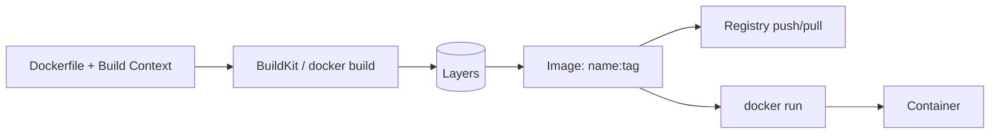
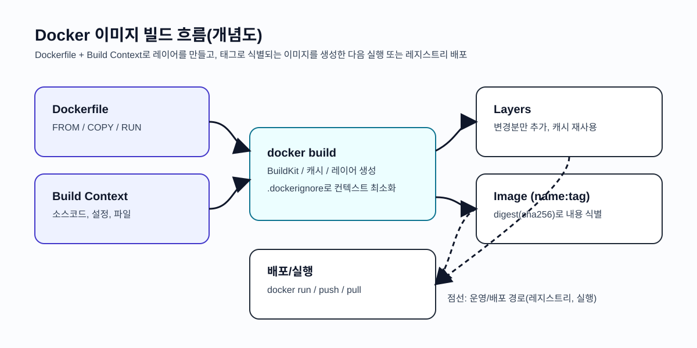
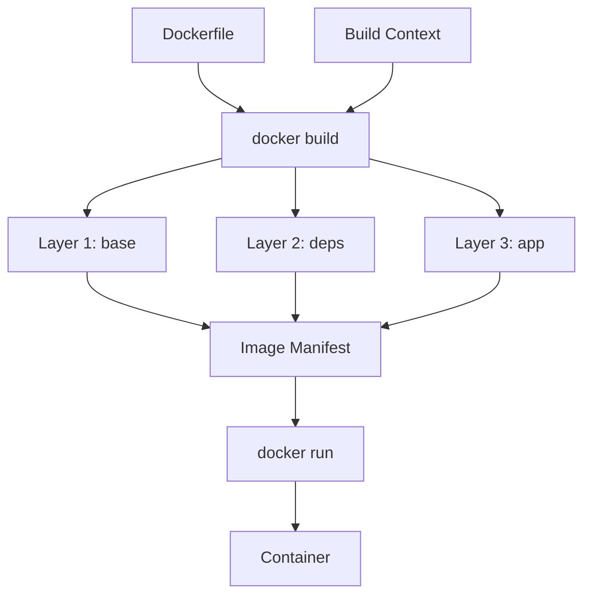
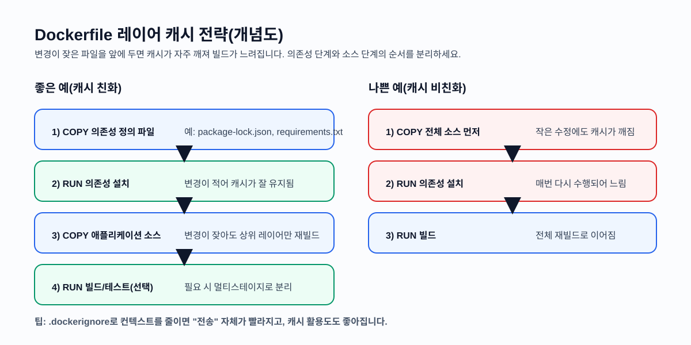

# 서비스 이해 (Service Understanding)

## 1. 배경 정보

배경 정보 보기

컨테이너는 "코드"만이 아니라 실행에 필요한 파일/설정/런타임까지 함께 옮겨야 재현성이 생깁니다. 전통적인 배포는 서버마다 OS/라이브러리/설정이 조금씩 달라 "내 PC에서는 되는데 서버에서는 안 된다" 같은 문제가 자주 발생합니다.

Docker 이미지(Image)는 이 문제를 해결하기 위해, 애플리케이션 실행에 필요한 파일 시스템 스냅샷과 메타데이터(실행 명령, 환경 변수, 포트 등)를 하나의 아티팩트(artifact)로 표준화합니다. 즉 "이 이미지를 실행하면 어디서든 같은 방식으로 실행된다"는 약속을 제공하는 배포 단위입니다.

이미지는 레이어(layer) 기반으로 구성되어 변경분만 추가되는 구조를 갖고, 레지스트리(registry)를 통해 배포/공유됩니다. 최근에는 Docker뿐 아니라 OCI(Open Container Initiative) 규격을 통해 컨테이너 런타임 생태계 전반에서 이미지 포맷과 배포 방식이 표준화되어 있습니다.

### 인포그래픽

출처: https://commons.wikimedia.org/wiki/File:Containers.svg

## 2. 핵심 개념

핵심 개념 보기

- 이미지(Image): 실행 가능한 파일 시스템과 설정의 묶음. 컨테이너(Container)는 이미지에서 만들어지는 "실행 인스턴스"입니다.
- 레이어(Layer): 이미지가 여러 파일 시스템 레이어의 합으로 구성됨. `RUN`, `COPY` 같은 Dockerfile 단계가 레이어로 쌓이며 캐시가 적용됩니다.
- Dockerfile: 이미지를 "어떻게 만들지" 선언하는 빌드 레시피. `FROM`, `RUN`, `COPY`, `WORKDIR`, `CMD`, `ENTRYPOINT` 등이 핵심입니다.
- Build Context(빌드 컨텍스트): `docker build .`의 `.`에 해당하는 전송 대상 파일 집합. `.dockerignore`로 불필요한 파일(예: `.git`, `node_modules`)을 제외합니다.
- 태그(Tag)와 다이제스트(Digest): `name:tag`는 사람이 읽기 쉬운 별칭(가변), `sha256:...` 다이제스트는 내용 기반 식별자(불변에 가까움)입니다. 운영에서는 "같은 태그가 다른 내용을 가리키는" 문제를 이해하고 관리해야 합니다.
- 레지스트리(Registry): 이미지를 저장/배포하는 서버. Docker Hub, 사설 레지스트리(Harbor), 클라우드 레지스트리(ECR/GCR/ACR) 등이 있습니다.
- OCI 이미지 규격: Docker 이외의 도구/런타임에서도 호환되도록 이미지 포맷, 매니페스트, 레이어 구조가 표준화되어 있습니다.

### 인포그래픽

출처: https://commons.wikimedia.org/wiki/File:Docker-on-physical.svg

## 3. 장단점

장단점 보기

**장점**:
- 재현성: 이미지가 동일하면 환경이 달라도 같은 실행 결과를 기대할 수 있어 배포 실패율을 줄입니다.
- 이식성: 개발/테스트/운영(CI/CD 포함)에서 같은 아티팩트를 재사용할 수 있습니다.
- 빠른 빌드/배포: 레이어 캐시로 변경분만 다시 빌드하고, 레지스트리로 효율적으로 배포할 수 있습니다.

**단점**:
- 이미지 비대화/빌드 시간 증가: `.dockerignore` 미사용, 레이어 설계 미흡, 불필요한 패키지 포함 등으로 이미지가 커지고 빌드가 느려집니다.
- 보안/공급망 리스크: 베이스 이미지 취약점, 태그 변조(같은 태그가 다른 내용을 가리킴), 이미지에 비밀정보(토큰/키)가 포함되는 실수 등이 발생할 수 있습니다.

**언제 "이미지 기반"이 적합하지 않을 수 있나**
- 상태를 이미지에 넣어야 한다고 착각할 때: 데이터는 볼륨/외부 스토리지로 분리하는 편이 일반적입니다.
- 빌드에 네트워크/외부 의존성이 많아 재현성이 깨질 때: 잠금 파일, 내부 미러/레지스트리, 빌드 캐시 전략을 같이 설계해야 합니다.

## 4. 자주 사용되는 사례

사용 사례 보기

1. 애플리케이션 배포 아티팩트 표준화: 개발자가 만든 이미지를 그대로 스테이징/운영에 배포(예: Kubernetes에서 Pod가 이미지를 실행)
2. CI 빌드/테스트 환경 통일: 빌드 도구/버전이 포함된 이미지를 만들어 CI 러너에서 재사용
3. 에어갭(폐쇄망) 배포: `docker save/load`로 이미지 파일을 옮겨서 배포(인터넷이 없는 환경에서도 가능)
4. 프리빌트(Pre-built) 이미지로 개발 온보딩: 새로 합류한 팀원이 로컬 환경 세팅 없이 이미지로 동일한 도구 체인을 사용

## 5. 연관 서비스

연관 서비스 보기

- 레지스트리: Docker Hub, Harbor(사설), AWS ECR / GCP Artifact Registry / Azure ACR
- 빌드 도구: BuildKit, `docker buildx`, CI 파이프라인(GitHub Actions, GitLab CI 등)
- 보안/검증: 이미지 취약점 스캐너(예: Trivy), SBOM 생성, 서명/검증(예: cosign)
- 오케스트레이션: Docker Compose, Kubernetes(이미지를 실행 단위로 사용)
- 대안: VM 이미지(AMI 등), 패키지/아카이브 기반 배포(예: deb/rpm, tar.gz)

## 6. 공식 문서 링크

- [Docker Docs](https://docs.docker.com/)
- [Dockerfile reference](https://docs.docker.com/reference/dockerfile/)
- [docker build (CLI)](https://docs.docker.com/reference/cli/docker/buildx/build/)
- [docker image (CLI)](https://docs.docker.com/reference/cli/docker/image/)
- [Docker Hub](https://docs.docker.com/docker-hub/)

## 7. 추가 자료

- [OCI Image Format Specification](https://github.com/opencontainers/image-spec)
- 외부 참고(이미지/도표가 포함된 페이지)
  - Docker Build 개요(공식): https://docs.docker.com/build/
  - Multi-stage builds(공식): https://docs.docker.com/build/building/multi-stage/
