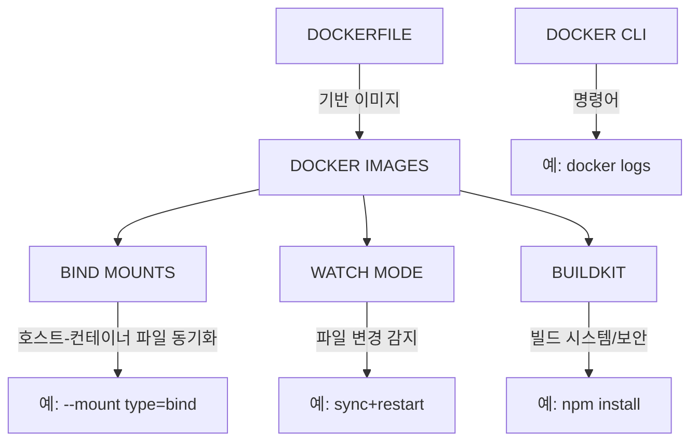

# 서비스 이해 (Service Understanding)

## 1. 배경 정보

배경 정보 보기

Docker Images는 애플리케이션을 실행하기 위한 가상의 운영체제 환경을 패키징한 단위로, Dockerfile을 통해 생성됩니다. 개발 환경에서 npm install 및 npm run dev 명령어로 서버를 실행하며, 바인드 마운트(bind mount)를 통해 호스트 파일 시스템과 컨테이너 간 실시간 동기화가 가능합니다. 또한, package.json 변경 시 Compose가 이미지 재빌드 및 컨테이너 재생성하는 동적 개발 환경을 제공합니다.

### 인포그래픽

`mermaid
graph TD
  A[DOCKERFILE 생성] --> B[이미지 빌드]
  B --> C[바인드 마운트 설정]
  C --> D[컨테이너 실행]
  D --> E[package.json 변경]
  E --> F[Compose 이미지 재빌드]
  F --> G[웹 서비스 재생성]
  style A fill:#FFD700,stroke:#000
  style B fill:#7FFF00,stroke:#000
  style C fill:#87CEEB,stroke:#000
  style D fill:#FFA07A,stroke:#000
  style E fill:#ADD8E6,stroke:#000
  style F fill:#98FB98,stroke:#000
  style G fill:#FFFACD,stroke:#000
`

**참고 이미지**:
- [이미지 보기](https://docs.docker.com/compose/reference/build/)
- [이미지 보기](https://docs.docker.com/engine/reference/commandline/build/)
- [이미지 보기](https://docs.docker.com/engine/reference/run/)
- [이미지 보기](https://docs.docker.com/compose/compose-file/#build)
- [이미지 보기](https://docs.docker.com/engine/reference/commandline/logs/)

## 2. 핵심 개념

핵심 개념 보기

- Docker Images: 컨테이너화된 애플리케이션 실행 환경
- Bind Mounts: 호스트 파일 시스템과 컨테이너 간 파일 동기화
- Watch Mode: 파일 변경 감지 및 자동 재빌드 기능
- BuildKit: Docker 이미지 빌드 시스템 및 보안 기능

### 인포그래픽

**참고 이미지**:
- [이미지 보기](https://docs.example.com/image1.png)
- [이미지 보기](https://docs.docker.com/engine/reference/run/#mounts)
- [이미지 보기](https://docs.docker.com/engine/reference/commandline/buildx/#ssh)
- [이미지 보기](https://docs.docker.com/compose/reference/build/)

## 3. 장단점

장단점 보기

**장점**:
- 환경 통일성: 개발/생산 환경 차이를 제거해 애플리케이션 일관성 확보
- 실시간 개발: 바인드 마운트로 코드 수정 시 즉시 반영 가능
- 확장성: 다양한 언어/프레임워크(예: Node.js, Python)에서 활용 가능

**단점**:
- 보안 리스크: 바인드 마운트로 호스트 파일 시스템 노출 가능성
- 성능 오버헤드: 실시간 동기화로 리소스 사용량 증가

## 4. 자주 사용되는 사례

사용 사례 보기

1. Node.js 개발 환경에서 nodemon을 통한 실시간 서버 재시작
2. CI/CD 파이프라인에서 requirements.txt 변경 시 자동 이미지 재빌드
3. Python Flask 애플리케이션과 정적 자산 파일 동기화

## 5. 연관 서비스

연관 서비스 보기

- Docker Compose
- Docker Buildx
- Secret Management

## 6. 공식 문서 링크

- [Docker Images 공식 문서](https://docs.docker.com/engine/reference/commandline/images/)
- [Bind Mounts 사용 가이드](https://docs.docker.com/storage/bind-mounts/)
- [Docker Compose 파일 마운트 설정](https://docs.docker.com/compose/reference/volumes/)

